# Go 高级开发教程：从并发原理到高性能系统设计

这是一份写给中高级 Go 开发者的教程。它不追求把每个 API 都罗列一遍，而是希望回答几个更根本的问题：

- goroutine 为什么轻量？轻量到什么程度？什么时候又会变重？
- channel、锁、`context` 分别解决什么问题？为什么不能混着乱用？
- Heap、Skiplist、分片 Map 这些数据结构为什么能提升性能？
- Top K、增量聚合、排行榜这些问题，本质上是在优化什么？
- 高并发系统为什么不能只靠“多开 goroutine”解决？
- 当系统处理不过来时，应该排队、丢弃、限流，还是降级？

很多人学习 Go 并发时，会先记住一句话：“不要通过共享内存来通信，而要通过通信来共享内存。”这句话很好，但如果只记住口号，反而容易误解。Go 的并发工具各有边界：channel 适合表达流程和同步，锁适合保护共享状态，`context` 适合控制生命周期，worker pool 适合控制系统容量。

真正成熟的工程师，不是把所有问题都写成 channel，也不是把所有共享数据都加一把大锁，而是知道在不同场景下做出合适的取舍。

这些问题的简短答案如下，后文会逐步展开。

| 问题 | 最佳答案 | 解读 |
| --- | --- | --- |
| goroutine 为什么轻量？ | 因为它由 Go runtime 在用户态调度，初始栈小，创建和切换成本低于 OS 线程。 | 轻量不等于免费。goroutine 过多仍会增加内存、调度和 GC 成本。 |
| channel、锁、`context` 分别解决什么？ | channel 表达通信和同步，锁保护共享状态，`context` 控制生命周期。 | 不要为了“更 Go”而滥用 channel。保护一个 Map 时，锁通常更直接。 |
| 数据结构为什么能提升性能？ | 好的数据结构减少了不必要的扫描、排序、锁竞争和内存访问。 | Heap 避免全量排序，Skiplist 支持动态有序，分片 Map 降低热点锁。 |
| Top K 和增量聚合本质上优化什么？ | 它们都在避免重复处理无关数据。 | Top K 不排序所有人，增量聚合不每次扫描原始事件。 |
| 高并发为什么不能只靠 goroutine？ | 因为真正稀缺的是 CPU、内存、队列容量、下游吞吐和锁资源。 | goroutine 只能表达并发，不能创造系统容量。 |
| 系统处理不过来怎么办？ | 优先限流和背压，再考虑排队、降级和补偿。 | 在线请求通常快速失败更好；关键数据写入要有补偿机制。 |

一个重要原则是：高并发系统不是让所有请求都成功，而是在超出容量时，让系统以可预期的方式失败。可预期，比表面上的“全都接收”更重要。

---

## 目录

- [学习路线](#学习路线)
- [第一部分：Go 并发基础](#第一部分go-并发基础)
  - [1. goroutine：不是免费的线程](#1-goroutine不是免费的线程)
  - [2. channel：带同步语义的队列](#2-channel带同步语义的队列)
  - [3. Mutex 与 RWMutex：保护不变量](#3-mutex-与-rwmutex保护不变量)
  - [4. sync.Map：特殊场景下的并发 Map](#4-syncmap特殊场景下的并发-map)
  - [5. context：让并发任务知道什么时候该停](#5-context让并发任务知道什么时候该停)
- [第二部分：高性能数据结构](#第二部分高性能数据结构)
  - [6. Heap：用局部有序换取效率](#6-heap用局部有序换取效率)
  - [7. 优先队列：让重要任务先执行](#7-优先队列让重要任务先执行)
  - [8. TreeMap 与 Skiplist：为范围查询而生](#8-treemap-与-skiplist为范围查询而生)
- [第三部分：并发数据结构设计](#第三部分并发数据结构设计)
  - [9. 线程安全的本质](#9-线程安全的本质)
- [第四部分：算法优化](#第四部分算法优化)
  - [10. Top K：不要为无关数据排序](#10-top-k不要为无关数据排序)
  - [11. 高频访问优化](#11-高频访问优化)
  - [12. 增量聚合：把查询成本前移](#12-增量聚合把查询成本前移)
- [第五部分：工程化设计](#第五部分工程化设计)
  - [13. 接口设计](#13-接口设计)
  - [14. 错误处理](#14-错误处理)
  - [15. 日志、指标与测试](#15-日志指标与测试)
- [第六部分：高并发系统设计](#第六部分高并发系统设计)
  - [16. Worker Pool：给系统设置边界](#16-worker-pool给系统设置边界)
  - [17. Fan-out / Fan-in：并行也会放大流量](#17-fan-out--fan-in并行也会放大流量)
  - [18. Backpressure：承认系统有容量上限](#18-backpressure承认系统有容量上限)
  - [19. 限流：系统的安全阀](#19-限流系统的安全阀)
- [第七部分：实战项目](#第七部分实战项目)
  - [20. Leaderboard 高级实现](#20-leaderboard-高级实现)
  - [21. ActivityTracker 高级实现](#21-activitytracker-高级实现)
- [附录 A：补充并发原语](#附录-a补充并发原语)
- [附录 B：优雅关闭与熔断降级](#附录-b优雅关闭与熔断降级)
- [高并发设计检查清单](#高并发设计检查清单)
- [常见线上故障模式](#常见线上故障模式)
- [生产排障手册](#生产排障手册)
- [结语](#结语)

---

## 学习路线

建议用 12 周完成这套训练。

| 周期 | 主题 | 要掌握的能力 |
| --- | --- | --- |
| 第 1-2 周 | Go 并发基础 | 理解 goroutine、channel、锁、`context` 的原理和边界 |
| 第 3-4 周 | 高性能数据结构 | 掌握 Heap、优先队列、TreeMap、Skiplist 的适用场景 |
| 第 5-6 周 | 并发数据结构 | 能设计线程安全 Map、计数器、缓存、排行榜 |
| 第 7-8 周 | 算法优化 | 能用 Top K、增量聚合、缓存减少系统负担 |
| 第 9-10 周 | 工程化设计 | 会设计接口、错误、日志、指标和测试 |
| 第 11-12 周 | 高并发系统 | 能设计 worker pool、fan-out、backpressure、限流系统 |

学习时不要只看代码。每一个主题都要从四个层次理解：

| 层次 | 应该问的问题 |
| --- | --- |
| 使用层 | API 怎么用？最小示例是什么？ |
| 原理层 | runtime 或数据结构内部大致做了什么？ |
| 工程层 | 生产环境下什么时候该用，什么时候不该用？ |
| 故障层 | 高并发时会怎样失败？如何保护系统？ |

---

# 第一部分：Go 并发基础

## 1. goroutine：不是免费的线程

goroutine 是 Go 最吸引人的特性之一。很多人第一次写 Go 时，会惊讶于这样一行代码：

```go
go doSomething()
```

它看起来太轻松了，以至于容易让人误以为 goroutine 是免费的。事实并非如此。goroutine 的确比操作系统线程轻得多，但只要是运行中的任务，就一定消耗资源。

### 1.1 goroutine 的系统级原理

操作系统线程是真正能被 CPU 调度执行的实体。传统语言里，如果大量创建线程，系统很快会吃不消，因为每个线程都有较大的栈、内核调度成本和上下文切换成本。

Go 的做法是自己在用户态做一层调度。可以用 G/M/P 模型来理解：

| 名称 | 含义 | 类比 |
| --- | --- | --- |
| G | goroutine | 一张待执行的任务卡 |
| M | OS 线程 | 真正干活的工人 |
| P | 调度上下文 | 工人的工具台和本地任务队列 |

Go runtime 会把大量 G 分配到少量 M 上执行。M 想执行 Go 代码，通常需要绑定一个 P。每个 P 有自己的本地运行队列，如果本地队列空了，还会从全局队列或其他 P 那里拿任务。

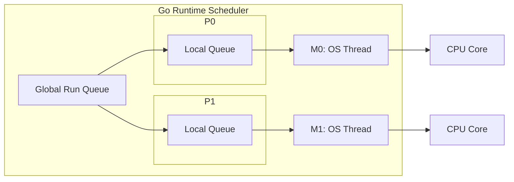

这套机制解释了两个现象：

1. goroutine 可以很多，因为它们不等于系统线程。
2. goroutine 不能无限多，因为它们仍然需要栈、元数据、调度和 GC 扫描成本。

### 1.2 高并发不是无限并发

假设一个接口每次请求启动 20 个 goroutine。如果有 1 万 QPS，每秒就会创建 20 万个 goroutine。即使每个 goroutine 很轻，调度、内存分配、GC 都会成为负担。

因此，高并发系统要做的第一件事不是“尽可能并发”，而是“限制并发，让资源可预测”。

| 场景 | 建议 |
| --- | --- |
| 少量异步任务 | 可以直接启动 goroutine |
| 大量独立任务 | 使用 worker pool |
| 请求内并行访问多个下游 | 使用 fan-out，并配合 `context` |
| CPU 密集任务 | 并发度接近 `runtime.GOMAXPROCS(0)` |
| IO 密集任务 | 根据下游承载能力设置并发上限 |

### 1.3 示例：并发抓取用户信息

```go
package main

import (
	"fmt"
	"sync"
	"time"
)

func fetchUser(id int) string {
	time.Sleep(100 * time.Millisecond)
	return fmt.Sprintf("user-%d", id)
}

func main() {
	ids := []int{1, 2, 3, 4, 5}
	results := make([]string, len(ids))

	var wg sync.WaitGroup
	for i, id := range ids {
		wg.Add(1)

		go func(i, id int) {
			defer wg.Done()
			results[i] = fetchUser(id)
		}(i, id)
	}

	wg.Wait()
	fmt.Println(results)
}
```

这段代码有三个值得注意的地方：

- `WaitGroup` 用来等待所有 goroutine 结束。
- 循环变量通过参数传入 goroutine，避免闭包捕获问题。
- 每个 goroutine 写入不同下标，因此不会发生同一位置的并发写。

### 1.4 常见坑

#### 坑 1：goroutine 没有退出条件，形成泄漏

为什么会出现：goroutine 一旦启动，就不会因为父函数返回而自动退出。如果它阻塞在 channel、网络请求、定时器或死循环里，就会一直活着。

错误示例：

```go
func watch(ch <-chan int) {
	go func() {
		for v := range ch {
			fmt.Println(v)
		}
	}()
}
```

如果 `ch` 永远不关闭，这个 goroutine 就永远不会退出。

修复方式：给长期运行的 goroutine 增加 `context`，并在循环中监听取消信号。

```go
func watch(ctx context.Context, ch <-chan int) {
	go func() {
		for {
			select {
			case v, ok := <-ch:
				if !ok {
					return
				}
				fmt.Println(v)
			case <-ctx.Done():
				return
			}
		}
	}()
}
```

生产建议：后台 goroutine 必须有清晰的生命周期。服务关闭、请求取消、上游退出时，它都应该能停止。

#### 坑 2：goroutine 中 panic 未恢复，导致进程崩溃

为什么会出现：panic 不会只杀死当前 goroutine。如果没有 recover，它会让整个进程退出。后台任务、worker pool、消息消费 goroutine 尤其要注意。

修复方式：在 goroutine 最外层 recover，并记录堆栈。

```go
go func() {
	defer func() {
		if r := recover(); r != nil {
			log.Printf("worker panic: %v", r)
		}
	}()

	runWorker()
}()
```

生产建议：recover 不是为了吞掉错误，而是为了避免单个任务拖垮整个进程。recover 后要记录日志、指标，必要时告警。

#### 坑 3：请求超时后，后台 goroutine 仍在工作

为什么会出现：请求 handler 返回不代表它启动的 goroutine 会自动停止。如果 goroutine 没有拿到请求的 `context`，它不知道上游已经放弃。

错误示例：

```go
func handler(w http.ResponseWriter, r *http.Request) {
	go doSlowWork()
	w.WriteHeader(http.StatusAccepted)
}
```

修复方式：传入 `r.Context()`，并让下游调用都支持取消。

```go
func handler(w http.ResponseWriter, r *http.Request) {
	go doSlowWork(r.Context())
	w.WriteHeader(http.StatusAccepted)
}
```

如果任务必须在请求结束后继续执行，就不要直接使用请求 context，而应该进入受控的后台队列，由后台系统管理重试、超时和关闭。

#### 坑 4：无限创建 goroutine，导致调度和内存压力

为什么会出现：`go func()` 太容易写，开发者容易把“并发”误解成“每个任务一个 goroutine”。任务量大时，goroutine 数量会瞬间膨胀。

错误示例：

```go
for _, job := range jobs {
	go process(job)
}
```

修复方式：使用 worker pool 或 semaphore 限制并发。

```go
sem := make(chan struct{}, 20)
for _, job := range jobs {
	sem <- struct{}{}
	go func(job Job) {
		defer func() { <-sem }()
		process(job)
	}(job)
}
```

生产建议：并发度应该根据 CPU、下游容量、连接池大小和压测结果确定，而不是根据任务数量确定。

### 1.5 练习

1. 写一个并发 URL 抓取器，最多同时抓取 10 个 URL。
2. 写一个会泄漏 goroutine 的例子，再用 `context` 修复。
3. 思考：如果一个任务是 CPU 密集型，启动 1000 个 goroutine 是否有意义？

参考答案与解读：

1. URL 抓取器应该使用“任务队列 + 固定 worker 数”或“semaphore 限制并发”。不要对每个 URL 直接启动一个 goroutine，否则 URL 数量一大就会失控。生产中还要给 HTTP client 设置连接池、请求超时、重试上限和最大响应体大小。
2. 常见泄漏例子是 goroutine 阻塞在发送 channel 上，但接收方已经退出。修复方式是给发送和接收都加 `select { case ...; case <-ctx.Done(): }`，让上游取消能传递到后台任务。
3. 通常没有意义。CPU 密集型任务受 CPU 核数限制，1000 个 goroutine 只会增加调度开销。最佳实践是并发度接近 `runtime.GOMAXPROCS(0)`，或者略高一点后压测确认。

生产实践：

- 所有请求级 goroutine 都应该能被 `context` 取消。
- 后台常驻 goroutine 要有明确的启动、停止、panic recover 和日志。
- 批量任务要设并发上限，不要直接按任务数量启动 goroutine。
- 线上要监控 goroutine 数量。稳定系统中 goroutine 数应该随流量波动，但不应长期单调上涨。

---

## 2. channel：带同步语义的队列

channel 常被认为是 Go 并发的灵魂。它不仅能传数据，还能表达同步关系。

### 2.1 channel 的本质

channel 可以理解成一个带同步语义的队列。它内部大致包含：

- 一个缓冲区。
- 一个等待发送的 goroutine 队列。
- 一个等待接收的 goroutine 队列。
- 一把内部锁。

无缓冲 channel 更像“当面交接”。发送方和接收方必须同时到场。  
有缓冲 channel 更像“临时仓库”。生产者可以先把东西放进去，消费者稍后再取。

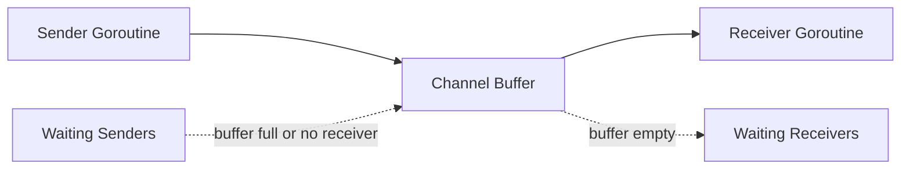

| 类型 | 行为 | 适用场景 |
| --- | --- | --- |
| 无缓冲 channel | 发送和接收同步发生 | 交接任务、同步信号 |
| 有缓冲 channel | 允许短暂排队 | 任务队列、削峰 |
| 只读 channel | 限制函数只能接收 | API 边界 |
| 只写 channel | 限制函数只能发送 | API 边界 |

### 2.2 channel 的内存可见性

Go 内存模型保证：channel 发送发生在对应接收之前。通俗地说，发送前写入的数据，接收后可以看到。

```go
done := make(chan struct{})
var x int

go func() {
	x = 42
	close(done)
}()

<-done
fmt.Println(x) // 一定能看到 42
```

这里 `close(done)` 不只是关闭 channel，它也是一个同步信号。

### 2.3 示例：订单处理流水线

```go
package main

import "fmt"

type Order struct {
	ID     int
	Amount int64
}

func producer(out chan<- Order) {
	defer close(out)

	for i := 1; i <= 5; i++ {
		out <- Order{ID: i, Amount: int64(i * 100)}
	}
}

func consumer(in <-chan Order) {
	for order := range in {
		fmt.Printf("process order: id=%d amount=%d\n", order.ID, order.Amount)
	}
}

func main() {
	ch := make(chan Order, 2)
	go producer(ch)
	consumer(ch)
}
```

### 2.4 channel 不是万能队列

channel 很好用，但不要把它当作无限队列。队列一旦没有边界，就会隐藏系统过载：

```text
请求进入速度 > 处理速度
       |
队列持续增长
       |
内存上涨，延迟上涨
       |
调用方超时重试
       |
流量更大，系统雪崩
```

高并发场景下，channel 队列一定要问三个问题：

- 缓冲区多大？
- 满了怎么办？
- 队列中的任务多久以后就没有意义？

参考答案与解读：

1. 缓冲区大小应该由“处理吞吐量 × 可接受排队时间”反推，而不是拍脑袋。比如 worker 每秒处理 2000 个任务，业务最多接受排队 1 秒，队列可以从 2000 附近开始压测。
2. 队列满了要根据业务选择策略：在线请求通常快速失败；日志指标可以丢弃；核心数据可以短暂等待或落入可靠消息队列；推荐、搜索等体验型功能可以降级。
3. 任务是否过期要看业务语义。用户已经取消的请求、过期的推荐刷新、超过展示窗口的排行榜更新，继续处理价值很低。生产中常给任务附带 deadline，worker 取出后先判断是否已经过期。

一个实用判断是：如果队列里的任务等待时间已经超过调用方超时时间，它即使被处理完也很可能没有用户价值，只是在消耗系统资源。

### 2.5 常见坑

#### 坑 1：向已关闭 channel 发送会 panic

为什么会出现：关闭 channel 表示“不会再有新数据”。如果关闭后仍然发送，说明发送方和关闭方的职责没有划清。

错误示例：

```go
ch := make(chan int)
close(ch)
ch <- 1 // panic: send on closed channel
```

解决方式：遵守“发送方负责关闭”的原则。如果有多个发送方，不要让任意发送方直接关闭 channel，而是由协调者在所有发送方结束后关闭。

```go
var wg sync.WaitGroup
ch := make(chan int)

for i := 0; i < 3; i++ {
	wg.Add(1)
	go func(id int) {
		defer wg.Done()
		ch <- id
	}(i)
}

go func() {
	wg.Wait()
	close(ch)
}()
```

#### 坑 2：从已关闭 channel 接收零值，误以为是真数据

为什么会出现：从已关闭且已被读空的 channel 接收不会阻塞，会立刻返回元素类型的零值。如果不检查 `ok`，业务可能把零值当成正常数据。

错误示例：

```go
v := <-ch
process(v) // ch 已关闭时，v 可能是零值
```

修复方式：

```go
v, ok := <-ch
if !ok {
	return
}
process(v)
```

如果使用 `for v := range ch`，循环会在 channel 关闭且数据读完后自动退出，这是消费者读取数据流的推荐写法。

#### 坑 3：`nil` channel 永久阻塞

为什么会出现：未初始化的 channel 是 nil。对 nil channel 发送和接收都会永久阻塞。这个特性有时可用于动态关闭 select 分支，但误用会导致死锁。

错误示例：

```go
var ch chan int
ch <- 1 // 永久阻塞
```

生产建议：结构体中的 channel 字段必须在构造函数里初始化，不要让调用方直接创建零值结构体后使用。

```go
type Queue struct {
	ch chan int
}

func NewQueue(size int) *Queue {
	return &Queue{ch: make(chan int, size)}
}
```

#### 坑 4：`default` 分支造成 CPU 空转

为什么会出现：`select` 带 `default` 时，如果其他 case 都没准备好，会立即执行 `default`。如果外层是 for 循环，就会变成忙等。

错误示例：

```go
for {
	select {
	case v := <-ch:
		process(v)
	default:
	}
}
```

修复方式：没有特殊理由时，不要加 `default`。如果确实需要轮询，要加退避或定时器。

```go
for {
	select {
	case v := <-ch:
		process(v)
	case <-time.After(10 * time.Millisecond):
		// idle
	}
}
```

生产建议：`default` 常用于“非阻塞尝试”，例如队列满时快速失败；不适合无休止轮询。

### 2.6 练习

1. 用 channel 实现一个生产者消费者模型。
2. 给任务队列加上最大长度，队列满时返回错误。
3. 思考：什么时候用 channel 比用锁更清晰？

参考答案与解读：

1. 生产者消费者模型中，生产者负责发送并关闭 channel，消费者用 `range ch` 读取直到 channel 关闭。多个生产者时不要让每个生产者都关闭 channel，应由协调者在所有生产者结束后关闭。
2. 有界队列可以使用带缓冲 channel 加 `select default` 实现非阻塞提交。队列满时返回类似 `ErrQueueFull` 的明确错误，并记录指标。
3. 当问题本质是“任务从 A 流向 B”或“等待某个事件发生”时，channel 更清晰；当问题本质是“多个 goroutine 读写同一份状态”时，锁更清晰。

生产实践：

- channel 的关闭责任要写进代码结构里。通常是发送方关闭，接收方不关闭。
- channel 不适合做无限缓冲。需要可靠排队时，应考虑 Kafka、Redis Stream、NATS、数据库 outbox 等持久化队列。
- 对高频小对象传递，channel 可能带来额外分配和调度成本，必要时用 benchmark 比较锁、atomic 和 channel。

---

## 3. Mutex 与 RWMutex：保护不变量

锁的作用不是保护代码，而是保护数据不变量。

所谓不变量，是业务上必须一直成立的关系。例如：

- 账户余额不能为负。
- `count` 必须等于 Map 中元素数量。
- 排行榜中用户的分数和排名索引必须一致。

如果多个字段共同构成一个不变量，就必须在同一个同步边界内修改它们。

### 3.1 Mutex 的同步语义

`Mutex.Unlock` 之前的写入，对另一个 goroutine 随后成功 `Lock` 后可见。这就是锁除了互斥以外的另一个作用：建立内存可见性。

```go
type Counter struct {
	mu sync.Mutex
	n  int64
}

func (c *Counter) Inc() {
	c.mu.Lock()
	defer c.mu.Unlock()

	c.n++
}

func (c *Counter) Value() int64 {
	c.mu.Lock()
	defer c.mu.Unlock()

	return c.n
}
```

### 3.2 RWMutex 不一定更快

`RWMutex` 允许多个读者同时进入，写者独占。它适合读多写少的场景。但如果写入很频繁，读写锁维护读者和写者状态的成本可能比普通 `Mutex` 更高。

| 场景 | 建议 |
| --- | --- |
| 读很多，写很少 | 可以考虑 `RWMutex` |
| 写很多 | 先用 `Mutex`，再 benchmark |
| 读只是简单整数 | 可以考虑 `atomic` |
| 多字段保持一致 | 用锁更清晰 |

### 3.3 锁竞争如何变成线上事故

锁竞争一开始只是慢一点，后来会变成系统问题：

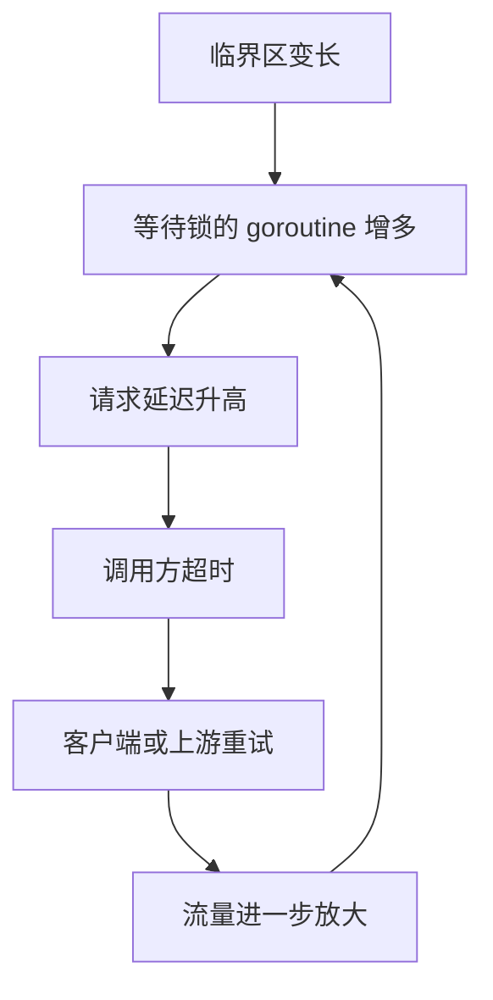

1. 临界区变长。
2. 等锁的 goroutine 增多。
3. 请求延迟升高。
4. 调用方超时重试。
5. 重试带来更多请求。
6. 系统进一步变慢。

因此，高并发下要尽量：

- 缩短临界区。
- 避免锁内做 IO。
- 使用分片锁降低竞争。
- 用快照减少读锁。
- 用批量合并减少写锁次数。

生产实践：

- 锁保护的是数据不变量。先写清楚哪些字段必须一起变化，再决定锁粒度。
- 临界区里只做内存操作，避免 RPC、数据库、文件 IO、同步日志和复杂回调。
- 如果必须在锁内判断状态、锁外执行慢操作、再回来更新状态，要考虑状态是否已经变化，必要时使用版本号或 CAS 思路。
- 分片锁适合大量 key 分散访问，不适合单个超级热点 key。单个热点 key 要考虑本地累加后批量 flush，或者把热点 key 拆成多个逻辑分片。
- 不要为了减少锁而牺牲正确性。数据结构还没稳定前，先用一把简单的锁保证正确，再根据指标拆分。

### 3.4 示例：读多写少缓存

```go
type User struct {
	ID   int64
	Name string
}

type UserCache struct {
	mu   sync.RWMutex
	data map[int64]User
}

func NewUserCache() *UserCache {
	return &UserCache{data: make(map[int64]User)}
}

func (c *UserCache) Get(id int64) (User, bool) {
	c.mu.RLock()
	defer c.mu.RUnlock()

	u, ok := c.data[id]
	return u, ok
}

func (c *UserCache) Set(u User) {
	c.mu.Lock()
	defer c.mu.Unlock()

	c.data[u.ID] = u
}
```

### 3.5 常见坑

#### 坑 1：复制包含锁的结构体

为什么会出现：`sync.Mutex`、`sync.RWMutex` 一旦使用后就不应该被复制。复制后会出现两个锁保护同一份或相关状态的错觉，轻则数据竞争，重则死锁。

错误示例：

```go
type Counter struct {
	mu sync.Mutex
	n  int
}

func (c Counter) Inc() { // 值接收者会复制 Counter，也复制锁
	c.mu.Lock()
	defer c.mu.Unlock()
	c.n++
}
```

修复方式：包含锁的结构体使用指针接收者，并避免值复制。

```go
func (c *Counter) Inc() {
	c.mu.Lock()
	defer c.mu.Unlock()
	c.n++
}
```

生产建议：包含锁的结构体不要作为函数返回值随意复制，不要放入会复制元素的容器操作中。可以用 `go vet -copylocks` 检查这类问题。

#### 坑 2：锁内调用外部服务

为什么会出现：外部服务耗时不可控。锁内做 RPC、DB、文件 IO，会让所有等待这把锁的 goroutine 一起排队。

错误示例：

```go
func (s *Store) Refresh(id int64) error {
	s.mu.Lock()
	defer s.mu.Unlock()

	user, err := s.client.LoadUser(id) // 锁内 RPC
	if err != nil {
		return err
	}
	s.users[id] = user
	return nil
}
```

修复方式：锁外做慢操作，锁内只更新共享状态。

```go
func (s *Store) Refresh(id int64) error {
	user, err := s.client.LoadUser(id)
	if err != nil {
		return err
	}

	s.mu.Lock()
	defer s.mu.Unlock()
	s.users[id] = user
	return nil
}
```

如果锁外加载期间状态可能变化，要引入版本号或再次检查，避免旧结果覆盖新结果。

#### 坑 3：同一份数据有的地方加锁，有的地方不加锁

为什么会出现：并发安全要求所有访问路径都遵守同一套同步规则。只要有一个读写路径绕过锁，race 仍然存在。

错误示例：

```go
func (c *Cache) Set(k string, v string) {
	c.mu.Lock()
	defer c.mu.Unlock()
	c.data[k] = v
}

func (c *Cache) UnsafeLen() int {
	return len(c.data) // 未加锁
}
```

修复方式：所有访问共享状态的方法都加同一把锁，或者返回不可变快照。

```go
func (c *Cache) Len() int {
	c.mu.RLock()
	defer c.mu.RUnlock()
	return len(c.data)
}
```

生产建议：不要把内部 Map 暴露给调用方。否则调用方可以绕过锁直接修改。

#### 坑 4：多个锁保护同一个不变量

为什么会出现：为了降低锁竞争，有时会把字段拆到不同锁下。但如果这些字段共同构成业务不变量，拆锁会让读者看到不一致状态。

例子：排行榜中 `scores` 和 `rankIndex` 必须一致。如果更新分数和更新排名索引用不同锁，读请求可能看到新分数配旧排名。

修复方式：同一个不变量用同一个锁保护；如果必须拆锁，则通过不可变快照、版本号或单线程聚合保证一致性。

参考答案：什么时候应该用 `Mutex`，什么时候用 `RWMutex`？

最佳答案是先看读写比例和临界区长度。读远多于写，并且读临界区不是极短时，`RWMutex` 可能有收益。写入频繁、读操作很短或锁竞争不明显时，`Mutex` 反而更简单、更快。

解读：`RWMutex` 并不是“更高级的 Mutex”。它要维护读者数量、写者等待等状态，本身有额外成本。生产中不要凭直觉替换，应该用 `go test -bench` 和真实读写比例验证。

---

## 4. sync.Map：特殊场景下的并发 Map

`sync.Map` 不是普通 Map 的高级替代品，而是为特定场景优化的结构。

它适合：

- key 写入后很少改变。
- 读远多于写。
- 多 goroutine 访问不同 key。
- 缓存、注册表、连接表等场景。

它不适合：

- 写多读少。
- 需要复杂事务。
- 需要强一致遍历。
- value 本身也会被并发修改。

### 4.1 为什么 sync.Map 适合读多写少

可以把 `sync.Map` 简化理解为两层：

- read 区：读路径很快。
- dirty 区：记录新写入和变化较多的数据。

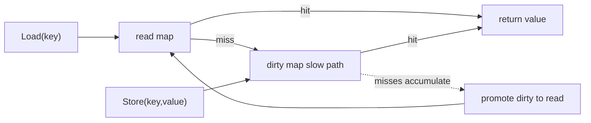

读取时先查 read 区，找不到再走慢路径查 dirty 区。写入多时，慢路径和内部协调成本会上升，所以它并不是所有场景都快。

### 4.2 示例：在线连接表

```go
type Conn struct {
	UserID int64
	Addr   string
}

type Registry struct {
	conns sync.Map // map[int64]*Conn
}

func (r *Registry) Add(conn *Conn) {
	r.conns.Store(conn.UserID, conn)
}

func (r *Registry) Get(userID int64) (*Conn, bool) {
	v, ok := r.conns.Load(userID)
	if !ok {
		return nil, false
	}
	return v.(*Conn), true
}

func (r *Registry) Remove(userID int64) {
	r.conns.Delete(userID)
}
```

### 4.3 常见坑

#### 坑 1：以为 `sync.Map` 会保护 value

```go
conn, _ := registry.Get(1)
conn.Addr = "new addr" // 如果多个 goroutine 同时改 conn，仍然有数据竞争
```

为什么会出现：`sync.Map` 只保证 `Load`、`Store`、`Delete` 这些 Map 操作本身并发安全。它不会自动保护 value 指向的对象。

如果 value 内部也会变化，就要给 value 加锁，或者使用不可变对象替换。

```go
type Conn struct {
	mu   sync.Mutex
	Addr string
}

func (c *Conn) SetAddr(addr string) {
	c.mu.Lock()
	defer c.mu.Unlock()
	c.Addr = addr
}
```

更推荐的方式是不可变替换：构造一个新的 value，再 `Store` 回去，避免调用方拿到可变内部对象。

```go
func (r *Registry) UpdateAddr(userID int64, addr string) {
	v, ok := r.conns.Load(userID)
	if !ok {
		return
	}
	old := v.(*Conn)

	// 构造一份新的不可变 Conn，整体替换
	updated := &Conn{UserID: old.UserID, Addr: addr}
	r.conns.Store(userID, updated)
}
```

不可变替换的好处是读者拿到的 `*Conn` 永远不会被别人改动。读者看到的是某个时刻的快照，也就不需要再对 value 加锁。

#### 坑 2：把 `Range` 当成强一致快照

为什么会出现：`sync.Map.Range` 遍历期间，其他 goroutine 仍然可以写入或删除。遍历看到的是一个弱一致视图，不保证包含遍历期间的所有更新。

错误场景：用 `Range` 计算严格账务总额、强一致排行榜、库存数量。这类逻辑需要强一致快照，不适合直接依赖 `sync.Map.Range`。

修复方式：如果需要强一致遍历，用 `map + RWMutex`，在读锁下复制一份快照，再在锁外计算。

```go
func (s *Store) Snapshot() map[string]int64 {
	s.mu.RLock()
	defer s.mu.RUnlock()

	cp := make(map[string]int64, len(s.data))
	for k, v := range s.data {
		cp[k] = v
	}
	return cp
}
```

#### 坑 3：复杂复合操作不是原子的

为什么会出现：`Load` 和 `Store` 单独是安全的，但“先 Load，判断，再修改，再 Store”这一整段不是自动原子的。

错误示例：

```go
v, _ := m.Load("count")
m.Store("count", v.(int)+1) // 多个 goroutine 会丢更新
```

修复方式：简单计数使用 `atomic`，复杂状态使用 `map + Mutex` 或 value 内部锁。不要用 `sync.Map` 拼出伪事务。

参考答案：`sync.Map` 和 `map + Mutex` 如何选择？

| 场景 | 推荐 |
| --- | --- |
| key 基本稳定，读远多于写 | `sync.Map` |
| 写入频繁，逻辑复杂 | `map + Mutex` |
| 需要类型安全和复合事务 | `map + Mutex` 或封装泛型结构 |
| 需要强一致遍历快照 | `map + Mutex` 下复制快照 |
| value 自身会变化 | value 内部加锁或使用不可变对象 |

生产实践：

- `sync.Map.Range` 不是强一致快照，不要用它做严格账务、强一致排行榜结算。
- 对 `sync.Map` 做一层类型封装，避免到处写类型断言。
- 如果需要 `Load` 后“检查并更新 value 内部状态”，通常还需要 value 级别的锁。
- 对缓存场景，要配合 TTL、容量上限和淘汰策略，`sync.Map` 本身不负责这些。

---

## 5. context：让并发任务知道什么时候该停

并发程序最容易遗漏的不是启动，而是停止。

用户请求已经超时，后台 goroutine 还在查数据库；服务准备关闭，worker 还在处理新任务；上游已经不需要结果，下游还在计算。这些都会浪费资源，严重时造成泄漏。

`context` 的作用就是把取消信号、超时和请求范围元数据传下去。

### 5.1 context 是一棵取消树

```text
request context
  |
  +-- db query context
  |
  +-- cache query context
  |
  +-- rpc context
```

父 context 取消后，子 context 也会收到取消信号。

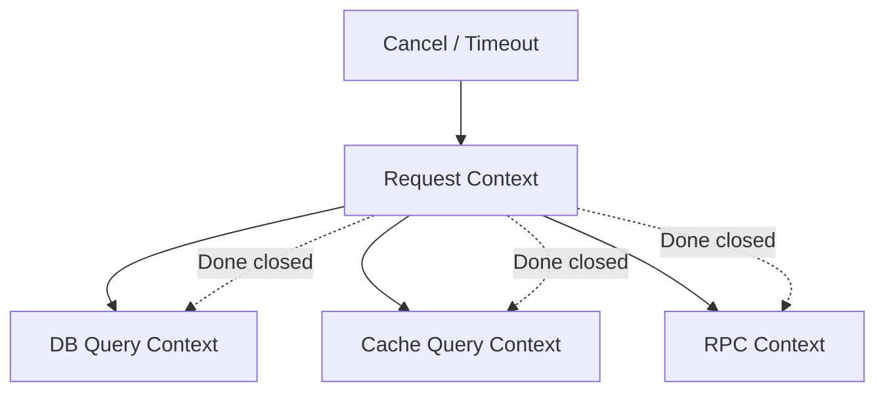

### 5.2 示例：带超时的查询

```go
func query(ctx context.Context, keyword string) (string, error) {
	select {
	case <-time.After(200 * time.Millisecond):
		return "result for " + keyword, nil
	case <-ctx.Done():
		return "", ctx.Err()
	}
}

func main() {
	ctx, cancel := context.WithTimeout(context.Background(), 100*time.Millisecond)
	defer cancel()

	result, err := query(ctx, "golang")
	if err != nil {
		fmt.Println("query failed:", err)
		return
	}

	fmt.Println(result)
}
```

### 5.3 超时预算

高并发系统不能每一层都随便设置一个很大的超时。更合理的方式是分配预算：

| 层级 | 示例 |
| --- | --- |
| API 总超时 | 200ms |
| 缓存查询 | 20ms |
| 数据库查询 | 80ms |
| 下游 RPC | 100ms |

如果每一层都设置 200ms，串行调用三个下游时，用户可能等 600ms。正确做法是让下游在上游剩余时间内工作。

### 5.4 常见坑

#### 坑 1：忘记调用 cancel

为什么会出现：`context.WithTimeout` 会创建定时器资源。即使超时最终会发生，提前调用 cancel 也能更快释放资源。

错误示例：

```go
func load() error {
	ctx, _ := context.WithTimeout(context.Background(), time.Second)
	return query(ctx)
}
```

修复方式：

```go
func load() error {
	ctx, cancel := context.WithTimeout(context.Background(), time.Second)
	defer cancel()
	return query(ctx)
}
```

生产建议：只要调用 `WithCancel`、`WithTimeout`、`WithDeadline`，就立刻写 `defer cancel()`，除非 cancel 的生命周期明确交给其他地方。

#### 坑 2：goroutine 不监听 `ctx.Done()`

为什么会出现：上游取消只是关闭 `Done` channel，不会强行杀死 goroutine。下游必须主动检查。

错误示例：

```go
func worker(ctx context.Context, jobs <-chan Job) {
	for job := range jobs {
		process(job)
	}
}
```

修复方式：

```go
func worker(ctx context.Context, jobs <-chan Job) {
	for {
		select {
		case job, ok := <-jobs:
			if !ok {
				return
			}
			process(job)
		case <-ctx.Done():
			return
		}
	}
}
```

如果 `process` 本身很慢，它也应该接收 context，否则 worker 只能在任务之间退出。

#### 坑 3：把业务参数塞进 `context.Value`

为什么会出现：`context.Value` 使用方便，容易被当成“万能参数袋”。这样会让函数真实依赖隐藏起来。

错误示例：

```go
func List(ctx context.Context) {
	page := ctx.Value("page").(int)
	_ = page
}
```

修复方式：业务参数放在显式请求对象中。

```go
type ListRequest struct {
	Page int
	Size int
}

func List(ctx context.Context, req ListRequest) {}
```

`context.Value` 只放 request id、trace id、租户 id、认证主体等请求范围元数据。

#### 坑 4：下游库没有传入 context，导致取消无效

为什么会出现：入口 handler 有 context，但实际调用数据库、HTTP、RPC 时没有使用支持 context 的 API。

修复方式：使用带 context 的方法，例如 `http.NewRequestWithContext`、`db.QueryContext`、`redis.WithContext` 等。

```go
req, err := http.NewRequestWithContext(ctx, http.MethodGet, url, nil)
if err != nil {
	return err
}
resp, err := http.DefaultClient.Do(req)
```

参考答案：`context.Value` 到底该放什么？

适合放 request id、trace id、租户 id、认证主体这类“请求范围元数据”。不适合放分页参数、业务开关、数据库连接、logger 配置和可选参数。

解读：`context.Value` 是隐式依赖。业务参数放进去后，函数签名看起来简单，但调用关系变得不透明，测试也更困难。生产代码里可以定义私有 key 类型，避免不同包之间 key 冲突。

生产实践：

- 凡是可能阻塞的函数都应接收 `context.Context`。
- `WithTimeout` 和 `WithCancel` 返回的 cancel 必须调用，通常 `defer cancel()`。
- 服务关闭时用根 context 取消后台任务。
- 对外部依赖要设置独立超时，不要只依赖入口超时。
- 区分 `context.Canceled` 和 `context.DeadlineExceeded`，前者可能是客户端主动断开，后者通常代表系统或下游慢。

---

# 第二部分：高性能数据结构

## 6. Heap：用局部有序换取效率

Heap 不保证全量有序，只保证堆顶是最大或最小值。正是因为它只维护较弱的有序性，插入和删除才可以做到 `O(log n)`。

### 6.1 为什么 Heap 适合 Top K

从 1 亿个用户里找前 100 名，如果全量排序，就是把 1 亿人完整排队。可我们并不关心第 101 名以后的人如何排序。

更好的办法是维护一个只有 100 个元素的小根堆：

- 堆里保存当前前 100 名候选人。
- 堆顶是这 100 人里分数最低的。
- 新用户如果比堆顶还低，直接丢弃。
- 新用户如果比堆顶高，就替换堆顶。

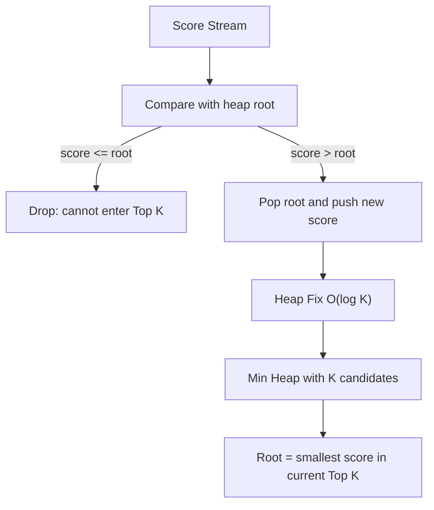

这样复杂度从 `O(n log n)` 降到 `O(n log k)`。

### 6.2 示例：Top K

```go
type UserScore struct {
	UserID int64
	Score  int64
}

type MinHeap []UserScore

func (h MinHeap) Len() int           { return len(h) }
func (h MinHeap) Less(i, j int) bool { return h[i].Score < h[j].Score }
func (h MinHeap) Swap(i, j int)      { h[i], h[j] = h[j], h[i] }

func (h *MinHeap) Push(x any) {
	*h = append(*h, x.(UserScore))
}

func (h *MinHeap) Pop() any {
	old := *h
	n := len(old)
	x := old[n-1]
	*h = old[:n-1]
	return x
}

func TopK(items []UserScore, k int) []UserScore {
	if k <= 0 {
		return nil
	}

	h := &MinHeap{}
	heap.Init(h)

	for _, item := range items {
		if h.Len() < k {
			heap.Push(h, item)
			continue
		}

		if item.Score > (*h)[0].Score {
			heap.Pop(h)
			heap.Push(h, item)
		}
	}

	result := make([]UserScore, h.Len())
	for i := len(result) - 1; i >= 0; i-- {
		result[i] = heap.Pop(h).(UserScore)
	}
	return result
}
```

### 6.3 高并发下的 Heap

Heap 本身不是并发安全的。高并发排行榜一般不让所有写请求抢同一把锁，而是：

- 按用户或榜单分片。
- 每个分片维护局部 Top K。
- 后台周期性合并出全局 Top K 快照。
- 读请求读快照。

这样写入路径不会被全局排序阻塞，读路径也不必等待写锁。

### 6.4 常见坑

#### 坑 1：以为 Heap 是全量有序

为什么会出现：堆顶一定是最小或最大值，但堆内部其他元素并不是完全排序的。直接遍历堆切片，得到的不是有序列表。

错误示例：

```go
for _, item := range *h {
	fmt.Println(item) // 不是按分数排序输出
}
```

修复方式：如果需要有序结果，要不断 `heap.Pop`，或者复制一份后排序。注意 `heap.Pop` 会破坏原堆。

#### 坑 2：Top K 用错堆方向

为什么会出现：求最大 Top K 时，应该维护大小为 K 的小根堆。很多人会直觉使用大根堆，结果无法快速淘汰当前候选集里最小的元素。

正确思路：

- 全局要找最高分。
- 堆里维护当前前 K 名。
- 堆顶应该是当前前 K 名里最低分。
- 新元素只需要和这个最低分比较。

#### 坑 3：K 接近 N 时仍然使用 Heap

为什么会出现：知道 Heap 能优化 Top K 后，容易所有 Top K 都用堆。但当 K 接近 N 时，`O(n log k)` 和 `O(n log n)` 差距不大，堆实现还更复杂。

生产建议：K 很小用堆；K 接近 N 或需要完整排序时，直接排序更简单。最终用 benchmark 判断。

#### 坑 4：并发读写同一个 Heap

为什么会出现：`container/heap` 不提供并发安全。一个 goroutine Push，另一个 goroutine Pop，会破坏底层切片和堆不变量。

修复方式：用锁保护整个堆操作，或者让单个 goroutine 独占堆，通过 channel 接收更新请求。高写入场景下优先考虑分片堆和快照合并。

---

## 7. 优先队列：让重要任务先执行

普通队列讲先来后到，优先队列讲谁更重要。

典型场景：

- 调度高优先级任务。
- 延迟队列取最早到期任务。
- 告警系统优先处理严重告警。
- 重试系统优先处理即将到期的任务。

### 7.1 生产级优先队列的难点

难点不在插入和弹出，而在任务会变化：

- 任务可能取消。
- 优先级可能调整。
- 执行时间可能推迟。
- 队列里可能残留无效任务。

因此常见实现会维护 `index` 字段，用于快速 `heap.Fix`。

```go
type Task struct {
	ID       string
	Priority int
	index    int
}
```

如果没有索引，更新一个任务需要扫描整个堆，复杂度会退化成 `O(n)`。

### 7.2 常见坑

#### 坑 1：修改堆中元素后忘记 `heap.Fix`

为什么会出现：堆只在 `heap.Push`、`heap.Pop`、`heap.Fix` 等操作时维护堆序。你直接修改元素字段，堆并不知道顺序已经被破坏。

错误示例：

```go
task.Priority = 100 // 堆结构不会自动调整
```

修复方式：元素中保存 `index`，修改优先级后调用 `heap.Fix`。

```go
func (pq *PriorityQueue) Update(task *Task, priority int) {
	task.Priority = priority
	heap.Fix(pq, task.index)
}
```

生产建议：不要把堆中元素直接暴露给外部随意修改。提供 `Update` 方法统一维护不变量。

#### 坑 2：`Less` 写反，最大堆和最小堆混淆

为什么会出现：Go 标准库 `container/heap` 默认根据 `Less` 构造最小堆。如果希望优先级大的先出队，`Less` 要反过来写。

```go
func (pq PriorityQueue) Less(i, j int) bool {
	return pq[i].Priority > pq[j].Priority // 最大堆
}
```

修复方式：给堆写单元测试，明确第一个 `Pop` 出来的是最高优先级还是最低优先级。

#### 坑 3：任务取消后不删除，堆里积累大量无效任务

为什么会出现：延迟队列或任务调度中，任务可能在执行前被取消。如果只在任务弹出时发现它已取消，堆里会长期堆积无效节点。

解决方式：

- 如果能通过 `index` 找到任务，取消时调用 `heap.Remove`。
- 如果取消非常频繁，可以使用 lazy delete，但要监控无效节点比例，超过阈值后重建堆。

```go
func (pq *PriorityQueue) Cancel(task *Task) {
	if task.index >= 0 {
		heap.Remove(pq, task.index)
	}
}
```

#### 坑 4：内存延迟队列没有持久化

为什么会出现：内存堆只存在于当前进程。进程重启、发布、宕机后，尚未执行的任务会丢失。

生产建议：订单超时关闭、支付补偿、消息重试这类关键任务，不要只放内存。可选方案包括：

- 数据库表保存任务状态，内存堆只做加速索引。
- Redis Sorted Set 保存执行时间。
- Kafka / RocketMQ / RabbitMQ 延迟消息。
- 服务启动时从持久化存储恢复未完成任务。

---

## 8. TreeMap 与 Skiplist：为范围查询而生

Go 的普通 `map` 是哈希表，适合精确查找，不适合范围查询。

如果要查询：

- 最近 10 分钟事件。
- 分数在 1000 到 2000 的用户。
- 某段时间内的订单。

普通 Map 只能全量遍历。数据量大时，这会非常慢。

### 8.1 有序结构的价值

有序结构把一部分成本放到写入时：写入时维护顺序，查询时就可以快速定位范围起点。

| 结构 | 优点 | 缺点 |
| --- | --- | --- |
| 红黑树 / AVL | 查询稳定 | 实现复杂 |
| B 树 | 缓存局部性好 | 实现复杂 |
| Skiplist | 实现相对简单，范围遍历方便 | 指针较多 |
| 排序切片 | 简单，遍历快 | 插入删除贵 |

### 8.2 Skiplist 的直觉

Skiplist 像一条普通链表上方修了几层快速通道：

```text
Level 3:  1 -------------------- 21
Level 2:  1 -------- 9 --------- 21
Level 1:  1 --- 5 -- 9 --- 15 -- 21
Level 0:  1 2 3 5 7 9 12 15 18 21
```

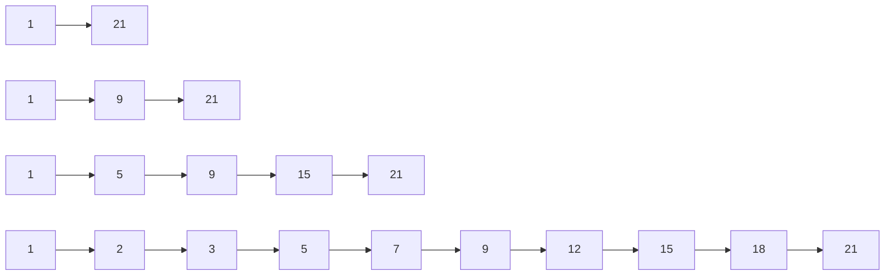

查找时从最高层开始跳，发现下一步会超过目标，就下降一层继续。它用随机层数近似平衡树的效果。

### 8.3 为什么排行榜适合 Skiplist

排行榜需要同时支持：

- 更新用户分数。
- 查询 Top N。
- 查询某个用户排名。
- 查询分数范围。

普通 Map 只能快速查用户分数。Heap 擅长 Top N，但不擅长任意用户排名。Skiplist 能维护分数顺序，因此适合排行榜。

生产级排行榜通常组合使用：

| 结构 | 作用 |
| --- | --- |
| `map[member]score` | 快速找到用户旧分数 |
| Skiplist | 按分数有序排列 |
| 快照数组 | 快速响应 Top N 高频读取 |

---

# 第三部分：并发数据结构设计

## 9. 线程安全的本质

线程安全不是“加锁”这么简单，而是让并发访问下的数据不变量始终成立。

Go 中的数据竞争是指：

- 两个 goroutine 同时访问同一块内存。
- 至少一个是写。
- 之间没有同步关系。

数据竞争的结果可能是读到旧值、读到不完整状态，甚至 Map 直接 panic。

### 9.1 三种设计思路

| 思路 | 适用场景 | 优点 | 缺点 |
| --- | --- | --- | --- |
| 共享内存 + 锁 | 通用结构 | 简单直接 | 有锁竞争 |
| 消息传递 | 状态顺序更新 | 不容易数据竞争 | 单点吞吐有限 |
| 不可变快照 | 读多写少 | 读路径快 | 写入复制成本高 |

这三种方案不是互斥的。生产系统经常混合使用：写路径用锁维护真实状态，读路径用不可变快照；或者入口用 channel 排队，内部用锁保护 Map。关键是先确定状态的所有权。

#### 方案一：共享内存 + 锁

这是最通用的方案。多个 goroutine 直接访问同一份状态，但所有访问都必须经过同一把锁。

```go
type Balance struct {
	mu     sync.Mutex
	amount int64
}

func (b *Balance) Deposit(delta int64) {
	b.mu.Lock()
	defer b.mu.Unlock()

	b.amount += delta
}

func (b *Balance) Withdraw(delta int64) bool {
	b.mu.Lock()
	defer b.mu.Unlock()

	if b.amount < delta {
		return false
	}
	b.amount -= delta
	return true
}

func (b *Balance) Value() int64 {
	b.mu.Lock()
	defer b.mu.Unlock()

	return b.amount
}
```

这段代码保护的不只是 `amount` 这个字段，而是“余额不能被并发写坏，且扣款不能扣成负数”这个不变量。`Withdraw` 里的检查和扣减必须在同一个临界区内完成。如果先检查、释放锁、再扣减，两个 goroutine 可能同时看到余额充足，最后把余额扣成负数。

生产中使用锁时，要给自己设一个检查清单：

- 哪些字段由这把锁保护？
- 哪些方法会读写这些字段？
- 是否有任何路径绕过了锁？
- 临界区内是否存在 RPC、DB、文件 IO、日志刷盘这类慢操作？

#### 方案二：消息传递

消息传递的思路是让一个 goroutine 独占状态，其他 goroutine 不直接修改状态，只发送命令。

```go
type accountCmd struct {
	kind  string
	delta int64
	reply chan int64
	ok    chan bool
}

type AccountActor struct {
	ch chan accountCmd
}

func NewAccountActor(initial int64) *AccountActor {
	a := &AccountActor{ch: make(chan accountCmd, 1024)}
	go a.loop(initial)
	return a
}

func (a *AccountActor) loop(balance int64) {
	for cmd := range a.ch {
		switch cmd.kind {
		case "deposit":
			balance += cmd.delta
			cmd.reply <- balance
		case "withdraw":
			if balance >= cmd.delta {
				balance -= cmd.delta
				cmd.ok <- true
			} else {
				cmd.ok <- false
			}
		case "value":
			cmd.reply <- balance
		}
	}
}
```

这个模型的原理是“状态串行化”。所有修改都在 `loop` 里按顺序发生，所以不需要锁。但它并不是免费午餐：单个 actor 只有一个 goroutine 处理命令，如果请求量太大，channel 会积压。因此生产中通常按 `accountID`、`roomID`、`boardID` 做分区，让多个 actor 分摊压力。

#### 方案三：不可变快照

不可变快照适合读多写少的数据，例如配置、规则、路由表、榜单 TopN。读请求直接拿当前快照，写请求构造一份新快照后一次性替换。

```go
type RouteTable struct {
	value atomic.Value // stores map[string]string
}

func NewRouteTable() *RouteTable {
	t := &RouteTable{}
	t.value.Store(map[string]string{})
	return t
}

func (t *RouteTable) Get(path string) (string, bool) {
	routes := t.value.Load().(map[string]string)
	target, ok := routes[path]
	return target, ok
}

func (t *RouteTable) Update(path string, target string) {
	old := t.value.Load().(map[string]string)
	next := make(map[string]string, len(old)+1)
	for k, v := range old {
		next[k] = v
	}
	next[path] = target
	t.value.Store(next)
}
```

关键原则是：发布出去的 `map` 不能再修改。`atomic.Value` 只保证指针替换是安全的，不会让 Map 本身变成并发安全。如果 `Update` 直接改 `old[path]`，读者仍然会和写者并发访问同一个 Map。

生产实践中，不可变快照常用在“读极多、写很少、允许读到上一版本”的场景。比如灰度规则每几秒更新一次，读请求每秒几十万次。让每个读请求加锁会把系统拖慢，而快照替换能让读路径接近普通 Map 查询。

### 9.2 分片 Map

全局一把锁的问题是所有请求都排队。分片 Map 把一个大 Map 拆成多个小 Map，每个 shard 有自己的锁。

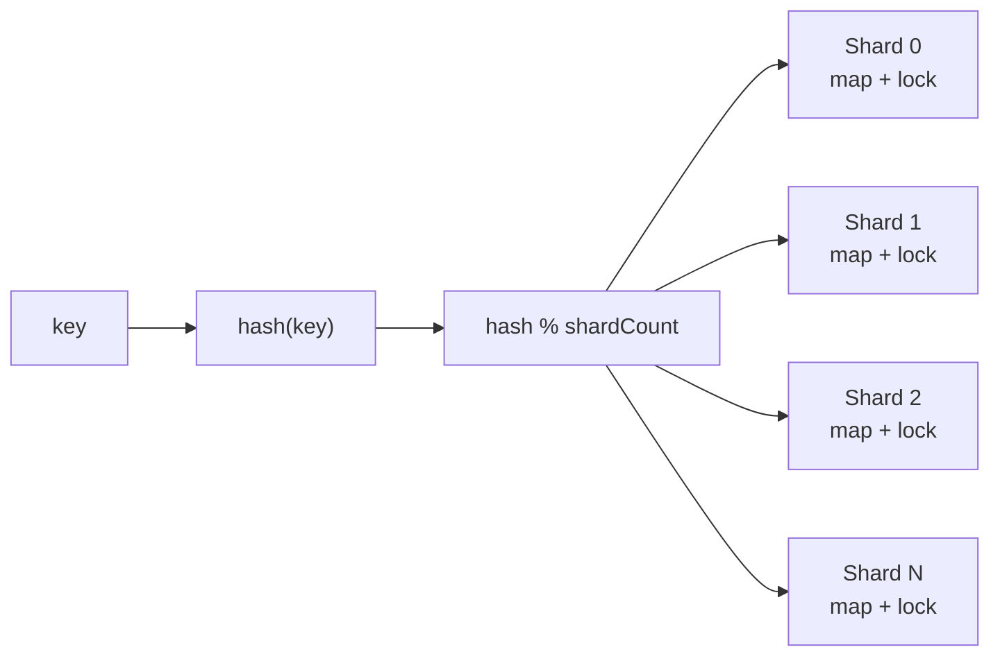

```go
const shardCount = 64

type shard struct {
	mu sync.RWMutex
	m  map[string]int64
}

type ShardedCounter struct {
	shards [shardCount]*shard
}

func NewShardedCounter() *ShardedCounter {
	c := &ShardedCounter{}
	for i := range c.shards {
		c.shards[i] = &shard{m: make(map[string]int64)}
	}
	return c
}

func (c *ShardedCounter) getShard(key string) *shard {
	h := fnv.New32a()
	h.Write([]byte(key))
	return c.shards[h.Sum32()%shardCount]
}
```

写入时根据 key 的 hash 找到对应 shard：

```go
func (c *ShardedCounter) Add(key string, delta int64) {
	s := c.getShard(key)
	s.mu.Lock()
	defer s.mu.Unlock()

	s.m[key] += delta
}
```

分片不是越多越好。分片越多，全量遍历和内存成本也越高。常见起点是 32、64、128，然后通过 benchmark 调整。

为了让这个结构能在真实代码中使用，还需要补上读取、快照和删除。下面是一个完整的计数器版本：

```go
func (c *ShardedCounter) Value(key string) int64 {
	s := c.getShard(key)
	s.mu.RLock()
	defer s.mu.RUnlock()

	return s.m[key]
}

func (c *ShardedCounter) Delete(key string) {
	s := c.getShard(key)
	s.mu.Lock()
	defer s.mu.Unlock()

	delete(s.m, key)
}

func (c *ShardedCounter) Snapshot() map[string]int64 {
	result := make(map[string]int64)

	for _, s := range c.shards {
		s.mu.RLock()
		for k, v := range s.m {
			result[k] = v
		}
		s.mu.RUnlock()
	}

	return result
}
```

`Snapshot` 需要特别解释。它逐个 shard 加读锁并复制数据，而不是直接返回内部 Map。这样调用方拿到的是一份普通副本，后续怎么遍历、排序、序列化，都不会阻塞写入路径，也不会破坏内部状态。

但这个快照不是严格同一时刻的全局快照。它复制 shard 0 时，shard 1 可能还在变化。如果业务需要“所有 shard 在同一个时间点完全一致”，就要引入全局版本、双缓冲快照，或者暂停写入后复制。多数统计、缓存、排行榜 TopN 场景可以接受这种弱一致；账务、库存、强一致扣减则不应该用这种方式。

生产使用方式：

- 分片 Map 适合 key 分布比较均匀的计数、缓存、状态表。
- 如果某个 key 是超级热点，分片锁也没用，因为热点永远落在同一个 shard。
- 全量遍历会扫所有 shard，不适合高频调用。高频 TopN 应该用后台快照，而不是请求来了再 `Snapshot + sort`。
- shard 数量应该固定或很少调整。动态扩容会涉及数据迁移，复杂度接近自己实现一个并发哈希表。

### 9.3 Copy-on-write 快照

配置、规则、路由表这类数据通常读很多，写很少。适合写时复制：

```go
type Snapshot struct {
	Rules map[string]Rule
}

type Store struct {
	value atomic.Value // stores *Snapshot
}
```

读请求直接读取当前快照，不需要加锁。更新时复制一份新数据，构造完成后一次性替换。

关键原则：快照发布后不能再修改。否则读者虽然无锁，仍然可能读到被并发修改的数据。

下面以“风控规则表”为例。读请求根据用户类型找规则，后台定时加载新规则：

```go
type Rule struct {
	MaxAmount int64
	Enabled   bool
}

type RuleSnapshot struct {
	Version int64
	Rules   map[string]Rule
}

type RuleStore struct {
	value atomic.Value // stores *RuleSnapshot
}

func NewRuleStore() *RuleStore {
	s := &RuleStore{}
	s.value.Store(&RuleSnapshot{Rules: map[string]Rule{}})
	return s
}

func (s *RuleStore) Match(userType string) (Rule, bool) {
	snapshot := s.value.Load().(*RuleSnapshot)
	rule, ok := snapshot.Rules[userType]
	return rule, ok
}

func (s *RuleStore) Replace(version int64, rules map[string]Rule) {
	next := make(map[string]Rule, len(rules))
	for k, v := range rules {
		next[k] = v
	}

	s.value.Store(&RuleSnapshot{
		Version: version,
		Rules:   next,
	})
}
```

为什么 `Replace` 里还要复制传入的 `rules`？因为调用方传进来的 Map 可能还会被它自己修改。如果直接保存引用，就把外部可变对象发布给了所有读者。生产代码里，任何要放进快照的 Map、slice、指针对象，都要确认是否真的不可变。

Copy-on-write 的典型落地：

- 配置中心下发规则，服务内原子替换。
- API 网关路由表、限流规则、灰度规则。
- 搜索、推荐、排行榜的读快照。
- 本地缓存的整批刷新。

它不适合高频写入。如果每秒更新几万次，每次都复制整个 Map，CPU 和内存分配会很高。此时应改用锁、分片锁或增量数据结构。

### 9.4 Actor 模型

Actor 模型让一个 goroutine 独占状态，其他 goroutine 通过消息请求它修改状态。

它适合强顺序场景，比如账户余额、库存扣减、房间状态。

优点是顺序清晰，缺点是单个 Actor 吞吐有限。高并发下通常要按用户 ID、房间 ID、订单 ID 做分区。

下面是一个更接近生产的库存 Actor。它支持扣减、查询和关闭：

```go
var ErrInsufficientStock = errors.New("insufficient stock")

type stockRequest struct {
	op    string
	n     int64
	reply chan stockResponse
}

type stockResponse struct {
	value int64
	err   error
}

type StockActor struct {
	ch     chan stockRequest
	closed chan struct{}
}

func NewStockActor(initial int64) *StockActor {
	a := &StockActor{
		ch:     make(chan stockRequest, 1024),
		closed: make(chan struct{}),
	}
	go a.loop(initial)
	return a
}

func (a *StockActor) loop(stock int64) {
	defer close(a.closed)

	for req := range a.ch {
		switch req.op {
		case "deduct":
			if stock < req.n {
				req.reply <- stockResponse{value: stock, err: ErrInsufficientStock}
				continue
			}
			stock -= req.n
			req.reply <- stockResponse{value: stock}
		case "value":
			req.reply <- stockResponse{value: stock}
		}
	}
}

func (a *StockActor) Deduct(ctx context.Context, n int64) (int64, error) {
	reply := make(chan stockResponse, 1)
	req := stockRequest{op: "deduct", n: n, reply: reply}

	select {
	case a.ch <- req:
	case <-ctx.Done():
		return 0, ctx.Err()
	}

	select {
	case resp := <-reply:
		return resp.value, resp.err
	case <-ctx.Done():
		return 0, ctx.Err()
	}
}

func (a *StockActor) Close() {
	close(a.ch)
	<-a.closed
}
```

这段代码里有两个重要细节：

1. `reply` 是带缓冲的 channel。这样调用方如果因为 `ctx` 超时提前返回，actor 后续发送响应时不会永久阻塞。
2. 发送请求和等待响应都监听 `ctx.Done()`。否则 actor 队列满或处理慢时，调用方会被无限挂住。

Actor 的生产使用方式：

- 每个 actor 的队列必须有上限，满了要返回忙碌错误或降级。
- actor 处理逻辑不能做慢 IO。慢 IO 应该拆到外部 worker，结果再发回 actor 更新状态。
- 单 actor 吞吐有限，需要按业务 key 分区。例如 `stockID % 128` 路由到不同 actor。
- actor 的生命周期要可控，空闲 actor 要能回收，否则海量 key 会创建海量 goroutine。

小结：线程安全设计的核心不是选择“锁还是 channel”，而是决定状态由谁拥有、谁能修改、修改是否有顺序要求、读者看到的是否必须是强一致状态。

---

# 第四部分：算法优化

## 10. Top K：不要为无关数据排序

Top K 的核心思想是：如果只需要前 K 个，就不要排序所有数据。

### 10.1 先问三个问题

1. 数据是一次性计算，还是持续更新？
2. K 相比 N 是很小，还是接近 N？
3. 结果必须实时，还是允许几秒延迟？

| 场景 | 推荐方案 |
| --- | --- |
| 一次性离线计算 | 排序、堆、QuickSelect |
| K 远小于 N | 小根堆 |
| 实时排行榜 | Skiplist 或有序结构 |
| 写入极高，读取很多 | 分片 Top K + 快照 |
| 海量热词 | 近似统计结构 |

这三个问题的参考答案：

1. 如果是一次性计算，比如离线统计昨天销量，排序或小根堆都可以；如果是持续更新，比如游戏排行榜，就要使用能动态更新的数据结构或分片快照。
2. 如果 K 很小，比如从 1 亿条里取前 100，小根堆非常合适；如果 K 接近 N，比如取前 80% 的用户，全量排序可能更简单，性能也未必差。
3. 如果结果必须实时，就要在写路径维护有序结构，成本较高；如果允许秒级延迟，就可以用后台合并和读快照，吞吐会好很多。

生产实践：

- Top K 结果要定义稳定排序规则，例如 `(score desc, update_time asc, member_id asc)`，否则同分用户排名会抖动。
- 读请求远多于写请求时，应优先考虑不可变快照，避免每次读都抢写锁或重新排序。
- 分片 Top K 合并时，每个 shard 至少保留 Top K 候选。如果全局要 Top 100，每个 shard 只保留 Top 10 是不安全的。
- 榜单要明确一致性语义：是实时排名、快照排名，还是“实时分数 + 快照排名”。接口文档要写清楚。
- 对超大规模热词，精确统计可能太贵，可以使用 Count-Min Sketch、Space-Saving 等近似算法，但要向业务说明误差。

### 10.2 强实时为什么贵

每次分数变化都立刻更新全局排名，意味着写路径要维护全局有序结构。写入越高，锁竞争越严重。

很多业务不需要毫秒级强实时。例如活动排行榜允许每秒刷新一次，用户几乎感知不到差别，但系统复杂度会大幅下降：

- 写请求更新分片数据。
- 后台每秒合并一次。
- 读请求读取快照。

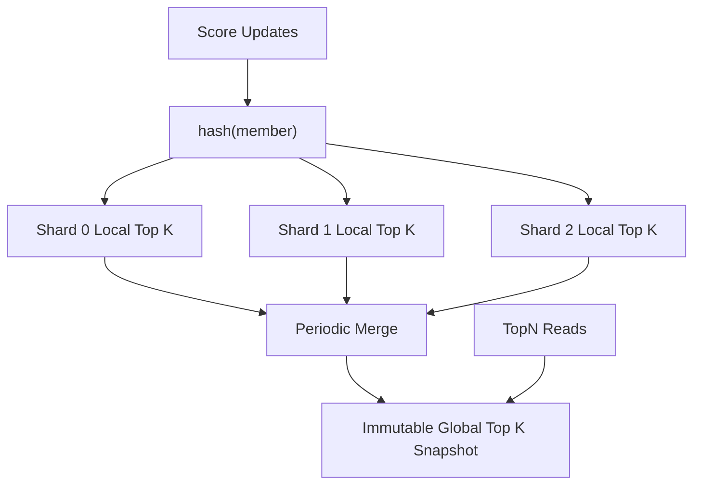

这是一种重要的工程取舍：用可接受的延迟换稳定性和吞吐。

### 10.3 三种 Top K 实现方式

Top K 没有唯一答案。常见实现有三类：全量排序、小根堆、QuickSelect。它们的差别在于是否需要完整有序、是否持续更新、实现复杂度是否可接受。

#### 全量排序：简单但成本高

```go
func TopKBySort(items []UserScore, k int) []UserScore {
	if k <= 0 {
		return nil
	}

	cp := append([]UserScore(nil), items...)
	sort.Slice(cp, func(i, j int) bool {
		if cp[i].Score != cp[j].Score {
			return cp[i].Score > cp[j].Score
		}
		return cp[i].UserID < cp[j].UserID
	})

	if k > len(cp) {
		k = len(cp)
	}
	return cp[:k]
}
```

全量排序适合数据量不大、K 接近 N、或者结果必须完整有序的场景。它的优点是简单、稳定、容易测试；缺点是 `O(n log n)`，当 N 很大且 K 很小时浪费明显。

#### 小根堆：大数据小 K 的常用方案

小根堆的核心是“只保留有希望进入 Top K 的元素”。堆大小固定为 K，堆顶是当前 Top K 里最低分。新元素如果不超过堆顶，直接忽略。

```go
func TopKByHeap(items []UserScore, k int) []UserScore {
	if k <= 0 {
		return nil
	}

	h := &MinHeap{}
	heap.Init(h)

	for _, item := range items {
		if h.Len() < k {
			heap.Push(h, item)
			continue
		}
		if item.Score > (*h)[0].Score {
			(*h)[0] = item
			heap.Fix(h, 0)
		}
	}

	out := make([]UserScore, h.Len())
	for i := len(out) - 1; i >= 0; i-- {
		out[i] = heap.Pop(h).(UserScore)
	}
	return out
}
```

这里使用 `heap.Fix` 替代 `Pop + Push`，可以少一次调整。复杂度是 `O(n log k)`，当 `k` 远小于 `n` 时收益明显。

#### QuickSelect：只找分界线

QuickSelect 的思想是快速找到第 K 大的分界点，然后只排序前 K 个候选。它平均复杂度接近 `O(n)`，但实现比堆更容易写错，最坏情况会退化。

```go
func TopKByQuickSelect(items []UserScore, k int) []UserScore {
	if k <= 0 {
		return nil
	}
	if k >= len(items) {
		return TopKBySort(items, k)
	}

	cp := append([]UserScore(nil), items...)
	// nthElement 是 QuickSelect 的分区函数：将第 k 大的元素放到 cp[k-1] 位置，
	// 并使 cp[:k] 都不小于 cp[k:]。完整实现可以参考算法教材；为保证最坏情况稳定，
	// 生产中通常采用随机化或 median-of-medians 选择枢轴。
	nthElement(cp, k)

	top := append([]UserScore(nil), cp[:k]...)
	sort.Slice(top, func(i, j int) bool {
		if top[i].Score != top[j].Score {
			return top[i].Score > top[j].Score
		}
		return top[i].UserID < top[j].UserID
	})
	return top
}
```

生产建议：业务代码里优先使用排序或堆。QuickSelect 适合离线任务、算法库或对性能非常敏感且有充分测试的场景。在线服务里，清晰和稳定通常比少量平均性能收益更重要。

### 10.4 生产中的 Top K 不是一个函数

真实 Top K 往往是一个系统问题，而不是一个函数问题。以“全站实时热词 Top 100”为例，生产实现通常分为几层：

1. 写入层：接收用户搜索词，先做清洗、归一化、限流。
2. 分片聚合层：按词 hash 到多个 shard，局部计数。
3. 局部 Top K：每个 shard 定期产出 Top 100 或 Top 200 候选。
4. 全局合并层：合并各 shard 候选，生成全局快照。
5. 查询层：只读不可变快照，保证低延迟。

这套设计的原理是把高频写入和高频读取解耦。写入不直接维护一个全局大锁结构，读取不每次触发全量计算。代价是结果有刷新延迟，但系统容量大幅提升。

---

## 11. 高频访问优化

高频路径优化的第一原则是：不要在每个请求里做重复且昂贵的事情。

常见成本包括：

- 锁竞争。
- 内存分配。
- 全量扫描。
- 全量排序。
- 数据库访问。
- 序列化和反序列化。
- 同步日志。

### 11.1 缓存的几个坑

| 问题 | 含义 | 解决方向 |
| --- | --- | --- |
| 缓存击穿 | 热点 key 过期，大量请求同时回源 | singleflight |
| 缓存穿透 | 查询不存在的数据 | 空值缓存 |
| 缓存雪崩 | 大量 key 同时过期 | TTL 加随机抖动 |
| 热点 key | 单个 key 被大量访问 | 多副本、分片、预热 |

缓存的目标不是让数据永远不变，而是在可接受的一致性范围内减少后端压力。

缓存问题的参考答案与生产解读：

- 缓存击穿的最佳做法是 singleflight。多个请求同时发现热点 key 过期时，只允许一个请求回源，其余请求等待结果或使用旧值。完整代码示例见[附录 A.5](#a5-singleflight合并重复请求)。
- 缓存穿透要缓存“不存在”的结果，但 TTL 要短，避免后来数据创建后仍长期返回不存在。
- 缓存雪崩要给 TTL 加随机抖动，例如基础 TTL 10 分钟，额外随机 0 到 60 秒，避免大量 key 同时失效。
- 热点 key 可以做本地缓存、多副本缓存、读写分离或提前预热。极端热点下，单个 Redis key 本身也会成为瓶颈。

生产实践：

- 缓存值要有版本或更新时间，方便排查“为什么用户看到旧数据”。
- 对核心数据使用 cache-aside 时，更新数据库后要删除缓存，而不是直接更新缓存。删除失败要有重试或消息补偿。
- 对读多写少的数据，可以使用本地内存缓存 + 远程缓存两级结构，但要注意本地缓存失效和容量上限。
- 热路径里不要同步打印大日志，不要每次都 JSON 序列化大对象，可以缓存序列化结果。
- 缓存不是一致性方案。涉及资金、库存、权限等关键数据时，缓存只能加速读取，最终判断仍应基于权威存储或强一致服务。

### 11.2 热路径优化示例：缓存序列化结果

很多接口的瓶颈不是数据库，而是每次请求都重复构造响应、排序、JSON 序列化。对于读多写少的数据，可以把序列化后的结果也放入快照。

```go
type TopSnapshot struct {
	Entries []Entry
	JSON    []byte
	At      time.Time
}

type TopCache struct {
	value atomic.Value // stores *TopSnapshot
}

func (c *TopCache) LoadJSON() ([]byte, bool) {
	v := c.value.Load()
	if v == nil {
		return nil, false
	}
	s := v.(*TopSnapshot)
	return append([]byte(nil), s.JSON...), true
}

func (c *TopCache) Store(entries []Entry) error {
	cp := append([]Entry(nil), entries...)
	data, err := json.Marshal(cp)
	if err != nil {
		return err
	}
	c.value.Store(&TopSnapshot{
		Entries: cp,
		JSON:    data,
		At:      time.Now(),
	})
	return nil
}
```

这里 `LoadJSON` 返回 `JSON` 的副本，是为了避免调用方修改内部字节切片。生产中如果响应写出后不会被修改，也可以通过约定减少拷贝，但前提是团队能严格遵守不可变规则。

这个优化背后的原理是“把重复计算从请求路径移到刷新路径”。如果榜单每秒刷新一次，而接口每秒被请求 5 万次，序列化一次和序列化 5 万次的成本差别非常大。

### 11.3 singleflight 的正确使用位置

`singleflight` 适合放在缓存回源处，而不是整个接口入口处。下面是一个典型 cache-aside 读取：

```go
type UserService struct {
	cache Cache
	group singleflight.Group
}

func (s *UserService) GetUser(ctx context.Context, id int64) (*User, error) {
	key := fmt.Sprintf("user:%d", id)

	if u, ok := s.cache.Get(key); ok {
		return u.(*User), nil
	}

	v, err, _ := s.group.Do(key, func() (any, error) {
		if u, ok := s.cache.Get(key); ok {
			return u.(*User), nil
		}

		u, err := loadUserFromDB(ctx, id)
		if err != nil {
			return nil, err
		}
		s.cache.Set(key, u, 5*time.Minute)
		return u, nil
	})
	if err != nil {
		return nil, err
	}
	return v.(*User), nil
}
```

回调里再次读缓存是必要的。因为当前 goroutine 等待进入 singleflight 回调期间，可能已经有别的请求把缓存填好了。这个二次检查可以减少不必要的 DB 访问。

生产注意点：

- singleflight 只合并同进程内的请求，多实例部署时还需要远程缓存或分布式锁配合。
- 不要对所有用户共用同一个 key，否则会把无关请求串行化。
- 回源必须有超时。否则热点 key 的所有等待者都会被一个慢查询拖住。
- 对不存在的数据也要缓存短 TTL 的空值，防止穿透。

---

## 12. 增量聚合：把查询成本前移

增量聚合的思想很简单：不要每次查询都重新扫描原始数据，而是在写入时维护统计结果。

### 12.1 为什么它有效

假设每秒写入 10 万条事件，查询最近 1 小时点击数。如果每次查询都扫描原始事件，查询成本会随着数据量增长。

如果按分钟聚合，查询 1 小时只需要读取 60 个桶。

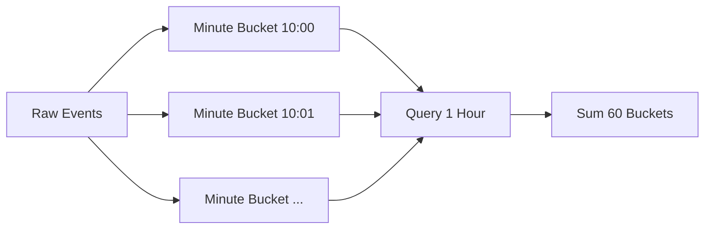

这就是增量聚合的本质：用写入时的一点成本，换取查询时的大幅降本。

### 12.2 桶粒度怎么选

| 粒度 | 适用 |
| --- | --- |
| 秒桶 | 精细实时监控 |
| 分钟桶 | 最近几小时趋势 |
| 小时桶 | 最近几天统计 |
| 天桶 | 长期报表 |

生产中常用多级聚合。查询大范围时用小时桶、天桶；查询边界部分时用分钟桶补齐精度。

参考答案：哪些指标适合增量聚合？

适合增量聚合的指标通常有可加性或可合并性，例如 PV、UV 近似值、点击数、订单数、金额总和、最大值、最小值、Top K 候选集合。不适合直接增量聚合的是需要复杂去重、强事务一致性、频繁修正历史、或者查询维度临时变化非常多的指标。

解读：增量聚合的关键是“状态能否被稳定维护”。计数和求和很好维护，复杂漏斗分析、任意条件筛选则可能需要保留明细或使用专门的 OLAP 系统。

生产实践：

- 明确窗口语义，推荐使用 `[start, end)`，避免边界重复计算。
- 事件中同时保存 `event_time` 和 `ingest_time`。前者表示业务发生时间，后者表示系统接收时间。
- 对迟到事件设置允许修正窗口，例如最近 10 分钟可修正，超过窗口进入离线补偿。
- 聚合桶要有 TTL 或归档策略，不能无限增长。
- 保留原始事件日志。聚合逻辑出错、口径变化或补数据时，可以重放修复。
- 查询大范围时使用粗粒度桶，查询边界时使用细粒度桶，这能显著减少扫描量。

### 12.3 迟到事件

真实事件可能乱序到达。移动端离线、网络重试、消息队列积压都会造成迟到事件。

处理方式：

- 允许修正最近一段时间的桶。
- 太晚的事件进入补偿任务。
- 同时记录业务发生时间和服务接收时间。
- 保留原始日志，必要时重算。

### 12.4 示例：分钟桶聚合器

下面的例子实现了一个按分钟聚合的计数器。它适合教学理解增量聚合的基本形态：

```go
type Event struct {
	Action    string
	EventTime time.Time
}

type minuteKey struct {
	Action string
	Minute int64
}

type MinuteAggregator struct {
	mu      sync.RWMutex
	buckets map[minuteKey]int64
}

func NewMinuteAggregator() *MinuteAggregator {
	return &MinuteAggregator{buckets: make(map[minuteKey]int64)}
}

func minuteOf(t time.Time) int64 {
	return t.Unix() / 60
}

func (a *MinuteAggregator) Add(e Event) {
	key := minuteKey{
		Action: e.Action,
		Minute: minuteOf(e.EventTime),
	}

	a.mu.Lock()
	defer a.mu.Unlock()
	a.buckets[key]++
}

func (a *MinuteAggregator) Count(action string, start, end time.Time) int64 {
	startMinute := minuteOf(start)
	endMinute := minuteOf(end.Add(-time.Nanosecond))

	a.mu.RLock()
	defer a.mu.RUnlock()

	var total int64
	for m := startMinute; m <= endMinute; m++ {
		total += a.buckets[minuteKey{Action: action, Minute: m}]
	}
	return total
}
```

这个实现故意简单，便于理解，但生产中还需要补几件事：

- 查询窗口使用 `[start, end)`，所以计算结束分钟时要处理边界。
- `Add` 要拒绝过早或过晚的事件，避免攻击者或错误客户端创建无限历史桶。
- `buckets` 要定期清理，否则服务运行越久内存越大。
- 如果 action 很多，单个 Map 会变成热点，应按 action 或用户分片。

### 12.5 多级桶查询的原理

分钟桶适合查最近几十分钟，天桶适合查几个月。多级桶查询的原则是：边界用细粒度，中间完整区间用粗粒度。

假设要查 `[10:07, 13:42)`：

```text
10:07 - 10:59  使用分钟桶
11:00 - 12:59  使用小时桶
13:00 - 13:42  使用分钟桶
```

这样既保证边界精度，又避免扫描 215 个分钟桶。窗口越大，多级桶收益越明显。

生产中常见结构：

```go
type MultiLevelAggregator struct {
	minutes *MinuteAggregator
	hours   *HourAggregator
	days    *DayAggregator
}
```

小时桶和天桶可以由后台任务从已经完整的分钟桶归并出来。注意不要聚合“还在变化的当前分钟”，否则迟到事件会导致小时桶与分钟桶不一致。常见做法是延迟 1 到 2 分钟再归并完整分钟。

---

# 第五部分：工程化设计

## 13. 接口设计

好的接口表达能力边界，而不是暴露实现细节。

```go
type Entry struct {
	Member string
	Score  int64
	Rank   int64
}

type Store interface {
	AddScore(ctx context.Context, board string, member string, delta int64) (int64, error)
	TopN(ctx context.Context, board string, n int) ([]Entry, error)
	Rank(ctx context.Context, board string, member string) (Entry, error)
}
```

接口设计建议：

- 接口尽量小。
- 第一个参数使用 `context.Context`。
- 错误语义要稳定。
- 不暴露内部锁、Map、Skiplist。
- 对分页、过滤、排序使用请求对象，避免参数爆炸。

### 13.1 用请求对象表达查询语义

当参数超过三四个时，继续堆函数参数会让接口难以演进。请求对象可以清楚表达默认值、边界和兼容性。

```go
type TopNRequest struct {
	Board     string
	Limit     int
	Offset    int
	Consistent bool
}

type TopNResponse struct {
	Entries   []Entry
	SnapshotAt time.Time
	Stale      bool
}

type Leaderboard interface {
	AddScore(ctx context.Context, board string, member string, delta int64) (Entry, error)
	TopN(ctx context.Context, req TopNRequest) (TopNResponse, error)
	Rank(ctx context.Context, board string, member string) (Entry, error)
}
```

`Consistent` 不一定意味着系统必须提供强一致实现，但它给接口留下了表达空间。比如当前版本只支持快照查询，可以在 `Consistent=true` 时返回 `ErrUnsupportedConsistency`，而不是以后破坏接口签名。

生产接口要把一致性语义写清楚：

- `AddScore` 返回的是写入后的实时分数，还是排队后的受理结果？
- `TopN` 是实时榜单，还是最近一次快照？
- `Rank` 找不到用户时返回 `ErrNotFound`，还是返回空排名？
- 分页过程中榜单刷新，是否保证同一页视图一致？

这些问题不提前定义，调用方会根据自己的理解使用接口，后续很难兼容。

---

## 14. 错误处理

Go 的错误处理强调显式返回。生产系统里要区分错误类型。

```go
var ErrNotFound = errors.New("not found")
var ErrRateLimited = errors.New("rate limited")

func loadUser(id int64) error {
	return fmt.Errorf("load user %d: %w", id, ErrNotFound)
}
```

建议：

- 底层错误要 wrap 上下文。
- 边界层转换成稳定错误码。
- 不用字符串比较错误。
- 区分可重试和不可重试错误。
- 不要每一层都重复打日志。

### 14.1 给错误加上稳定语义

生产系统里，错误不仅给人看，也给程序判断。推荐定义稳定错误，再用 `errors.Is` 判断：

```go
var (
	ErrNotFound       = errors.New("not found")
	ErrBusy           = errors.New("busy")
	ErrInvalidRequest = errors.New("invalid request")
)

func validateTopN(n int) error {
	if n <= 0 || n > 1000 {
		return fmt.Errorf("%w: n must be in [1,1000]", ErrInvalidRequest)
	}
	return nil
}

func writeHTTPError(w http.ResponseWriter, err error) {
	switch {
	case errors.Is(err, ErrInvalidRequest):
		http.Error(w, err.Error(), http.StatusBadRequest)
	case errors.Is(err, ErrNotFound):
		http.Error(w, err.Error(), http.StatusNotFound)
	case errors.Is(err, ErrBusy):
		http.Error(w, err.Error(), http.StatusTooManyRequests)
	default:
		http.Error(w, "internal error", http.StatusInternalServerError)
	}
}
```

这里不要用字符串比较。字符串是给人看的，后续很容易变化；错误类型和错误码才是给程序判断的。

生产日志也要避免重复。通常在边界层打日志，例如 HTTP handler、消息消费入口、定时任务入口。底层函数只负责 wrap 错误上下文：

```go
func LoadBoard(ctx context.Context, id string) (*Board, error) {
	board, err := repo.FindBoard(ctx, id)
	if err != nil {
		return nil, fmt.Errorf("find board %s: %w", id, err)
	}
	return board, nil
}
```

如果每一层都打印一次同一个错误，线上日志会被放大，排障反而更困难。

---

## 15. 日志、指标与测试

高并发系统不能靠猜。至少要观察：

| 指标 | 说明 |
| --- | --- |
| QPS | 当前吞吐 |
| p99 延迟 | 尾延迟 |
| 错误率 | 系统健康度 |
| 队列长度 | 是否积压 |
| goroutine 数 | 是否泄漏 |
| 内存和 GC | 是否有分配压力 |
| 限流数 | 是否过载 |

常用命令：

```bash
go test ./...
go test -race ./...
go test -bench=. -benchmem ./...
```

并发结构一定要跑 race test。性能优化一定要跑 benchmark。

### 15.1 指标要和系统边界对应

指标不是越多越好，而是要覆盖关键边界。以 worker pool 为例，至少要有：

```text
pool_submit_total{result="ok|busy|timeout"}
pool_queue_length
pool_task_duration_seconds
pool_worker_busy
pool_panic_total
```

这些指标对应系统的核心问题：

- `submit_total` 看入口是否被拒绝。
- `queue_length` 看是否积压。
- `task_duration` 看处理是否变慢。
- `worker_busy` 看 worker 是否打满。
- `panic_total` 看任务是否有未处理异常。

日志适合记录离散事件，指标适合观察趋势，trace 适合定位单次请求路径，pprof 适合分析 CPU、内存和 goroutine。不要试图用日志替代所有观测手段。

### 15.2 并发测试示例

并发数据结构要同时测正确性和 race。下面是分片计数器的测试思路：

```go
func TestShardedCounterConcurrentAdd(t *testing.T) {
	c := NewShardedCounter()

	var wg sync.WaitGroup
	for i := 0; i < 100; i++ {
		wg.Add(1)
		go func() {
			defer wg.Done()
			for j := 0; j < 1000; j++ {
				c.Add("hot", 1)
			}
		}()
	}
	wg.Wait()

	if got := c.Value("hot"); got != 100000 {
		t.Fatalf("value=%d, want=100000", got)
	}
}
```

运行：

```bash
go test -race ./...
```

`-race` 不能证明没有并发 bug，但能抓住大量真实问题。对核心并发结构，race test 应该是 CI 的一部分。

### 15.3 benchmark 要回答具体问题

不要为了 benchmark 而 benchmark。好的 benchmark 应该回答一个选择题：`Mutex` 和 `RWMutex` 哪个更适合这个读写比例？分片数 32 和 128 哪个更好？快照查询是否真的比实时排序快？

```go
func BenchmarkShardedCounterAdd(b *testing.B) {
	c := NewShardedCounter()
	b.RunParallel(func(pb *testing.PB) {
		for pb.Next() {
			c.Add("user:123", 1)
		}
	})
}
```

如果所有 goroutine 都写同一个 key，这个 benchmark 测的是热点竞争；如果 key 随机分布，测的是分片扩展性。两者都重要，但含义完全不同。写 benchmark 时要让数据分布接近真实流量。

---

# 第六部分：高并发系统设计

## 16. Worker Pool：给系统设置边界

worker pool 的价值不是“并发处理任务”这么简单，而是限制系统最多同时处理多少任务。

没有 worker pool 的写法：

```go
for _, task := range tasks {
	go handle(task)
}
```

如果任务很多，这会瞬间创建大量 goroutine。worker pool 则让并发数量可控。

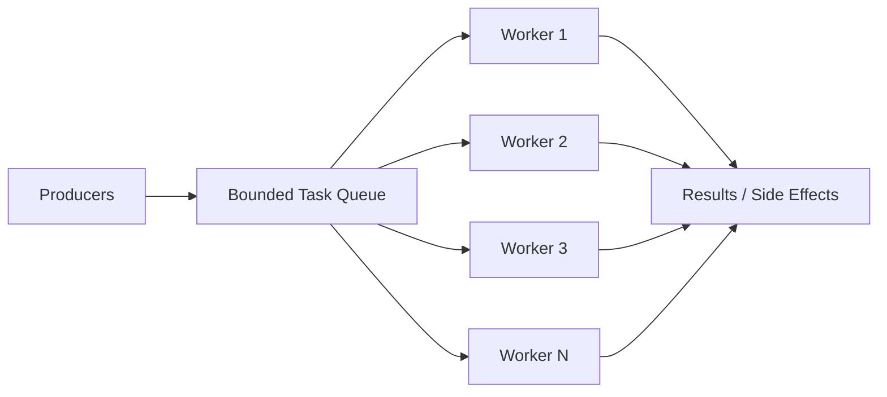

### 16.1 worker 数量如何估算

粗略公式：

```text
并发数 ≈ 目标吞吐量 * 平均处理耗时
```

如果希望每秒处理 2000 个事件，每个事件平均耗时 10ms，那么需要大约：

```text
2000 * 0.01 = 20
```

这只是起点。还要结合 CPU、内存、p99 延迟、下游容量压测调整。

参考答案与解读：

- CPU 密集型任务：worker 数通常接近 CPU 核数，过多只会增加上下文切换。
- IO 密集型任务：worker 数可以高于 CPU 核数，但不能超过下游能承受的并发。
- 数据库任务：worker 数不能只看应用，要看连接池大小、慢查询、数据库 CPU 和锁等待。
- 混合任务：最好拆成多个阶段，例如解析、计算、写库分别使用不同 pool，避免慢 IO 阻塞 CPU 任务。

生产实践：

- worker 数和队列长度都做成配置，但要有上限，避免误配置。
- 启动后暴露当前 worker 数、busy worker 数、队列长度、任务耗时、失败数。
- 任务执行要加 recover，panic 不能让 worker 静默退出。
- 不同优先级任务不要共用一个队列，否则低优先级任务可能阻塞关键任务。

### 16.2 队列长度如何估算

队列不是越长越好。它应该由可接受排队时间反推：

```text
队列长度 ≈ 处理吞吐量 * 可接受排队秒数
```

如果每秒处理 5000 个任务，最多接受排队 2 秒，队列长度可以从 10000 附近开始测试。

### 16.3 生产级 worker pool 要考虑

- 任务错误如何处理。
- worker panic 如何 recover。
- 队列满了怎么办。
- 服务关闭时是否 drain。
- 是否暴露队列长度和处理耗时。

这些问题的推荐答案：

| 问题 | 推荐做法 |
| --- | --- |
| 任务错误如何处理 | 返回错误后统一记录指标和日志，必要时进入重试队列 |
| panic 如何 recover | worker 外层 `defer recover`，记录堆栈并继续服务 |
| 队列满了怎么办 | 在线请求快速失败，后台任务可短暂等待或转持久队列 |
| 服务关闭是否 drain | 先停止接收新任务，再等待已接收任务完成，设置最大等待时间 |
| 任务是否可重试 | 只重试幂等任务，并设置最大次数和退避 |

一个生产级 worker pool 至少应该具备：有界队列、提交超时、错误回调、panic recover、优雅关闭、指标暴露。否则它只是一个教学示例。

### 16.4 教学版 worker pool 实现

下面的实现展示核心结构：有界队列、提交超时、panic recover、关闭等待。

```go
var ErrPoolClosed = errors.New("pool closed")
var ErrPoolBusy = errors.New("pool busy")

type Task func(context.Context) error

type Pool struct {
	queue chan Task
	wg    sync.WaitGroup

	mu        sync.RWMutex
	closeOnce sync.Once
	closed    chan struct{}
	onError   func(error)
}

func NewPool(workers int, queueSize int, onError func(error)) *Pool {
	p := &Pool{
		queue:   make(chan Task, queueSize),
		closed:  make(chan struct{}),
		onError: onError,
	}

	for i := 0; i < workers; i++ {
		p.wg.Add(1)
		go p.worker()
	}
	return p
}

func (p *Pool) Submit(ctx context.Context, task Task) error {
	p.mu.RLock()
	defer p.mu.RUnlock()

	select {
	case <-p.closed:
		return ErrPoolClosed
	default:
	}

	select {
	case p.queue <- task:
		return nil
	case <-p.closed:
		return ErrPoolClosed
	case <-ctx.Done():
		return ctx.Err()
	default:
		return ErrPoolBusy
	}
}

func (p *Pool) worker() {
	defer p.wg.Done()

	for task := range p.queue {
		func() {
			defer func() {
				if r := recover(); r != nil && p.onError != nil {
					p.onError(fmt.Errorf("task panic: %v", r))
				}
			}()

			if err := task(context.Background()); err != nil && p.onError != nil {
				p.onError(err)
			}
		}()
	}
}

func (p *Pool) Shutdown(ctx context.Context) error {
	p.closeOnce.Do(func() {
		p.mu.Lock()
		defer p.mu.Unlock()

		close(p.closed)
		close(p.queue)
	})

	done := make(chan struct{})
	go func() {
		p.wg.Wait()
		close(done)
	}()

	select {
	case <-done:
		return nil
	case <-ctx.Done():
		return ctx.Err()
	}
}
```

这个版本仍然是教学版，因为它没有指标、任务级超时、优先级、动态扩缩容和 drain 进度。但它已经具备生产实现的骨架。

注意 `Submit` 中的 `default` 表示队列满时快速失败。如果业务希望短暂等待，可以移除 `default`，让它等待 `ctx` 超时或入队成功，但此时不要在等待入队期间长期持有关闭锁。在线请求通常更适合快速失败；后台任务可以接受有限等待。

---

## 17. Fan-out / Fan-in：并行也会放大流量

Fan-out 能降低延迟。例如一个接口要查 5 个下游，串行可能 250ms，并行后接近最慢的那个下游。

但 fan-out 会放大流量。一个请求 fan-out 到 10 个下游，1 万 QPS 会变成 10 万次下游调用。

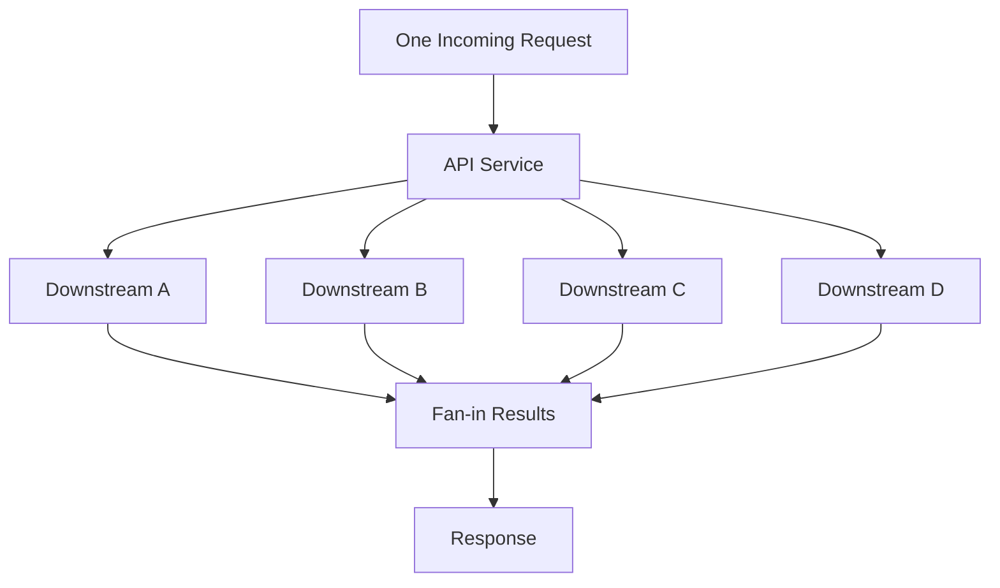

因此 fan-out 必须有：

- 总超时。
- 单下游超时。
- 最大并发数。
- 失败策略。
- 取消机制。

参考答案：fan-out 的失败策略怎么选？

| 业务类型 | 策略 | 解读 |
| --- | --- | --- |
| 支付、扣库存 | 全部成功或明确失败 | 不能返回部分成功让调用方误解 |
| 聚合页面 | 部分成功 | 核心信息展示，非核心模块可降级 |
| 多机房读 | 最快成功 | 谁先返回用谁，拿到结果后取消其他请求 |
| 多副本写 | Quorum | 达到多数成功即可返回 |
| 埋点、日志 | Best effort | 失败记录指标，不阻塞主流程 |

生产实践：

- 对每个下游设置独立并发限制，不能只限制入口请求数。
- fan-out 请求要继承入口 context，但单下游可以有更短 timeout。
- 拿到足够结果后立刻 cancel 剩余请求，减少无效消耗。
- 失败结果要能区分：超时、限流、业务失败、下游不可用。
- 对非核心下游要允许降级，不要让一个推荐服务拖垮整个首页。

常见失败策略：

| 策略 | 场景 |
| --- | --- |
| 全部成功 | 金融、强一致流程 |
| 部分成功 | 聚合页、推荐页 |
| 最快成功 | 多机房读 |
| Quorum | 多副本系统 |
| Best effort | 日志、埋点 |

### 17.1 示例：带并发上限的批量查询

批量查询最容易写成“每个 ID 一个 goroutine”。更稳妥的方式是使用 `errgroup.SetLimit` 限制并发：

```go
func LoadUsers(ctx context.Context, ids []int64) ([]User, error) {
	g, ctx := errgroup.WithContext(ctx)
	g.SetLimit(20)

	results := make([]User, len(ids))

	for i, id := range ids {
		i, id := i, id
		g.Go(func() error {
			user, err := loadUser(ctx, id)
			if err != nil {
				return err
			}
			results[i] = user
			return nil
		})
	}

	if err := g.Wait(); err != nil {
		return nil, err
	}
	return results, nil
}
```

这里每个 goroutine 写不同下标，所以不会互相覆盖。但如果写的是同一个 Map，就必须加锁或先写局部结果再合并。

`SetLimit(20)` 的生产含义不是“20 一定最好”，而是给下游设置最大并发。这个值应该参考下游连接池、服务限流、压测结果和入口 QPS。没有这个上限时，一个大请求就可能瞬间打满下游。

### 17.2 拿到足够结果后取消剩余请求

有些场景只需要最快成功的一份结果，例如多机房读：

```go
func Fastest(ctx context.Context, replicas []string, key string) (string, error) {
	ctx, cancel := context.WithCancel(ctx)
	defer cancel()

	type result struct {
		value string
		err   error
	}
	ch := make(chan result, len(replicas))

	for _, replica := range replicas {
		replica := replica
		go func() {
			value, err := readFromReplica(ctx, replica, key)
			ch <- result{value: value, err: err}
		}()
	}

	var lastErr error
	for range replicas {
		r := <-ch
		if r.err == nil {
			cancel()
			return r.value, nil
		}
		lastErr = r.err
	}
	return "", lastErr
}
```

`ch` 用带缓冲是为了避免 `cancel()` 后其它 goroutine 返回时卡在发送结果上。生产中还要限制 replicas 数量，或者复用 worker pool，避免一次请求启动过多 goroutine。

---

## 18. Backpressure：承认系统有容量上限

背压就是系统处理不过来时，向上游明确表达“我现在不能再接了”。

如果没有背压，压力会藏在队列里：

```text
请求进入
  |
队列积压
  |
延迟升高
  |
调用方超时重试
  |
系统更忙
```

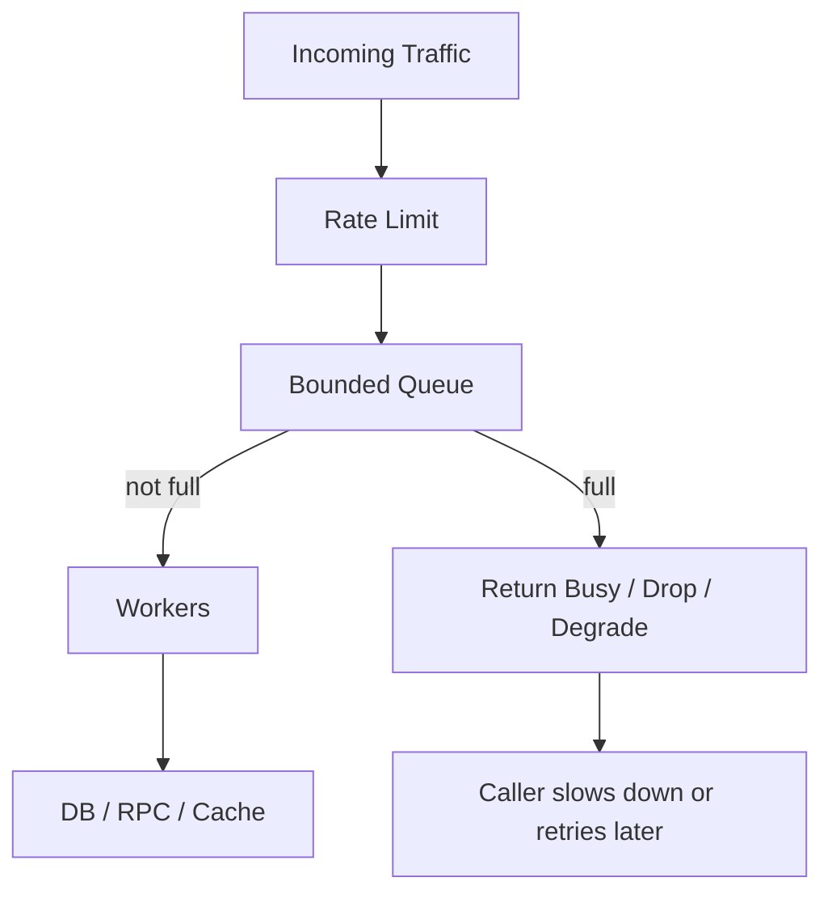

背压策略：

| 策略 | 适用 |
| --- | --- |
| 阻塞等待 | 不能轻易丢任务 |
| 快速失败 | 在线请求 |
| 丢弃最新 | 日志、指标 |
| 丢弃最旧 | 保留最新状态 |
| 降级处理 | 搜索、推荐、聚合页 |

背压不是失败，而是系统自我保护。

参考答案：队列满了到底该怎么办？

最佳答案取决于业务价值和可补偿性：

- 在线读请求：快速失败或返回降级结果，避免用户一直等待。
- 可丢弃事件：直接丢弃并记录丢弃数量，例如部分日志和指标。
- 关键写入：短暂等待，失败后写入可靠队列或返回明确错误，由调用方重试。
- 状态刷新：可以丢弃旧任务，保留最新任务。

生产实践：

- 背压错误要有明确错误码，例如 `ErrBusy`、`ErrQueueFull`、`RESOURCE_EXHAUSTED`。
- 记录队列长度、入队等待时间、丢弃数、快速失败数。
- 客户端重试必须有指数退避和抖动，不能立即重试。
- 背压应该尽量发生在靠近入口的位置，越早拒绝，浪费越少。
- 不要把背压全部转移给数据库。数据库通常是更稀缺也更共享的资源。

### 18.1 背压要变成代码分支

背压不是文档里的口号，而是明确的代码路径。下面是一个有界写入队列：

```go
type AsyncWriter struct {
	queue chan Event
}

func NewAsyncWriter(size int) *AsyncWriter {
	return &AsyncWriter{queue: make(chan Event, size)}
}

func (w *AsyncWriter) Write(ctx context.Context, e Event) error {
	select {
	case w.queue <- e:
		return nil
	case <-ctx.Done():
		return ctx.Err()
	default:
		return ErrBusy
	}
}
```

这个实现的行为非常明确：

- 队列没满：接受任务。
- 请求已经取消：返回取消错误。
- 队列已满：立即返回 `ErrBusy`。

如果业务不能丢任务，可以把 `default` 去掉，让请求等待一小段时间：

```go
func (w *AsyncWriter) WriteWait(ctx context.Context, e Event) error {
	select {
	case w.queue <- e:
		return nil
	case <-ctx.Done():
		return ctx.Err()
	}
}
```

但等待必须受 `ctx` 控制。无限等待会把压力从队列转移到请求 goroutine，最后表现为 goroutine 数暴涨和入口超时。

### 18.2 丢弃策略也要符合业务语义

不同队列满时的处理策略不同：

```go
type LatestQueue struct {
	mu    sync.Mutex
	items []Event
	limit int
}

func (q *LatestQueue) Push(e Event) {
	q.mu.Lock()
	defer q.mu.Unlock()

	if len(q.items) == q.limit {
		copy(q.items[0:], q.items[1:])
		q.items[len(q.items)-1] = e
		return
	}
	q.items = append(q.items, e)
}
```

这个队列满时丢弃最旧事件，保留最新事件。它适合“状态刷新”类任务，例如更新用户在线状态、刷新推荐缓存。不适合订单、支付、库存，因为旧事件同样有业务价值。

生产实践中，背压策略应该写进接口文档和指标：

- 返回 `ErrBusy` 的请求是否应该重试？
- 客户端重试等待多久？
- 丢弃了多少任务？
- 被丢弃的任务是否有补偿路径？

---

## 19. 限流：系统的安全阀

限流控制进入系统的请求速率。它的目标不是让所有请求成功，而是在过载时让系统保持可用。

常见算法：

| 算法 | 特点 |
| --- | --- |
| 固定窗口 | 简单，但边界有突刺 |
| 滑动窗口 | 平滑，成本稍高 |
| 漏桶 | 固定速率流出 |
| 令牌桶 | 允许短暂突发，最常用 |

限流位置：

- 网关限流。
- 服务实例限流。
- 用户维度限流。
- 接口维度限流。
- 下游依赖限流。

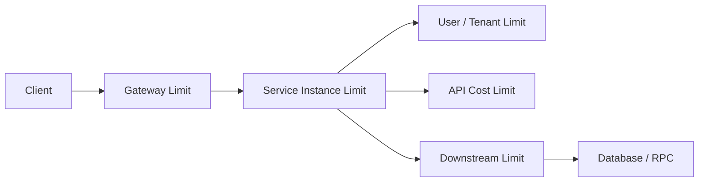

限流响应要明确。HTTP 场景通常返回 `429 Too Many Requests`，并可以携带 `Retry-After`。

参考答案：固定窗口、滑动窗口、漏桶、令牌桶怎么选？

| 算法 | 适合场景 | 注意点 |
| --- | --- | --- |
| 固定窗口 | 简单接口保护 | 窗口边界可能瞬间放过双倍流量 |
| 滑动窗口 | 用户/API 限流 | 更平滑，但存储和计算成本更高 |
| 漏桶 | 需要平滑下游流量 | 不适合允许突发的业务 |
| 令牌桶 | 大多数在线服务 | 允许突发，但总速率受控 |

生产实践：

- 网关限流保护整体入口，服务内限流保护单实例，下游限流保护数据库和 RPC。
- 限流维度至少包括接口、用户或租户、来源 IP、下游依赖。
- 限流配置要能动态调整，并设置安全默认值。
- 限流不能只看 QPS，还要看请求成本。一次复杂查询可能抵得上几十次普通查询。
- 返回限流错误时，告诉调用方是否可重试以及建议等待时间。

### 19.1 令牌桶原理

令牌桶可以理解为一个桶按固定速率产生令牌，请求进来必须先拿令牌。桶有容量上限，所以可以允许短暂突发，但长期平均速率不会超过生成速率。

```text
每秒产生 100 个令牌，桶容量 200
空闲 2 秒后桶满，可瞬间处理 200 个请求
之后如果请求持续到来，平均只能每秒通过 100 个
```

这比漏桶更适合在线服务，因为真实流量往往有短暂突刺。完全平滑会增加延迟，适度突发能提升用户体验。

### 19.2 使用 x/time/rate 实现接口限流

Go 常用 `golang.org/x/time/rate`：

```go
type RateLimiter struct {
	mu       sync.Mutex
	limiters map[string]*rate.Limiter
}

func NewRateLimiter() *RateLimiter {
	return &RateLimiter{limiters: make(map[string]*rate.Limiter)}
}

func (r *RateLimiter) Allow(key string) bool {
	r.mu.Lock()
	limiter, ok := r.limiters[key]
	if !ok {
		limiter = rate.NewLimiter(rate.Limit(100), 200)
		r.limiters[key] = limiter
	}
	r.mu.Unlock()

	return limiter.Allow()
}
```

这里的 key 可以是 `userID`、`tenantID`、`apiName` 或组合键。不同 key 使用独立 limiter，避免一个大客户把所有用户的额度用光。

生产中还要补：

- limiter map 的清理，否则无限用户会让内存增长。
- 配置动态调整，例如不同租户不同额度。
- 分布式限流。如果服务有很多实例，本地限流只能限制单实例，不能限制全局。
- 请求成本权重。复杂查询可以消耗多个 token。

### 19.3 限流和背压的区别

限流发生在请求进入系统前，目标是控制速率；背压发生在系统处理不过来时，目标是反馈容量不足。

一个接口可能同时使用两者：

```go
func (h *Handler) ServeHTTP(w http.ResponseWriter, r *http.Request) {
	if !h.limiter.Allow(userKey(r)) {
		w.Header().Set("Retry-After", "1")
		http.Error(w, "rate limited", http.StatusTooManyRequests)
		return
	}

	if err := h.pool.Submit(r.Context(), h.makeTask(r)); err != nil {
		if errors.Is(err, ErrPoolBusy) {
			http.Error(w, "busy", http.StatusServiceUnavailable)
			return
		}
		http.Error(w, err.Error(), http.StatusInternalServerError)
		return
	}

	w.WriteHeader(http.StatusAccepted)
}
```

限流返回 `429`，表示调用方超过配额；背压返回 `503` 或业务 busy 错误，表示服务当前容量不足。区分这两者有助于调用方选择不同重试策略。

---

# 第七部分：实战项目

## 20. Leaderboard 高级实现

目标：实现高并发排行榜。

核心能力：

- 增加用户分数。
- 查询 Top N。
- 查询用户排名。
- 支持多榜单。
- 支持并发安全。
- 支持快照缓存。

推荐架构：

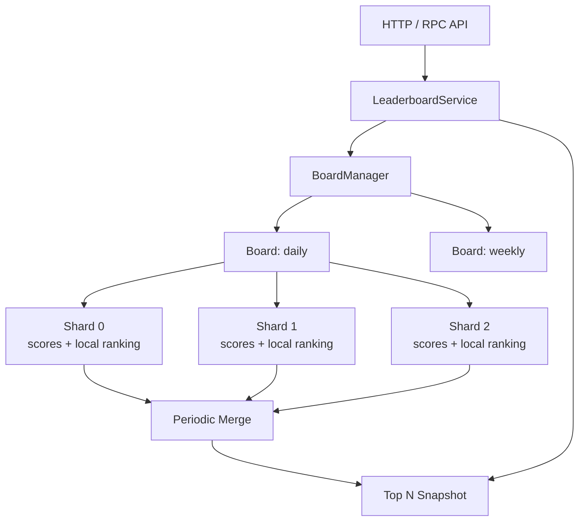

### 20.1 设计思路

- 写入按 member 分片。
- 每个分片维护局部数据。
- 后台周期性合并 Top K。
- 读请求读取不可变快照。
- 对用户排名可以提供“实时分数 + 快照排名”语义。

### 20.2 常见坑

#### 坑 1：每次写入都全量排序

为什么会出现：最直观的实现是每次 `AddScore` 后把所有用户重新排序。小数据量没问题，一旦用户达到几十万、几百万，写入路径会被排序拖垮。

错误思路：

```go
scores[member] += delta
sort.Slice(allEntries, less) // 每次写入都排序全量数据
```

修复方式：写路径只更新分片数据；后台周期性合并 Top K 快照。对于实时性要求高的榜单，可以使用 Skiplist 或 Redis Sorted Set，但也要评估写入成本。

#### 坑 2：`TopN` 返回内部切片

为什么会出现：为了少一次拷贝，直接返回内部缓存切片。但调用方拿到切片后可能修改元素，污染内部快照。

错误示例：

```go
func (b *Board) TopN(n int) []Entry {
	return b.snapshot[:n]
}
```

修复方式：返回副本。

```go
func (b *Board) TopN(n int) []Entry {
	result := make([]Entry, n)
	copy(result, b.snapshot[:n])
	return result
}
```

生产建议：对外返回的数据默认都当成不可信可变对象。内部缓存和快照不要暴露给调用方。

#### 坑 3：同分用户排序不稳定

为什么会出现：只按分数排序时，同分用户之间顺序可能随 Map 遍历顺序、排序实现和刷新批次变化而抖动。

修复方式：定义完整排序键，例如：

```text
score desc, updated_at asc, member_id asc
```

这样同分用户也有稳定顺序，用户刷新页面时排名不会无故跳动。

#### 坑 4：读写强一致要求过高，导致系统无法扩展

为什么会出现：如果要求每次写入后所有读请求立刻看到全局精确排名，读写路径会高度耦合，通常需要全局有序结构和强同步。

解决方式：明确 API 语义。生产中常见做法是：

- `GetScore` 返回实时分数。
- `TopN` 返回最近一次快照。
- `Rank` 返回快照排名，并告知刷新周期。

这能用很小的业务延迟换来更高吞吐和更稳定的尾延迟。

### 20.3 项目练习

1. 实现多榜单 `BoardManager`。
2. 实现后台每秒刷新 Top 100。
3. 实现 `AddScore`、`TopN`、`Rank`。
4. 对 10 万、100 万用户做 benchmark。
5. 增加 HTTP API 和压测脚本。

### 20.4 参考实现方向

- `BoardManager` 用 `map[string]*Board + RWMutex` 管理榜单。榜单数量变化不频繁时，这比 `sync.Map` 更容易保证类型安全和初始化语义。
- 每个 `Board` 内部按 member hash 分成多个 shard。写入只锁对应 shard，避免所有用户更新争抢一把锁。
- 每个 shard 维护 `map[member]score` 和局部 Top K 候选。后台定时从所有 shard 拉取候选并归并成全局快照。
- `TopN` 直接读 `atomic.Value` 中的不可变快照，避免读请求和写请求互相阻塞。
- `Rank` 可以分两种语义：实时计算精确排名，或者返回快照排名。生产中建议先提供快照排名，并在 API 文档中说明刷新周期。
- benchmark 要分别测写入吞吐、TopN 延迟、快照合并耗时、内存占用。不要只测单个函数平均耗时。

### 20.5 生产最佳实践

- 排名规则必须稳定。推荐按 `score desc, updated_at asc, member_id asc` 排序。
- `TopN` 返回结果要复制，不能把内部快照切片直接暴露给调用方修改。
- 快照刷新失败时保留旧快照，并记录错误指标。
- 对超大榜单可以把实时写入和查询拆开：写入进消息队列，聚合服务消费更新榜单，查询服务只读快照或 Redis Sorted Set。
- 对用户可见榜单，要考虑反作弊、分数回滚、重复事件幂等和补偿重算。

### 20.6 教学案例：分片快照排行榜

下面实现一个教学版排行榜。它不依赖第三方库，重点展示生产设计里的几个核心点：

- 写入按 member 分片，降低锁竞争。
- 每个 shard 保存真实分数。
- 后台或调用方触发 `Refresh` 生成不可变 TopN 快照。
- `TopN` 从 `atomic.Value` 读取快照，不阻塞写入。
- 排序规则稳定，避免同分排名抖动。

先定义数据结构：

```go
type Entry struct {
	Member    string
	Score     int64
	UpdatedAt time.Time
	Rank      int
}

type boardShard struct {
	mu     sync.RWMutex
	scores map[string]Entry
}

type Board struct {
	shards []boardShard
	topK   int
	snap   atomic.Value // stores []Entry
}

func NewBoard(shardCount int, topK int) *Board {
	if shardCount <= 0 {
		shardCount = 64
	}
	if topK <= 0 {
		topK = 100
	}

	b := &Board{
		shards: make([]boardShard, shardCount),
		topK:   topK,
	}
	for i := range b.shards {
		b.shards[i].scores = make(map[string]Entry)
	}
	b.snap.Store([]Entry{})
	return b
}
```

`snap` 里保存的是不可变快照。写入路径永远不修改它，只在刷新时整体替换。

member 到 shard 的映射：

```go
func (b *Board) shardFor(member string) *boardShard {
	h := fnv.New32a()
	_, _ = h.Write([]byte(member))
	return &b.shards[int(h.Sum32())%len(b.shards)]
}
```

增加分数：

```go
func (b *Board) AddScore(member string, delta int64, now time.Time) Entry {
	s := b.shardFor(member)

	s.mu.Lock()
	defer s.mu.Unlock()

	entry := s.scores[member]
	entry.Member = member
	entry.Score += delta
	entry.UpdatedAt = now
	s.scores[member] = entry
	return entry
}
```

这里 `AddScore` 只锁一个 shard。它返回的是实时分数，但不承诺实时排名。这个语义很重要：写入吞吐高时，实时更新全局排名会把所有写请求拉回一把全局锁或一个全局有序结构。

快照刷新：

```go
func (b *Board) Refresh() {
	h := &entryMinHeap{}
	heap.Init(h)

	for i := range b.shards {
		s := &b.shards[i]
		s.mu.RLock()
		for _, entry := range s.scores {
			pushTopK(h, entry, b.topK)
		}
		s.mu.RUnlock()
	}

	result := make([]Entry, h.Len())
	for i := len(result) - 1; i >= 0; i-- {
		result[i] = heap.Pop(h).(Entry)
	}
	sort.Slice(result, func(i, j int) bool {
		return better(result[i], result[j])
	})
	for i := range result {
		result[i].Rank = i + 1
	}

	b.snap.Store(result)
}

func pushTopK(h *entryMinHeap, entry Entry, k int) {
	if h.Len() < k {
		heap.Push(h, entry)
		return
	}
	if better(entry, (*h)[0]) {
		(*h)[0] = entry
		heap.Fix(h, 0)
	}
}
```

`Refresh` 的成本与用户总数有关，所以它不应该在每次 `TopN` 请求中执行。生产中通常由后台 ticker 定期刷新，例如每秒一次：

```go
func (b *Board) StartRefresh(ctx context.Context, interval time.Duration) {
	ticker := time.NewTicker(interval)
	go func() {
		defer ticker.Stop()
		for {
			select {
			case <-ticker.C:
				b.Refresh()
			case <-ctx.Done():
				return
			}
		}
	}()
}
```

堆和排序规则：

```go
type entryMinHeap []Entry

func (h entryMinHeap) Len() int { return len(h) }

func (h entryMinHeap) Less(i, j int) bool {
	return worse(h[i], h[j])
}

func (h entryMinHeap) Swap(i, j int) {
	h[i], h[j] = h[j], h[i]
}

func (h *entryMinHeap) Push(x any) {
	*h = append(*h, x.(Entry))
}

func (h *entryMinHeap) Pop() any {
	old := *h
	n := len(old)
	x := old[n-1]
	*h = old[:n-1]
	return x
}

func better(a, b Entry) bool {
	if a.Score != b.Score {
		return a.Score > b.Score
	}
	if !a.UpdatedAt.Equal(b.UpdatedAt) {
		return a.UpdatedAt.Before(b.UpdatedAt)
	}
	return a.Member < b.Member
}

func worse(a, b Entry) bool {
	return better(b, a)
}
```

这个排序规则表示：分数越高越靠前；同分时更早达到该分数的人靠前；如果时间也相同，member 字典序小的靠前。生产榜单一定要有完整排序键，否则同分用户会因为 Map 遍历顺序而排名抖动。

读取 TopN：

```go
func (b *Board) TopN(n int) []Entry {
	entries := b.snap.Load().([]Entry)
	if n > len(entries) {
		n = len(entries)
	}
	if n <= 0 {
		return nil
	}

	out := make([]Entry, n)
	copy(out, entries[:n])
	return out
}
```

返回副本是为了保护内部快照。如果调用方修改返回的切片，不会污染下一次查询。

查询用户排名可以先做快照语义：

```go
func (b *Board) Rank(member string) (Entry, bool) {
	entries := b.snap.Load().([]Entry)
	for _, entry := range entries {
		if entry.Member == member {
			return entry, true
		}
	}
	return Entry{}, false
}
```

这个 `Rank` 只在 TopK 快照中查找用户，复杂度是 `O(k)`。如果业务要求任意用户排名，就不能只保存 TopK，需要使用 Skiplist、Redis Sorted Set，或者在刷新快照时构建 `map[member]rank`。

### 20.7 多榜单管理器

实际业务通常有日榜、周榜、活动榜等多个 board。管理器负责创建和查找榜单：

```go
type BoardManager struct {
	mu     sync.RWMutex
	boards map[string]*Board
}

func NewBoardManager() *BoardManager {
	return &BoardManager{boards: make(map[string]*Board)}
}

func (m *BoardManager) GetOrCreate(name string) *Board {
	m.mu.RLock()
	board := m.boards[name]
	m.mu.RUnlock()
	if board != nil {
		return board
	}

	m.mu.Lock()
	defer m.mu.Unlock()

	if board = m.boards[name]; board != nil {
		return board
	}
	board = NewBoard(64, 100)
	m.boards[name] = board
	return board
}

func (m *BoardManager) AddScore(boardName, member string, delta int64) Entry {
	board := m.GetOrCreate(boardName)
	return board.AddScore(member, delta, time.Now())
}

func (m *BoardManager) TopN(boardName string, n int) []Entry {
	m.mu.RLock()
	board := m.boards[boardName]
	m.mu.RUnlock()
	if board == nil {
		return nil
	}
	return board.TopN(n)
}
```

这里使用“双重检查”避免每次都加写锁。第一次读锁找不到时，再进入写锁；进入写锁后还要再查一次，因为可能有另一个 goroutine 已经创建了 board。

生产扩展方向：

- 增加 board 生命周期管理，长期无人访问的活动榜要清理。
- `Refresh` 失败要保留旧快照，并记录失败指标。
- 如果榜单写入量极高，`Refresh` 扫全量用户会变重，需要每个 shard 维护局部 TopK 候选。
- 分数变更要幂等。活动积分通常来自事件流，必须用事件 ID 去重，避免消息重试重复加分。

### 20.8 HTTP API 示例

教学项目可以先暴露两个接口：

```go
func addScoreHandler(m *BoardManager) http.HandlerFunc {
	return func(w http.ResponseWriter, r *http.Request) {
		board := r.URL.Query().Get("board")
		member := r.URL.Query().Get("member")
		delta, err := strconv.ParseInt(r.URL.Query().Get("delta"), 10, 64)
		if err != nil || board == "" || member == "" {
			http.Error(w, "invalid request", http.StatusBadRequest)
			return
		}

		entry := m.AddScore(board, member, delta)
		_ = json.NewEncoder(w).Encode(entry)
	}
}

func topNHandler(m *BoardManager) http.HandlerFunc {
	return func(w http.ResponseWriter, r *http.Request) {
		board := r.URL.Query().Get("board")
		n, _ := strconv.Atoi(r.URL.Query().Get("n"))
		if n <= 0 {
			n = 10
		}

		entries := m.TopN(board, n)
		_ = json.NewEncoder(w).Encode(entries)
	}
}
```

这个 HTTP 层只用于教学。生产接口还要补鉴权、限流、请求体大小限制、错误码、指标、访问日志和超时控制。

### 20.9 Leaderboard 练习验收标准

完成这个案例后，至少做三类验证：

```go
func TestBoardTopNStableOrder(t *testing.T) {
	b := NewBoard(4, 10)
	now := time.Now()
	b.AddScore("b", 10, now)
	b.AddScore("a", 10, now)
	b.AddScore("c", 20, now)
	b.Refresh()

	got := b.TopN(3)
	if got[0].Member != "c" || got[1].Member != "a" || got[2].Member != "b" {
		t.Fatalf("unexpected order: %#v", got)
	}
}
```

```bash
go test -race ./...
go test -bench=Board -benchmem ./...
```

压测时分别看写入吞吐、`TopN` p99、`Refresh` 耗时和内存占用。如果 `Refresh` 耗时接近刷新间隔，说明快照生成已经成为瓶颈，需要局部 TopK 或外部存储。

---

## 21. ActivityTracker 高级实现

目标：实现高吞吐活动事件追踪系统。

核心能力：

- 写入事件。
- 查询窗口统计。
- 查询高频行为。
- 支持异步写入。
- 支持背压。
- 支持增量聚合。
- 支持过期清理。

推荐架构：

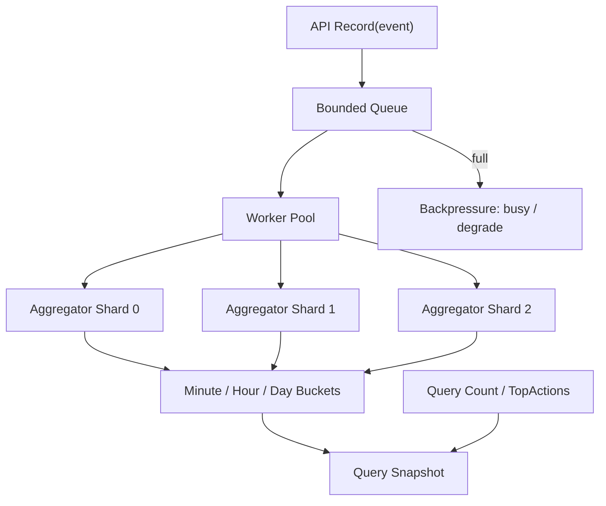

### 21.1 设计思路

- 写入先进入有界队列。
- 队列满时快速失败或降级。
- worker 批量聚合事件。
- 聚合结果按分钟、小时、天分桶。
- 查询优先读取聚合桶。
- 过期桶定期清理。

### 21.2 常见坑

#### 坑 1：队列无上限

为什么会出现：为了“不丢事件”，开发者容易把队列做得很大，甚至使用无限增长的内存结构。结果系统处理不过来时，内存先被打爆。

修复方式：使用有界队列，并定义满队列策略。

```go
func (t *Tracker) Record(ctx context.Context, e Event) error {
	select {
	case t.queue <- e:
		return nil
	case <-ctx.Done():
		return ctx.Err()
	default:
		return ErrBusy
	}
}
```

生产建议：关键事件不要依赖无限内存队列，而应写入可靠消息队列或本地 WAL，再异步消费。

#### 坑 2：查询大窗口时扫描太多分钟桶

为什么会出现：分钟桶适合短窗口查询。如果查询最近 90 天，扫描分钟桶需要访问 129600 个桶，延迟和 CPU 都会很差。

修复方式：使用多级聚合。查询大范围用天桶或小时桶，边界部分再用分钟桶补齐。

```text
查询最近 25 小时 =
  起始边界若干分钟桶
  + 中间完整小时桶
  + 结束边界若干分钟桶
```

#### 坑 3：事件时间和服务时间混用

为什么会出现：客户端上报的事件时间可能不准，服务端接收时间又不能完全代表业务发生时间。混用后，统计口径会混乱。

修复方式：同时保存两个时间：

- `event_time`：业务发生时间。
- `ingest_time`：服务接收时间。

实时统计通常按 `event_time` 入桶，但排障、积压监控和迟到分析要看 `ingest_time`。

#### 坑 4：没有迟到事件处理策略

为什么会出现：移动端离线、网络重试、消息队列积压都会让事件延迟到达。如果聚合系统只接受当前分钟，迟到事件要么丢失，要么污染历史。

解决方式：设置可修正窗口。例如最近 10 分钟允许修正，超过 10 分钟进入离线补偿。查询快照要标注数据延迟。

#### 坑 5：没有保留原始日志，无法重算

为什么会出现：增量聚合只保存结果，一旦代码 bug、统计口径变化或迟到策略调整，就无法修复历史数据。

生产建议：重要统计必须保留原始事件流或明细日志。聚合结果是加速查询的派生数据，不应是唯一事实来源。

### 21.3 项目练习

1. 实现 64 分片聚合。
2. 实现分钟桶、小时桶、天桶。
3. 实现 `TopActions(start, end, n)`。
4. 暴露队列长度、写入失败数、处理延迟。
5. 实现优雅关闭。

### 21.4 参考实现方向

- 写入入口只做轻量校验和入队，不在请求路径里做复杂聚合。
- 队列使用有界 channel，满了返回 `ErrBusy` 或降级，不能无限阻塞。
- worker 消费事件后按 `hash(action)` 或 `hash(userID)` 写入不同 aggregator shard。
- 每个 shard 维护分钟桶，后台定时把完整分钟聚合到小时桶，把完整小时聚合到天桶。
- `TopActions` 查询时先在每个 shard 内计算局部 Top K，再归并全局 Top K。
- 优雅关闭分两步：先停止接收新事件，再 drain 队列，最后 flush 聚合状态。

### 21.5 生产最佳实践

- 事件要有唯一 ID 或幂等键，避免消息重试导致重复计数。
- 保存原始事件日志或消息流，方便口径变化后重算。
- 明确迟到事件策略，例如只修正最近 10 分钟，超过窗口进入离线补偿。
- 指标至少包括入队成功数、入队失败数、队列长度、消费延迟、聚合耗时、桶数量、丢弃数。
- 如果查询跨度很大，禁止扫描过多分钟桶，应自动切换到小时桶或天桶。

### 21.6 教学案例：异步活动追踪器

下面实现一个教学版 `ActivityTracker`。它覆盖真实系统的核心结构：

- `Record` 只做轻量校验和入队。
- 有界队列提供背压。
- 多个 worker 异步消费事件。
- 聚合器按 action 和分钟分桶。
- 查询读取聚合桶，而不是扫描原始事件。
- 关闭时停止接收新事件并等待 worker 退出。

先定义事件和错误：

```go
var ErrTrackerClosed = errors.New("tracker closed")
var ErrTrackerBusy = errors.New("tracker busy")
var ErrInvalidEvent = errors.New("invalid event")

type ActivityEvent struct {
	ID        string
	UserID    string
	Action    string
	EventTime time.Time
	IngestTime time.Time
}
```

`ID` 用于幂等。`EventTime` 是业务发生时间，`IngestTime` 是服务接收时间。生产中两者都要保存，因为统计口径和排障口径不同。

聚合 shard：

```go
type actionMinute struct {
	Action string
	Minute int64
}

type trackerShard struct {
	mu      sync.RWMutex
	counts  map[actionMinute]int64
	seenIDs map[string]struct{}
}

func (s *trackerShard) init() {
	s.counts = make(map[actionMinute]int64)
	s.seenIDs = make(map[string]struct{})
}

func (s *trackerShard) add(e ActivityEvent) {
	s.mu.Lock()
	defer s.mu.Unlock()

	if e.ID != "" {
		if _, ok := s.seenIDs[e.ID]; ok {
			return
		}
		s.seenIDs[e.ID] = struct{}{}
	}

	key := actionMinute{
		Action: e.Action,
		Minute: e.EventTime.Unix() / 60,
	}
	s.counts[key]++
}
```

`seenIDs` 是教学版幂等实现。生产中不能无限保存所有 ID，通常会设置 TTL、使用 Redis、布隆过滤器，或者依赖上游消息系统的 exactly-once/幂等语义。

查询窗口统计：

```go
func (s *trackerShard) count(action string, start, end time.Time) int64 {
	startMinute := start.Unix() / 60
	endMinute := end.Add(-time.Nanosecond).Unix() / 60

	s.mu.RLock()
	defer s.mu.RUnlock()

	var total int64
	for m := startMinute; m <= endMinute; m++ {
		total += s.counts[actionMinute{Action: action, Minute: m}]
	}
	return total
}
```

这个查询只适合短窗口。长窗口要使用小时桶和天桶，否则扫描分钟数过多。

Tracker 主体：

```go
type ActivityTracker struct {
	queue  chan ActivityEvent
	shards []trackerShard

	mu        sync.RWMutex
	wg        sync.WaitGroup
	closeOnce sync.Once
	closed    chan struct{}
}

func NewActivityTracker(workerCount int, queueSize int, shardCount int) *ActivityTracker {
	if workerCount <= 0 {
		workerCount = 8
	}
	if queueSize <= 0 {
		queueSize = 10000
	}
	if shardCount <= 0 {
		shardCount = 64
	}

	t := &ActivityTracker{
		queue:  make(chan ActivityEvent, queueSize),
		shards: make([]trackerShard, shardCount),
		closed: make(chan struct{}),
	}
	for i := range t.shards {
		t.shards[i].init()
	}
	for i := 0; i < workerCount; i++ {
		t.wg.Add(1)
		go t.worker()
	}
	return t
}
```

写入入口：

```go
func (t *ActivityTracker) Record(ctx context.Context, e ActivityEvent) error {
	if e.Action == "" || e.EventTime.IsZero() {
		return ErrInvalidEvent
	}
	if e.IngestTime.IsZero() {
		e.IngestTime = time.Now()
	}

	t.mu.RLock()
	defer t.mu.RUnlock()

	select {
	case <-t.closed:
		return ErrTrackerClosed
	default:
	}

	select {
	case t.queue <- e:
		return nil
	case <-t.closed:
		return ErrTrackerClosed
	case <-ctx.Done():
		return ctx.Err()
	default:
		return ErrTrackerBusy
	}
}
```

这里的 `default` 是背压策略：队列满了立刻失败。对于埋点类事件，可以返回成功但记录丢弃数；对于关键行为事件，应返回明确错误，让调用方进入可靠重试或消息队列。

worker 和 shard 路由：

```go
func (t *ActivityTracker) worker() {
	defer t.wg.Done()

	for e := range t.queue {
		shard := t.shardFor(e.Action)
		shard.add(e)
	}
}

func (t *ActivityTracker) shardFor(action string) *trackerShard {
	h := fnv.New32a()
	_, _ = h.Write([]byte(action))
	return &t.shards[int(h.Sum32())%len(t.shards)]
}
```

这里按 action 分片，适合查询 action 维度统计。如果写入热点是单个 action，例如 `page_view` 占 90%，这个分片会失效。生产中可以改为按 `(action, userID)` 或事件 ID 分片，查询时再跨 shard 汇总。

查询接口：

```go
func (t *ActivityTracker) Count(action string, start, end time.Time) int64 {
	if !start.Before(end) {
		return 0
	}

	var total int64
	for i := range t.shards {
		total += t.shards[i].count(action, start, end)
	}
	return total
}
```

即使按 action 分片，这里仍然遍历所有 shard，是为了让未来分片策略变化时查询语义不变。生产中如果明确 action 只会落到一个 shard，可以直接查目标 shard，但代码耦合会更强。

优雅关闭：

```go
func (t *ActivityTracker) Shutdown(ctx context.Context) error {
	t.closeOnce.Do(func() {
		t.mu.Lock()
		defer t.mu.Unlock()

		close(t.closed)
		close(t.queue)
	})

	done := make(chan struct{})
	go func() {
		t.wg.Wait()
		close(done)
	}()

	select {
	case <-done:
		return nil
	case <-ctx.Done():
		return ctx.Err()
	}
}
```

关闭顺序是：先关闭 `closed`，让新请求被拒绝；再关闭队列，让 worker 消费完已入队事件后退出。这个版本没有持久化 flush，如果事件不能丢，关闭前还要把未处理事件写入 WAL 或可靠消息队列。

### 21.7 TopActions 查询

`TopActions(start, end, n)` 的朴素做法是扫描窗口内所有桶，累加每个 action 的计数，然后用堆取 TopN：

```go
type ActionCount struct {
	Action string
	Count  int64
}

func (t *ActivityTracker) TopActions(start, end time.Time, n int) []ActionCount {
	if n <= 0 || !start.Before(end) {
		return nil
	}

	total := make(map[string]int64)
	for i := range t.shards {
		t.shards[i].fillRange(total, start, end)
	}

	h := &actionMinHeap{}
	heap.Init(h)
	for action, count := range total {
		item := ActionCount{Action: action, Count: count}
		if h.Len() < n {
			heap.Push(h, item)
			continue
		}
		if item.Count > (*h)[0].Count {
			(*h)[0] = item
			heap.Fix(h, 0)
		}
	}

	out := make([]ActionCount, h.Len())
	for i := len(out) - 1; i >= 0; i-- {
		out[i] = heap.Pop(h).(ActionCount)
	}
	return out
}

func (s *trackerShard) fillRange(total map[string]int64, start, end time.Time) {
	startMinute := start.Unix() / 60
	endMinute := end.Add(-time.Nanosecond).Unix() / 60

	s.mu.RLock()
	defer s.mu.RUnlock()

	for key, count := range s.counts {
		if key.Minute >= startMinute && key.Minute <= endMinute {
			total[key.Action] += count
		}
	}
}
```

这个实现容易理解，但生产中要注意：如果 action 和桶都很多，扫描所有 `counts` 会变慢。优化方向有两个：

- 按时间组织桶：`map[minute]map[action]count`，查询窗口时只扫相关分钟。
- 后台维护 TopActions 快照：查询直接读快照，适合热门固定窗口，如最近 5 分钟、1 小时、24 小时。

堆实现：

```go
type actionMinHeap []ActionCount

func (h actionMinHeap) Len() int { return len(h) }

func (h actionMinHeap) Less(i, j int) bool {
	if h[i].Count != h[j].Count {
		return h[i].Count < h[j].Count
	}
	return h[i].Action > h[j].Action
}

func (h actionMinHeap) Swap(i, j int) { h[i], h[j] = h[j], h[i] }

func (h *actionMinHeap) Push(x any) {
	*h = append(*h, x.(ActionCount))
}

func (h *actionMinHeap) Pop() any {
	old := *h
	n := len(old)
	x := old[n-1]
	*h = old[:n-1]
	return x
}
```

### 21.8 过期清理和迟到事件

内存聚合器必须清理旧桶：

```go
func (t *ActivityTracker) Cleanup(before time.Time) {
	beforeMinute := before.Unix() / 60
	for i := range t.shards {
		s := &t.shards[i]
		s.mu.Lock()
		for key := range s.counts {
			if key.Minute < beforeMinute {
				delete(s.counts, key)
			}
		}
		s.mu.Unlock()
	}
}
```

清理策略要和迟到事件策略一致。如果允许修正最近 10 分钟，就不能清理 10 分钟内的桶。常见配置：

```text
实时修正窗口：10 分钟
内存保留窗口：2 小时
离线明细保留：7 天或更久
```

如果事件晚到超过实时修正窗口，生产系统通常不直接修改内存聚合，而是写入补偿队列，由离线任务重算历史报表。这样实时系统不会被非常旧的事件拖慢。

### 21.9 ActivityTracker 验收标准

这个案例完成后，至少验证四件事：

```go
func TestActivityTrackerCount(t *testing.T) {
	tracker := NewActivityTracker(2, 100, 4)
	defer tracker.Shutdown(context.Background())

	now := time.Now()
	for i := 0; i < 10; i++ {
		err := tracker.Record(context.Background(), ActivityEvent{
			ID:        fmt.Sprintf("e-%d", i),
			UserID:    "u1",
			Action:    "click",
			EventTime: now,
		})
		if err != nil {
			t.Fatal(err)
		}
	}

	requireEventually(t, func() bool {
		return tracker.Count("click", now.Add(-time.Minute), now.Add(time.Minute)) == 10
	})
}

func requireEventually(t *testing.T, fn func() bool) {
	t.Helper()

	deadline := time.Now().Add(time.Second)
	for time.Now().Before(deadline) {
		if fn() {
			return
		}
		time.Sleep(10 * time.Millisecond)
	}
	t.Fatal("condition was not met before timeout")
}
```

测试异步系统时不要立刻断言，因为事件还在队列里。可以使用 `require.Eventually`，或者在教学代码里提供 `Flush` 方法等待队列处理完成。

压测和观测重点：

- `Record` 成功数、失败数、`ErrTrackerBusy` 数量。
- 队列长度和队列等待时间。
- worker 消费延迟，即 `now - ingest_time`。
- 聚合桶数量和内存占用。
- `TopActions` 查询的 p99 延迟。

生产落地时，`ActivityTracker` 通常不会单独运行在业务进程里。更常见的架构是：业务服务把事件写入 Kafka、Pulsar、NATS 或本地 WAL，聚合服务异步消费并维护实时视图。这样业务入口不会被统计系统拖慢，统计系统故障也不会直接影响核心交易链路。

---

# 附录 A：补充并发原语

除了 goroutine、channel、锁和 `context`，Go 标准库和 `golang.org/x/sync` 还提供了几个常用的并发原语。它们解决的场景更具体，但在高并发系统里非常实用。

## A.1 atomic：无锁计数与标志位

`sync/atomic` 提供底层原子操作。适合单个数值的并发读写，例如计数器、开关、版本号。Go 1.19 引入了面向对象的 `atomic.Int64`、`atomic.Pointer[T]` 等类型，推荐优先使用。

```go
type Counter struct {
	n atomic.Int64
}

func (c *Counter) Inc()          { c.n.Add(1) }
func (c *Counter) Value() int64  { return c.n.Load() }
```

使用 atomic 的几点注意：

- 只适合保护单个字段。多个字段构成不变量时，仍需锁或原子替换整个结构。
- `atomic.Value` 和 `atomic.Pointer[T]` 适合整体替换一个不可变快照，是实现 copy-on-write 的基础。
- 不要对 `int` 或 `int64` 裸字段混用 atomic 和普通读写，会被 race detector 检测为竞争。

## A.2 sync.Once：只执行一次的初始化

`sync.Once` 保证某段代码在进程生命周期内只执行一次，线程安全且开销很小。常用于懒加载单例、初始化连接池、注册 metrics。

```go
var (
	once   sync.Once
	client *http.Client
)

func HTTPClient() *http.Client {
	once.Do(func() {
		client = &http.Client{Timeout: 3 * time.Second}
	})
	return client
}
```

要点：

- 如果 `Do` 中的函数 panic，`sync.Once` 仍认为“已执行”，后续调用不会重试。需要时要在 `Do` 内自己 recover 并重置。
- Go 1.21 引入了 `sync.OnceFunc`、`sync.OnceValue`、`sync.OnceValues`，写法更简洁，推荐在新代码里使用。

## A.3 sync.Pool：复用临时对象

`sync.Pool` 用来复用短期对象，降低 GC 压力。典型场景是 JSON 编解码缓冲、`bytes.Buffer`、临时切片。

```go
var bufPool = sync.Pool{
	New: func() any { return new(bytes.Buffer) },
}

func Format(v any) string {
	buf := bufPool.Get().(*bytes.Buffer)
	buf.Reset()
	defer bufPool.Put(buf)

	fmt.Fprintf(buf, "%v", v)
	return buf.String()
}
```

要点：

- Pool 里的对象随时可能被 GC 回收，不能用来做“缓存”。
- 放回前必须 Reset，避免污染下一个使用者。
- 不要把已经被别人引用的对象放回 Pool，否则会导致数据竞争。
- 只对热路径和大对象使用。小对象直接 new 通常更简单，GC 代价也不大。

## A.4 errgroup：并发等待 + 错误短路

`golang.org/x/sync/errgroup` 是 fan-out 场景最常用的工具。它封装了 `WaitGroup` + 错误收集 + context 取消。

```go
import "golang.org/x/sync/errgroup"

func Aggregate(ctx context.Context, userID int64) (Profile, error) {
	g, ctx := errgroup.WithContext(ctx)

	var (
		base    BaseInfo
		orders  []Order
		credits int64
	)

	g.Go(func() (err error) {
		base, err = loadBase(ctx, userID)
		return
	})
	g.Go(func() (err error) {
		orders, err = loadOrders(ctx, userID)
		return
	})
	g.Go(func() (err error) {
		credits, err = loadCredits(ctx, userID)
		return
	})

	if err := g.Wait(); err != nil {
		return Profile{}, err
	}
	return Profile{Base: base, Orders: orders, Credits: credits}, nil
}
```

要点：

- 任何子任务返回 error，`errgroup` 会自动 cancel 关联的 ctx，其它子任务应尽快退出。
- `golang.org/x/sync/errgroup` 提供的 `errgroup.SetLimit(n)` 可以限制同时运行的 goroutine 数（需要 `golang.org/x/sync` v0.1.0 及以上），非常适合批量 fan-out。
- 子任务内部必须检查 `ctx.Done()`，否则 cancel 没有意义。

## A.5 singleflight：合并重复请求

`golang.org/x/sync/singleflight` 把相同 key 的并发请求合并成一次。典型场景是缓存击穿：热点 key 过期的瞬间，不要让成百上千的请求同时打到数据库。

```go
import "golang.org/x/sync/singleflight"

var g singleflight.Group

func GetUser(ctx context.Context, id int64) (*User, error) {
	key := fmt.Sprintf("user:%d", id)

	v, err, _ := g.Do(key, func() (any, error) {
		// 同一时刻相同 key 只有一个 goroutine 进入这里
		return loadUserFromDB(ctx, id)
	})
	if err != nil {
		return nil, err
	}
	return v.(*User), nil
}
```

要点：

- 合并的是“同一 key 的回源”，不是整个接口的调用。
- 一个请求失败，所有在等待的请求也会收到同一个错误。如果希望失败不传染，可以在回调里捕获错误。
- 对于延迟很高的上游（比如外部 API），`DoChan` 配合 `select` 更灵活，调用方可以自己决定是否放弃等待。

## A.6 小结

| 原语 | 适用场景 | 不适合的场景 |
| --- | --- | --- |
| `atomic` | 计数器、标志位、快照指针替换 | 多字段不变量 |
| `sync.Once` | 懒加载单例、一次性初始化 | 需要重试或条件重置 |
| `sync.Pool` | 复用临时 buffer、临时对象 | 当成长期缓存 |
| `errgroup` | 并发 fan-out + 错误短路 | 每个子任务必须独立成功 |
| `singleflight` | 缓存击穿、合并重复回源 | 每个请求结果需要互不影响 |

---

# 附录 B：优雅关闭与熔断降级

## B.1 优雅关闭

服务关闭不是“杀进程”。粗暴地退出会导致正在处理的请求失败、写入中的数据丢失、下游连接被强制断开。优雅关闭的目标是：收到停止信号后，先停止接收新请求，再等待已接收的请求完成，最后释放资源。

典型流程：

```text
1. 捕获 SIGINT / SIGTERM
2. 停止接收新请求（关闭监听、取消健康检查）
3. 通知后台 goroutine 退出
4. 等待在途请求处理完成（有最大等待时间）
5. flush 聚合状态、关闭数据库连接、上报下线
6. 进程退出
```

HTTP 服务的标准做法：

```go
func Run(ctx context.Context, srv *http.Server) error {
	errCh := make(chan error, 1)
	go func() {
		errCh <- srv.ListenAndServe()
	}()

	select {
	case <-ctx.Done():
		shutdownCtx, cancel := context.WithTimeout(context.Background(), 30*time.Second)
		defer cancel()
		return srv.Shutdown(shutdownCtx)
	case err := <-errCh:
		if err != nil && err != http.ErrServerClosed {
			return err
		}
		return nil
	}
}

func main() {
	ctx, stop := signal.NotifyContext(context.Background(), os.Interrupt, syscall.SIGTERM)
	defer stop()

	srv := &http.Server{Addr: ":8080", Handler: router}
	if err := Run(ctx, srv); err != nil {
		log.Fatal(err)
	}
}
```

后台 worker pool 的优雅关闭分两步：先关闭入口（不再接收新任务），再等待队列 drain 完成或超时：

```go
func (p *Pool) Shutdown(ctx context.Context) error {
	p.closeOnce.Do(func() { close(p.closed) }) // 拒绝新任务
	done := make(chan struct{})
	go func() {
		p.wg.Wait() // 等待在途任务完成
		close(done)
	}()

	select {
	case <-done:
		return nil
	case <-ctx.Done():
		return ctx.Err() // 超时后强制退出，记录未完成任务数
	}
}
```

要点：

- 必须设置 shutdown 超时。永远等下去等于没有关闭。
- 关闭顺序要倒着来：先入口、再业务、最后基础设施（DB、MQ、缓存）。
- 关闭前把健康检查置为失败，让负载均衡尽快摘除自己。Kubernetes 环境下要配合 `preStop` hook 和 `terminationGracePeriodSeconds`。
- 异步任务要区分“可丢弃”和“必须完成”。必须完成的任务在关闭前应落盘或转移到持久队列。

## B.2 熔断（Circuit Breaker）

熔断的作用是在下游持续失败时，主动断开调用，避免把自己拖垮。它是 fan-out、重试、缓存之外的最后一道屏障。

熔断器有三个状态：

| 状态 | 含义 | 行为 |
| --- | --- | --- |
| Closed | 正常 | 请求直通，失败计数累积 |
| Open | 断路 | 请求立即失败（fail fast），不调用下游 |
| Half-Open | 试探 | 放行少量请求，根据结果决定回到 Closed 或 Open |

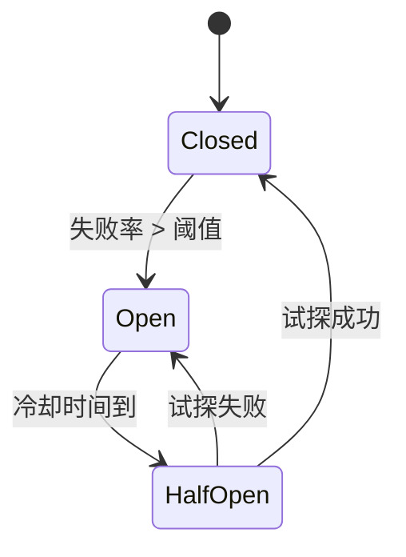

常见实现库：`sony/gobreaker`、`afex/hystrix-go`、`resilience4j`（Java 参考）。

```go
import "github.com/sony/gobreaker"

var cb = gobreaker.NewCircuitBreaker(gobreaker.Settings{
	Name:        "user-service",
	MaxRequests: 3,
	Interval:    60 * time.Second,
	Timeout:     10 * time.Second,
	ReadyToTrip: func(counts gobreaker.Counts) bool {
		return counts.ConsecutiveFailures > 10
	},
})

func GetUser(ctx context.Context, id int64) (*User, error) {
	v, err := cb.Execute(func() (any, error) {
		return loadUserFromRPC(ctx, id)
	})
	if err != nil {
		return nil, err
	}
	return v.(*User), nil
}
```

要点：

- 熔断粒度要合理。按“服务+接口”或“服务+上游依赖”维度，不要一个熔断器覆盖整个进程。
- 熔断开启时要返回明确错误，并且要有指标和告警。长期 Open 说明下游真的有问题。
- 和超时、重试配合使用。熔断不能替代超时；超时保证单次请求快速失败，熔断保证持续失败时不再尝试。
- 幂等写入才可以重试。熔断打开期间的请求通常不应进入重试队列。

## B.3 降级（Fallback）

降级是在系统部分能力不可用时，返回一个“次优但可用”的结果。它不是对业务的妥协，而是对用户体验的守护。

常见降级方式：

| 场景 | 降级策略 |
| --- | --- |
| 推荐服务不可用 | 返回热门商品或静态列表 |
| 个性化价格不可用 | 返回原价 |
| 风控服务超时 | 走保守规则（拒绝或人工审核） |
| 缓存集群故障 | 直接走 DB，同时限流保护 |
| 监控/埋点不可用 | 本地缓冲或直接丢弃，不阻塞主流程 |

实现降级的两种常见形态：

1. **被动降级**：调用失败或超时后回落到备用逻辑。适合偶发故障。
2. **主动降级**：通过配置或开关强制跳过某些能力。适合发布期、大促期间预先关闭非核心功能。

要点：

- 降级结果要清晰标注。例如在响应里加 `degraded: true` 或日志里标记 `fallback=cache-miss`，便于排查。
- 降级路径也要有容量保护。大促期间，所有请求同时回落到 DB 会让数据库直接崩溃。
- 降级不能悄悄损失核心数据。涉及扣款、发货、库存等强一致场景，宁可失败也不降级。
- 演练比设计更重要。定期在预发环境关闭某个下游，验证降级路径是否真正生效。

熔断、限流、降级、背压不是四件独立的工具，而是一套组合拳：

```text
限流：在入口限制进入速率
背压：向上游表明“我满了”
熔断：在下游故障时主动断开
降级：在能力缺失时返回次优结果
```

组合使用，系统才能在过载和故障下保持“可预期的失败”。

---

# 高并发设计检查清单

## 1. 并发安全

- 所有共享状态是否有明确保护？最佳实践是给每个结构体写清楚“哪些字段由哪把锁保护”，复杂对象可以在字段注释中标明。
- 是否跑过 `go test -race`？并发数据结构、缓存、worker pool、排行榜更新路径都应该覆盖 race test。
- 是否存在 goroutine 泄漏？压测前后观察 goroutine 数，停止流量后应回落到稳定水平。
- channel 关闭责任是否明确？通常发送方关闭；多个发送方时由协调者关闭。
- 锁内是否调用外部服务？生产代码中应避免锁内 RPC、DB、文件 IO 和同步日志。

## 2. 性能

- 热路径是否有全局锁？如果 p99 延迟随并发快速上升，优先检查锁竞争。
- 是否存在全量排序或全量扫描？TopN、统计查询、范围查询都要特别检查。
- 是否有不必要内存分配？用 `go test -bench=. -benchmem` 看 allocs/op，热路径尽量减少临时对象。
- Top K 是否避免了全量排序？K 远小于 N 时优先堆、分片 Top K 或快照。
- 查询是否使用增量聚合？高频统计查询不应每次扫描原始事件。

## 3. 稳定性

- 是否有超时？入口、下游、队列等待都要有超时预算。
- 是否有取消？请求取消后，后台 goroutine 和下游调用应尽快停止。
- 是否有限流？限流要覆盖网关、服务实例、用户/API 和下游依赖。
- 是否有背压？队列满、worker 忙、下游慢时要有明确策略。
- 队列是否有上限？所有内存队列都应有容量上限和满队列指标。
- 是否有优雅关闭？先停入口，再 drain 队列，最后关闭 worker，并设置最大等待时间。

## 4. 可观测性

- 是否有 QPS、延迟、错误率？延迟要看 p50、p90、p99，不只看平均值。
- 是否有队列长度？队列长度和入队等待时间是背压前兆。
- 是否有 goroutine 数？持续上涨通常意味着泄漏或阻塞。
- 是否有内存和 GC 指标？内存上涨、GC 频繁会直接影响尾延迟。
- 是否记录限流、丢弃、降级次数？这些不是噪声，而是系统过载的核心信号。

检查清单的使用方法：每次上线高并发功能前，至少用一次压测验证这些问题。不要等线上事故后才补指标和边界。

---

# 常见线上故障模式

| 现象 | 常见原因 | 处理方向 |
| --- | --- | --- |
| goroutine 持续上涨 | 阻塞、泄漏、未监听 context | 加超时、取消、边界 |
| p99 延迟升高 | 锁竞争、GC、下游慢、队列积压 | 看 trace、pprof、指标 |
| CPU 高但吞吐低 | 自旋、调度频繁、日志过多 | 降并发、批量、减少热路径开销 |
| 内存上涨 | 队列积压、缓存无淘汰 | 加上限、TTL、pprof |
| 数据偶发错误 | 数据竞争、快照被修改 | race test、不可变对象 |
| 数据库被打爆 | fan-out、重试风暴、缺少限流 | 限流、熔断、缓存 |

## 生产排障手册

遇到高并发问题时，不要先改代码。先判断系统属于哪一种问题。

### 1. goroutine 持续上涨

优先检查：

- 是否有 goroutine 阻塞在 channel send/receive。
- 是否有下游调用没有超时。
- 是否有请求结束后后台任务还在运行。
- worker 是否因为队列不关闭而无法退出。

排查方法：

```bash
curl http://localhost:6060/debug/pprof/goroutine?debug=2
```

看堆栈里最多的阻塞点。如果大量 goroutine 卡在同一个 channel send，通常是消费者退出或处理太慢。如果大量卡在网络读写，通常是下游超时没设置好。

### 2. p99 延迟升高

优先检查：

- 锁等待是否增加。
- 队列长度是否上涨。
- 下游延迟是否上涨。
- GC 是否变频繁。
- 是否发生重试风暴。

最佳实践是把延迟拆成阶段：入队等待时间、处理时间、下游调用时间、序列化时间。只看总耗时很难定位问题。

### 3. CPU 高但吞吐不上去

常见原因：

- goroutine 太多，调度成本升高。
- 锁竞争导致自旋和频繁唤醒。
- 热路径频繁 JSON 编解码。
- 日志量过大。
- 正则、排序、加密等 CPU 重操作在每个请求中重复执行。

处理顺序：

1. 用 CPU profile 找最热函数。
2. 先减少重复计算和同步日志。
3. 再考虑缓存、批量、算法优化。
4. 最后才考虑调 `GOMAXPROCS` 或做底层微优化。

### 4. 数据库被打爆

数据库通常是整个系统最共享、最稀缺的资源。保护数据库比保护单个服务更重要。

生产处理建议：

- 给数据库访问设置连接池上限。
- 对昂贵查询做接口级限流。
- 使用缓存和 singleflight 合并热点读。
- fan-out 查询要限制并发。
- 重试必须有退避和最大次数。
- 对写入高峰使用消息队列削峰，但队列也必须有积压监控。

如果数据库已经过载，第一步通常不是扩容，而是先止血：限流、降级、关闭非核心查询、减少重试。

---

# 结语

Go 的并发能力很强，但它给工程师的是工具，不是答案。

goroutine 让并发变得容易，但不能替你决定并发上限。channel 让通信变得优雅，但不能替你设计背压。锁让共享状态变得安全，但不能替你消除锁竞争。Heap、Skiplist、增量聚合能提升性能，但前提是你知道瓶颈在哪里。

高并发系统的核心不是把程序写得更复杂，而是把边界设计清楚：

- 并发有边界。
- 队列有边界。
- 等待有边界。
- 一致性有边界。
- 失败也有边界。

当你能解释为什么这里用锁，那里用 channel；为什么这里读快照，那里强一致；为什么 Top K 不全量排序；为什么队列满了要快速失败，你就已经不只是会写 Go，而是在设计一个能承受真实流量的系统。
