# Go 高级开发教程：从并发原理到高性能系统设计

这是一份写给中高级 Go 开发者的教程。它不追求把每个 API 都罗列一遍，而是希望回答几个更根本的问题：

- goroutine 为什么轻量？轻量到什么程度？什么时候又会变重？
- channel、锁、`context` 分别解决什么问题？为什么不能混着乱用？
- Heap、Skiplist、分片 Map 这些数据结构为什么能提升性能？
- Top K、增量聚合、排行榜这些问题，本质上是在优化什么？
- 高并发系统为什么不能只靠“多开 goroutine”解决？
- 当系统处理不过来时，应该排队、丢弃、限流，还是降级？

很多人学习 Go 并发时，会先记住一句话：“不要通过共享内存来通信，而要通过通信来共享内存。”这句话很好，但如果只记住口号，反而容易误解。Go 的并发工具各有边界：channel 适合表达流程和同步，锁适合保护共享状态，`context` 适合控制生命周期，worker pool 适合控制系统容量。

真正成熟的工程师，不是把所有问题都写成 channel，也不是把所有共享数据都加一把大锁，而是知道在不同场景下做出合适的取舍。

这些问题的简短答案如下，后文会逐步展开。

| 问题 | 最佳答案 | 解读 |
| --- | --- | --- |
| goroutine 为什么轻量？ | 因为它由 Go runtime 在用户态调度，初始栈小，创建和切换成本低于 OS 线程。 | 轻量不等于免费。goroutine 过多仍会增加内存、调度和 GC 成本。 |
| channel、锁、`context` 分别解决什么？ | channel 表达通信和同步，锁保护共享状态，`context` 控制生命周期。 | 不要为了“更 Go”而滥用 channel。保护一个 Map 时，锁通常更直接。 |
| 数据结构为什么能提升性能？ | 好的数据结构减少了不必要的扫描、排序、锁竞争和内存访问。 | Heap 避免全量排序，Skiplist 支持动态有序，分片 Map 降低热点锁。 |
| Top K 和增量聚合本质上优化什么？ | 它们都在避免重复处理无关数据。 | Top K 不排序所有人，增量聚合不每次扫描原始事件。 |
| 高并发为什么不能只靠 goroutine？ | 因为真正稀缺的是 CPU、内存、队列容量、下游吞吐和锁资源。 | goroutine 只能表达并发，不能创造系统容量。 |
| 系统处理不过来怎么办？ | 优先限流和背压，再考虑排队、降级和补偿。 | 在线请求通常快速失败更好；关键数据写入要有补偿机制。 |

一个重要原则是：高并发系统不是让所有请求都成功，而是在超出容量时，让系统以可预期的方式失败。可预期，比表面上的“全都接收”更重要。

---

## 学习路线

建议用 12 周完成这套训练。

| 周期 | 主题 | 要掌握的能力 |
| --- | --- | --- |
| 第 1-2 周 | Go 并发基础 | 理解 goroutine、channel、锁、`context` 的原理和边界 |
| 第 3-4 周 | 高性能数据结构 | 掌握 Heap、优先队列、TreeMap、Skiplist 的适用场景 |
| 第 5-6 周 | 并发数据结构 | 能设计线程安全 Map、计数器、缓存、排行榜 |
| 第 7-8 周 | 算法优化 | 能用 Top K、增量聚合、缓存减少系统负担 |
| 第 9-10 周 | 工程化设计 | 会设计接口、错误、日志、指标和测试 |
| 第 11-12 周 | 高并发系统 | 能设计 worker pool、fan-out、backpressure、限流系统 |

学习时不要只看代码。每一个主题都要从四个层次理解：

| 层次 | 应该问的问题 |
| --- | --- |
| 使用层 | API 怎么用？最小示例是什么？ |
| 原理层 | runtime 或数据结构内部大致做了什么？ |
| 工程层 | 生产环境下什么时候该用，什么时候不该用？ |
| 故障层 | 高并发时会怎样失败？如何保护系统？ |

---

# 第一部分：Go 并发基础

## 1. goroutine：不是免费的线程

goroutine 是 Go 最吸引人的特性之一。很多人第一次写 Go 时，会惊讶于这样一行代码：

```go
go doSomething()
```

它看起来太轻松了，以至于容易让人误以为 goroutine 是免费的。事实并非如此。goroutine 的确比操作系统线程轻得多，但只要是运行中的任务，就一定消耗资源。

### 1.1 goroutine 的系统级原理

操作系统线程是真正能被 CPU 调度执行的实体。传统语言里，如果大量创建线程，系统很快会吃不消，因为每个线程都有较大的栈、内核调度成本和上下文切换成本。

Go 的做法是自己在用户态做一层调度。可以用 G/M/P 模型来理解：

| 名称 | 含义 | 类比 |
| --- | --- | --- |
| G | goroutine | 一张待执行的任务卡 |
| M | OS 线程 | 真正干活的工人 |
| P | 调度上下文 | 工人的工具台和本地任务队列 |

Go runtime 会把大量 G 分配到少量 M 上执行。M 想执行 Go 代码，通常需要绑定一个 P。每个 P 有自己的本地运行队列，如果本地队列空了，还会从全局队列或其他 P 那里拿任务。

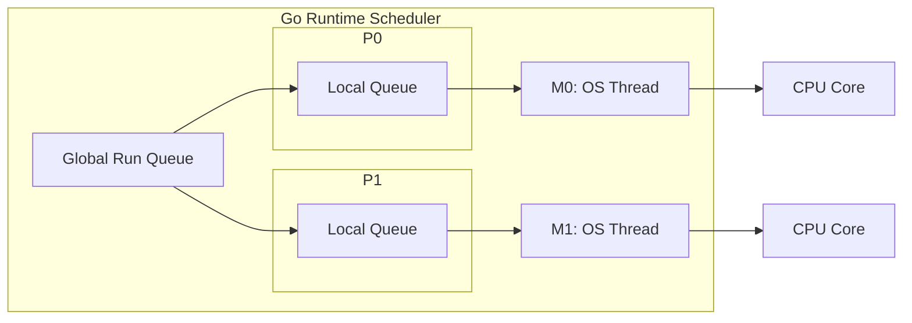

这套机制解释了两个现象：

1. goroutine 可以很多，因为它们不等于系统线程。
2. goroutine 不能无限多，因为它们仍然需要栈、元数据、调度和 GC 扫描成本。

### 1.2 高并发不是无限并发

假设一个接口每次请求启动 20 个 goroutine。如果有 1 万 QPS，每秒就会创建 20 万个 goroutine。即使每个 goroutine 很轻，调度、内存分配、GC 都会成为负担。

因此，高并发系统要做的第一件事不是“尽可能并发”，而是“限制并发，让资源可预测”。

| 场景 | 建议 |
| --- | --- |
| 少量异步任务 | 可以直接启动 goroutine |
| 大量独立任务 | 使用 worker pool |
| 请求内并行访问多个下游 | 使用 fan-out，并配合 `context` |
| CPU 密集任务 | 并发度接近 `GOMAXPROCS` |
| IO 密集任务 | 根据下游承载能力设置并发上限 |

### 1.3 示例：并发抓取用户信息

```go
package main

import (
	"fmt"
	"sync"
	"time"
)

func fetchUser(id int) string {
	time.Sleep(100 * time.Millisecond)
	return fmt.Sprintf("user-%d", id)
}

func main() {
	ids := []int{1, 2, 3, 4, 5}
	results := make([]string, len(ids))

	var wg sync.WaitGroup
	for i, id := range ids {
		wg.Add(1)

		go func(i, id int) {
			defer wg.Done()
			results[i] = fetchUser(id)
		}(i, id)
	}

	wg.Wait()
	fmt.Println(results)
}
```

这段代码有三个值得注意的地方：

- `WaitGroup` 用来等待所有 goroutine 结束。
- 循环变量通过参数传入 goroutine，避免闭包捕获问题。
- 每个 goroutine 写入不同下标，因此不会发生同一位置的并发写。

### 1.4 常见坑

#### 坑 1：goroutine 没有退出条件，形成泄漏

为什么会出现：goroutine 一旦启动，就不会因为父函数返回而自动退出。如果它阻塞在 channel、网络请求、定时器或死循环里，就会一直活着。

错误示例：

```go
func watch(ch <-chan int) {
	go func() {
		for v := range ch {
			fmt.Println(v)
		}
	}()
}
```

如果 `ch` 永远不关闭，这个 goroutine 就永远不会退出。

修复方式：给长期运行的 goroutine 增加 `context`，并在循环中监听取消信号。

```go
func watch(ctx context.Context, ch <-chan int) {
	go func() {
		for {
			select {
			case v, ok := <-ch:
				if !ok {
					return
				}
				fmt.Println(v)
			case <-ctx.Done():
				return
			}
		}
	}()
}
```

生产建议：后台 goroutine 必须有清晰的生命周期。服务关闭、请求取消、上游退出时，它都应该能停止。

#### 坑 2：goroutine 中 panic 未恢复，导致进程崩溃

为什么会出现：panic 不会只杀死当前 goroutine。如果没有 recover，它会让整个进程退出。后台任务、worker pool、消息消费 goroutine 尤其要注意。

修复方式：在 goroutine 最外层 recover，并记录堆栈。

```go
go func() {
	defer func() {
		if r := recover(); r != nil {
			log.Printf("worker panic: %v", r)
		}
	}()

	runWorker()
}()
```

生产建议：recover 不是为了吞掉错误，而是为了避免单个任务拖垮整个进程。recover 后要记录日志、指标，必要时告警。

#### 坑 3：请求超时后，后台 goroutine 仍在工作

为什么会出现：请求 handler 返回不代表它启动的 goroutine 会自动停止。如果 goroutine 没有拿到请求的 `context`，它不知道上游已经放弃。

错误示例：

```go
func handler(w http.ResponseWriter, r *http.Request) {
	go doSlowWork()
	w.WriteHeader(http.StatusAccepted)
}
```

修复方式：传入 `r.Context()`，并让下游调用都支持取消。

```go
func handler(w http.ResponseWriter, r *http.Request) {
	go doSlowWork(r.Context())
	w.WriteHeader(http.StatusAccepted)
}
```

如果任务必须在请求结束后继续执行，就不要直接使用请求 context，而应该进入受控的后台队列，由后台系统管理重试、超时和关闭。

#### 坑 4：无限创建 goroutine，导致调度和内存压力

为什么会出现：`go func()` 太容易写，开发者容易把“并发”误解成“每个任务一个 goroutine”。任务量大时，goroutine 数量会瞬间膨胀。

错误示例：

```go
for _, job := range jobs {
	go process(job)
}
```

修复方式：使用 worker pool 或 semaphore 限制并发。

```go
sem := make(chan struct{}, 20)
for _, job := range jobs {
	sem <- struct{}{}
	go func(job Job) {
		defer func() { <-sem }()
		process(job)
	}(job)
}
```

生产建议：并发度应该根据 CPU、下游容量、连接池大小和压测结果确定，而不是根据任务数量确定。

### 1.5 练习

1. 写一个并发 URL 抓取器，最多同时抓取 10 个 URL。
2. 写一个会泄漏 goroutine 的例子，再用 `context` 修复。
3. 思考：如果一个任务是 CPU 密集型，启动 1000 个 goroutine 是否有意义？

参考答案与解读：

1. URL 抓取器应该使用“任务队列 + 固定 worker 数”或“semaphore 限制并发”。不要对每个 URL 直接启动一个 goroutine，否则 URL 数量一大就会失控。生产中还要给 HTTP client 设置连接池、请求超时、重试上限和最大响应体大小。
2. 常见泄漏例子是 goroutine 阻塞在发送 channel 上，但接收方已经退出。修复方式是给发送和接收都加 `select { case ...; case <-ctx.Done(): }`，让上游取消能传递到后台任务。
3. 通常没有意义。CPU 密集型任务受 CPU 核数限制，1000 个 goroutine 只会增加调度开销。最佳实践是并发度接近 `runtime.GOMAXPROCS(0)`，或者略高一点后压测确认。

生产实践：

- 所有请求级 goroutine 都应该能被 `context` 取消。
- 后台常驻 goroutine 要有明确的启动、停止、panic recover 和日志。
- 批量任务要设并发上限，不要直接按任务数量启动 goroutine。
- 线上要监控 goroutine 数量。稳定系统中 goroutine 数应该随流量波动，但不应长期单调上涨。

---

## 2. channel：带同步语义的队列

channel 常被认为是 Go 并发的灵魂。它不仅能传数据，还能表达同步关系。

### 2.1 channel 的本质

channel 可以理解成一个带同步语义的队列。它内部大致包含：

- 一个缓冲区。
- 一个等待发送的 goroutine 队列。
- 一个等待接收的 goroutine 队列。
- 一把内部锁。

无缓冲 channel 更像“当面交接”。发送方和接收方必须同时到场。  
有缓冲 channel 更像“临时仓库”。生产者可以先把东西放进去，消费者稍后再取。

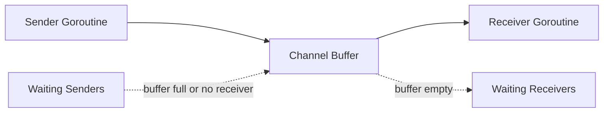

| 类型 | 行为 | 适用场景 |
| --- | --- | --- |
| 无缓冲 channel | 发送和接收同步发生 | 交接任务、同步信号 |
| 有缓冲 channel | 允许短暂排队 | 任务队列、削峰 |
| 只读 channel | 限制函数只能接收 | API 边界 |
| 只写 channel | 限制函数只能发送 | API 边界 |

### 2.2 channel 的内存可见性

Go 内存模型保证：channel 发送发生在对应接收之前。通俗地说，发送前写入的数据，接收后可以看到。

```go
done := make(chan struct{})
var x int

go func() {
	x = 42
	close(done)
}()

<-done
fmt.Println(x) // 一定能看到 42
```

这里 `close(done)` 不只是关闭 channel，它也是一个同步信号。

### 2.3 示例：订单处理流水线

```go
package main

import "fmt"

type Order struct {
	ID     int
	Amount int64
}

func producer(out chan<- Order) {
	defer close(out)

	for i := 1; i <= 5; i++ {
		out <- Order{ID: i, Amount: int64(i * 100)}
	}
}

func consumer(in <-chan Order) {
	for order := range in {
		fmt.Printf("process order: id=%d amount=%d\n", order.ID, order.Amount)
	}
}

func main() {
	ch := make(chan Order, 2)
	go producer(ch)
	consumer(ch)
}
```

### 2.4 channel 不是万能队列

channel 很好用，但不要把它当作无限队列。队列一旦没有边界，就会隐藏系统过载：

```text
请求进入速度 > 处理速度
       |
队列持续增长
       |
内存上涨，延迟上涨
       |
调用方超时重试
       |
流量更大，系统雪崩
```

高并发场景下，channel 队列一定要问三个问题：

- 缓冲区多大？
- 满了怎么办？
- 队列中的任务多久以后就没有意义？

参考答案与解读：

1. 缓冲区大小应该由“处理吞吐量 × 可接受排队时间”反推，而不是拍脑袋。比如 worker 每秒处理 2000 个任务，业务最多接受排队 1 秒，队列可以从 2000 附近开始压测。
2. 队列满了要根据业务选择策略：在线请求通常快速失败；日志指标可以丢弃；核心数据可以短暂等待或落入可靠消息队列；推荐、搜索等体验型功能可以降级。
3. 任务是否过期要看业务语义。用户已经取消的请求、过期的推荐刷新、超过展示窗口的排行榜更新，继续处理价值很低。生产中常给任务附带 deadline，worker 取出后先判断是否已经过期。

一个实用判断是：如果队列里的任务等待时间已经超过调用方超时时间，它即使被处理完也很可能没有用户价值，只是在消耗系统资源。

### 2.5 常见坑

#### 坑 1：向已关闭 channel 发送会 panic

为什么会出现：关闭 channel 表示“不会再有新数据”。如果关闭后仍然发送，说明发送方和关闭方的职责没有划清。

错误示例：

```go
ch := make(chan int)
close(ch)
ch <- 1 // panic: send on closed channel
```

解决方式：遵守“发送方负责关闭”的原则。如果有多个发送方，不要让任意发送方直接关闭 channel，而是由协调者在所有发送方结束后关闭。

```go
var wg sync.WaitGroup
ch := make(chan int)

for i := 0; i < 3; i++ {
	wg.Add(1)
	go func(id int) {
		defer wg.Done()
		ch <- id
	}(i)
}

go func() {
	wg.Wait()
	close(ch)
}()
```

#### 坑 2：从已关闭 channel 接收零值，误以为是真数据

为什么会出现：从已关闭且已 drain 的 channel 接收不会阻塞，会立刻返回元素类型的零值。如果不检查 `ok`，业务可能把零值当成正常数据。

错误示例：

```go
v := <-ch
process(v) // ch 已关闭时，v 可能是零值
```

修复方式：

```go
v, ok := <-ch
if !ok {
	return
}
process(v)
```

如果使用 `for v := range ch`，循环会在 channel 关闭且数据读完后自动退出，这是消费者读取数据流的推荐写法。

#### 坑 3：`nil` channel 永久阻塞

为什么会出现：未初始化的 channel 是 nil。对 nil channel 发送和接收都会永久阻塞。这个特性有时可用于动态关闭 select 分支，但误用会导致死锁。

错误示例：

```go
var ch chan int
ch <- 1 // 永久阻塞
```

生产建议：结构体中的 channel 字段必须在构造函数里初始化，不要让调用方直接创建零值结构体后使用。

```go
type Queue struct {
	ch chan int
}

func NewQueue(size int) *Queue {
	return &Queue{ch: make(chan int, size)}
}
```

#### 坑 4：`default` 分支造成 CPU 空转

为什么会出现：`select` 带 `default` 时，如果其他 case 都没准备好，会立即执行 `default`。如果外层是 for 循环，就会变成忙等。

错误示例：

```go
for {
	select {
	case v := <-ch:
		process(v)
	default:
	}
}
```

修复方式：没有特殊理由时，不要加 `default`。如果确实需要轮询，要加退避或定时器。

```go
for {
	select {
	case v := <-ch:
		process(v)
	case <-time.After(10 * time.Millisecond):
		// idle
	}
}
```

生产建议：`default` 常用于“非阻塞尝试”，例如队列满时快速失败；不适合无休止轮询。

### 2.6 练习

1. 用 channel 实现一个生产者消费者模型。
2. 给任务队列加上最大长度，队列满时返回错误。
3. 思考：什么时候用 channel 比用锁更清晰？

参考答案与解读：

1. 生产者消费者模型中，生产者负责发送并关闭 channel，消费者用 `range ch` 读取直到 channel 关闭。多个生产者时不要让每个生产者都关闭 channel，应由协调者在所有生产者结束后关闭。
2. 有界队列可以使用带缓冲 channel 加 `select default` 实现非阻塞提交。队列满时返回类似 `ErrQueueFull` 的明确错误，并记录指标。
3. 当问题本质是“任务从 A 流向 B”或“等待某个事件发生”时，channel 更清晰；当问题本质是“多个 goroutine 读写同一份状态”时，锁更清晰。

生产实践：

- channel 的关闭责任要写进代码结构里。通常是发送方关闭，接收方不关闭。
- channel 不适合做无限缓冲。需要可靠排队时，应考虑 Kafka、Redis Stream、NATS、数据库 outbox 等持久化队列。
- 对高频小对象传递，channel 可能带来额外分配和调度成本，必要时用 benchmark 比较锁、atomic 和 channel。

---

## 3. Mutex 与 RWMutex：保护不变量

锁的作用不是保护代码，而是保护数据不变量。

所谓不变量，是业务上必须一直成立的关系。例如：

- 账户余额不能为负。
- `count` 必须等于 Map 中元素数量。
- 排行榜中用户的分数和排名索引必须一致。

如果多个字段共同构成一个不变量，就必须在同一个同步边界内修改它们。

### 3.1 Mutex 的同步语义

`Mutex.Unlock` 之前的写入，对另一个 goroutine 随后成功 `Lock` 后可见。这就是锁除了互斥以外的另一个作用：建立内存可见性。

```go
type Counter struct {
	mu sync.Mutex
	n  int64
}

func (c *Counter) Inc() {
	c.mu.Lock()
	defer c.mu.Unlock()

	c.n++
}

func (c *Counter) Value() int64 {
	c.mu.Lock()
	defer c.mu.Unlock()

	return c.n
}
```

### 3.2 RWMutex 不一定更快

`RWMutex` 允许多个读者同时进入，写者独占。它适合读多写少的场景。但如果写入很频繁，读写锁维护读者和写者状态的成本可能比普通 `Mutex` 更高。

| 场景 | 建议 |
| --- | --- |
| 读很多，写很少 | 可以考虑 `RWMutex` |
| 写很多 | 先用 `Mutex`，再 benchmark |
| 读只是简单整数 | 可以考虑 `atomic` |
| 多字段保持一致 | 用锁更清晰 |

### 3.3 锁竞争如何变成线上事故

锁竞争一开始只是慢一点，后来会变成系统问题：

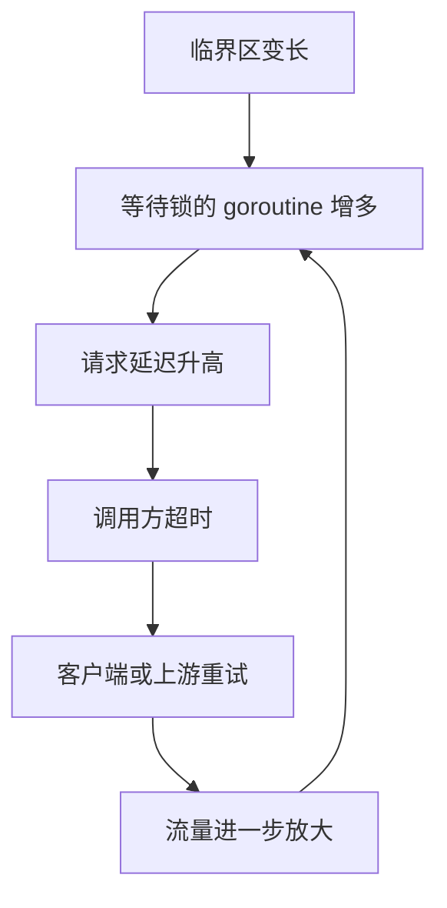

1. 临界区变长。
2. 等锁的 goroutine 增多。
3. 请求延迟升高。
4. 调用方超时重试。
5. 重试带来更多请求。
6. 系统进一步变慢。

因此，高并发下要尽量：

- 缩短临界区。
- 避免锁内做 IO。
- 使用分片锁降低竞争。
- 用快照减少读锁。
- 用批量合并减少写锁次数。

生产实践：

- 锁保护的是数据不变量。先写清楚哪些字段必须一起变化，再决定锁粒度。
- 临界区里只做内存操作，避免 RPC、数据库、文件 IO、同步日志和复杂回调。
- 如果必须在锁内判断状态、锁外执行慢操作、再回来更新状态，要考虑状态是否已经变化，必要时使用版本号或 CAS 思路。
- 分片锁适合大量 key 分散访问，不适合单个超级热点 key。单个热点 key 要考虑本地累加后批量 flush，或者把热点 key 拆成多个逻辑分片。
- 不要为了减少锁而牺牲正确性。数据结构还没稳定前，先用一把简单的锁保证正确，再根据指标拆分。

### 3.4 示例：读多写少缓存

```go
type User struct {
	ID   int64
	Name string
}

type UserCache struct {
	mu   sync.RWMutex
	data map[int64]User
}

func NewUserCache() *UserCache {
	return &UserCache{data: make(map[int64]User)}
}

func (c *UserCache) Get(id int64) (User, bool) {
	c.mu.RLock()
	defer c.mu.RUnlock()

	u, ok := c.data[id]
	return u, ok
}

func (c *UserCache) Set(u User) {
	c.mu.Lock()
	defer c.mu.Unlock()

	c.data[u.ID] = u
}
```

### 3.5 常见坑

#### 坑 1：复制包含锁的结构体

为什么会出现：`sync.Mutex`、`sync.RWMutex` 一旦使用后就不应该被复制。复制后会出现两个锁保护同一份或相关状态的错觉，轻则数据竞争，重则死锁。

错误示例：

```go
type Counter struct {
	mu sync.Mutex
	n  int
}

func (c Counter) Inc() { // 值接收者会复制 Counter，也复制锁
	c.mu.Lock()
	defer c.mu.Unlock()
	c.n++
}
```

修复方式：包含锁的结构体使用指针接收者，并避免值复制。

```go
func (c *Counter) Inc() {
	c.mu.Lock()
	defer c.mu.Unlock()
	c.n++
}
```

生产建议：包含锁的结构体不要作为函数返回值随意复制，不要放入会复制元素的容器操作中。可以用 `go vet -copylocks` 检查这类问题。

#### 坑 2：锁内调用外部服务

为什么会出现：外部服务耗时不可控。锁内做 RPC、DB、文件 IO，会让所有等待这把锁的 goroutine 一起排队。

错误示例：

```go
func (s *Store) Refresh(id int64) error {
	s.mu.Lock()
	defer s.mu.Unlock()

	user, err := s.client.LoadUser(id) // 锁内 RPC
	if err != nil {
		return err
	}
	s.users[id] = user
	return nil
}
```

修复方式：锁外做慢操作，锁内只更新共享状态。

```go
func (s *Store) Refresh(id int64) error {
	user, err := s.client.LoadUser(id)
	if err != nil {
		return err
	}

	s.mu.Lock()
	defer s.mu.Unlock()
	s.users[id] = user
	return nil
}
```

如果锁外加载期间状态可能变化，要引入版本号或再次检查，避免旧结果覆盖新结果。

#### 坑 3：同一份数据有的地方加锁，有的地方不加锁

为什么会出现：并发安全要求所有访问路径都遵守同一套同步规则。只要有一个读写路径绕过锁，race 仍然存在。

错误示例：

```go
func (c *Cache) Set(k string, v string) {
	c.mu.Lock()
	defer c.mu.Unlock()
	c.data[k] = v
}

func (c *Cache) UnsafeLen() int {
	return len(c.data) // 未加锁
}
```

修复方式：所有访问共享状态的方法都加同一把锁，或者返回不可变快照。

```go
func (c *Cache) Len() int {
	c.mu.RLock()
	defer c.mu.RUnlock()
	return len(c.data)
}
```

生产建议：不要把内部 Map 暴露给调用方。否则调用方可以绕过锁直接修改。

#### 坑 4：多个锁保护同一个不变量

为什么会出现：为了降低锁竞争，有时会把字段拆到不同锁下。但如果这些字段共同构成业务不变量，拆锁会让读者看到不一致状态。

例子：排行榜中 `scores` 和 `rankIndex` 必须一致。如果更新分数和更新排名索引用不同锁，读请求可能看到新分数配旧排名。

修复方式：同一个不变量用同一个锁保护；如果必须拆锁，则通过不可变快照、版本号或单线程聚合保证一致性。

参考答案：什么时候应该用 `Mutex`，什么时候用 `RWMutex`？

最佳答案是先看读写比例和临界区长度。读远多于写，并且读临界区不是极短时，`RWMutex` 可能有收益。写入频繁、读操作很短或锁竞争不明显时，`Mutex` 反而更简单、更快。

解读：`RWMutex` 并不是“更高级的 Mutex”。它要维护读者数量、写者等待等状态，本身有额外成本。生产中不要凭直觉替换，应该用 `go test -bench` 和真实读写比例验证。

---

## 4. sync.Map：特殊场景下的并发 Map

`sync.Map` 不是普通 Map 的高级替代品，而是为特定场景优化的结构。

它适合：

- key 写入后很少改变。
- 读远多于写。
- 多 goroutine 访问不同 key。
- 缓存、注册表、连接表等场景。

它不适合：

- 写多读少。
- 需要复杂事务。
- 需要强一致遍历。
- value 本身也会被并发修改。

### 4.1 为什么 sync.Map 适合读多写少

可以把 `sync.Map` 简化理解为两层：

- read 区：读路径很快。
- dirty 区：记录新写入和变化较多的数据。

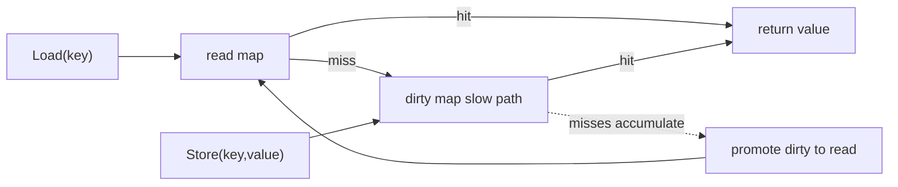

读取时先查 read 区，找不到再走慢路径查 dirty 区。写入多时，慢路径和内部协调成本会上升，所以它并不是所有场景都快。

### 4.2 示例：在线连接表

```go
type Conn struct {
	UserID int64
	Addr   string
}

type Registry struct {
	conns sync.Map // map[int64]*Conn
}

func (r *Registry) Add(conn *Conn) {
	r.conns.Store(conn.UserID, conn)
}

func (r *Registry) Get(userID int64) (*Conn, bool) {
	v, ok := r.conns.Load(userID)
	if !ok {
		return nil, false
	}
	return v.(*Conn), true
}

func (r *Registry) Remove(userID int64) {
	r.conns.Delete(userID)
}
```

### 4.3 常见坑

#### 坑 1：以为 `sync.Map` 会保护 value

```go
conn, _ := registry.Get(1)
conn.Addr = "new addr" // 如果多个 goroutine 同时改 conn，仍然有数据竞争
```

为什么会出现：`sync.Map` 只保证 `Load`、`Store`、`Delete` 这些 Map 操作本身并发安全。它不会自动保护 value 指向的对象。

如果 value 内部也会变化，就要给 value 加锁，或者使用不可变对象替换。

```go
type Conn struct {
	mu   sync.Mutex
	Addr string
}

func (c *Conn) SetAddr(addr string) {
	c.mu.Lock()
	defer c.mu.Unlock()
	c.Addr = addr
}
```

更推荐的方式是不可变替换：构造一个新的 value，再 `Store` 回去，避免调用方拿到可变内部对象。

#### 坑 2：把 `Range` 当成强一致快照

为什么会出现：`sync.Map.Range` 遍历期间，其他 goroutine 仍然可以写入或删除。遍历看到的是一个弱一致视图，不保证包含遍历期间的所有更新。

错误场景：用 `Range` 计算严格账务总额、强一致排行榜、库存数量。这类逻辑需要强一致快照，不适合直接依赖 `sync.Map.Range`。

修复方式：如果需要强一致遍历，用 `map + RWMutex`，在读锁下复制一份快照，再在锁外计算。

```go
func (s *Store) Snapshot() map[string]int64 {
	s.mu.RLock()
	defer s.mu.RUnlock()

	cp := make(map[string]int64, len(s.data))
	for k, v := range s.data {
		cp[k] = v
	}
	return cp
}
```

#### 坑 3：复杂复合操作不是原子的

为什么会出现：`Load` 和 `Store` 单独是安全的，但“先 Load，判断，再修改，再 Store”这一整段不是自动原子的。

错误示例：

```go
v, _ := m.Load("count")
m.Store("count", v.(int)+1) // 多个 goroutine 会丢更新
```

修复方式：简单计数使用 `atomic`，复杂状态使用 `map + Mutex` 或 value 内部锁。不要用 `sync.Map` 拼出伪事务。

参考答案：`sync.Map` 和 `map + Mutex` 如何选择？

| 场景 | 推荐 |
| --- | --- |
| key 基本稳定，读远多于写 | `sync.Map` |
| 写入频繁，逻辑复杂 | `map + Mutex` |
| 需要类型安全和复合事务 | `map + Mutex` 或封装泛型结构 |
| 需要强一致遍历快照 | `map + Mutex` 下复制快照 |
| value 自身会变化 | value 内部加锁或使用不可变对象 |

生产实践：

- `sync.Map.Range` 不是强一致快照，不要用它做严格账务、强一致排行榜结算。
- 对 `sync.Map` 做一层类型封装，避免到处写类型断言。
- 如果需要 `Load` 后“检查并更新 value 内部状态”，通常还需要 value 级别的锁。
- 对缓存场景，要配合 TTL、容量上限和淘汰策略，`sync.Map` 本身不负责这些。

---

## 5. context：让并发任务知道什么时候该停

并发程序最容易遗漏的不是启动，而是停止。

用户请求已经超时，后台 goroutine 还在查数据库；服务准备关闭，worker 还在处理新任务；上游已经不需要结果，下游还在计算。这些都会浪费资源，严重时造成泄漏。

`context` 的作用就是把取消信号、超时和请求范围元数据传下去。

### 5.1 context 是一棵取消树

```text
request context
  |
  +-- db query context
  |
  +-- cache query context
  |
  +-- rpc context
```

父 context 取消后，子 context 也会收到取消信号。

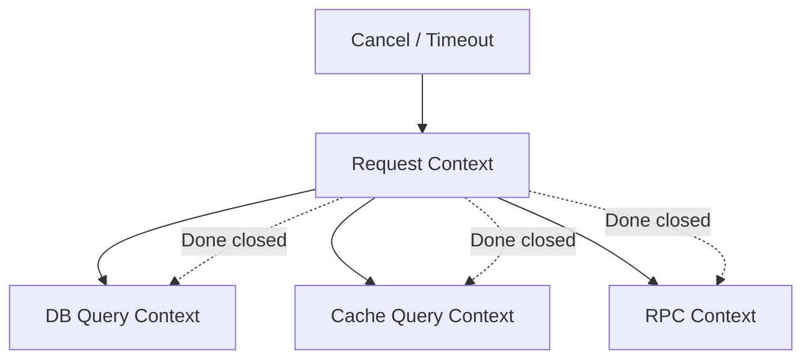

### 5.2 示例：带超时的查询

```go
func query(ctx context.Context, keyword string) (string, error) {
	select {
	case <-time.After(200 * time.Millisecond):
		return "result for " + keyword, nil
	case <-ctx.Done():
		return "", ctx.Err()
	}
}

func main() {
	ctx, cancel := context.WithTimeout(context.Background(), 100*time.Millisecond)
	defer cancel()

	result, err := query(ctx, "golang")
	if err != nil {
		fmt.Println("query failed:", err)
		return
	}

	fmt.Println(result)
}
```

### 5.3 超时预算

高并发系统不能每一层都随便设置一个很大的超时。更合理的方式是分配预算：

| 层级 | 示例 |
| --- | --- |
| API 总超时 | 200ms |
| 缓存查询 | 20ms |
| 数据库查询 | 80ms |
| 下游 RPC | 100ms |

如果每一层都设置 200ms，串行调用三个下游时，用户可能等 600ms。正确做法是让下游在上游剩余时间内工作。

### 5.4 常见坑

#### 坑 1：忘记调用 cancel

为什么会出现：`context.WithTimeout` 会创建定时器资源。即使超时最终会发生，提前调用 cancel 也能更快释放资源。

错误示例：

```go
func load() error {
	ctx, _ := context.WithTimeout(context.Background(), time.Second)
	return query(ctx)
}
```

修复方式：

```go
func load() error {
	ctx, cancel := context.WithTimeout(context.Background(), time.Second)
	defer cancel()
	return query(ctx)
}
```

生产建议：只要调用 `WithCancel`、`WithTimeout`、`WithDeadline`，就立刻写 `defer cancel()`，除非 cancel 的生命周期明确交给其他地方。

#### 坑 2：goroutine 不监听 `ctx.Done()`

为什么会出现：上游取消只是关闭 `Done` channel，不会强行杀死 goroutine。下游必须主动检查。

错误示例：

```go
func worker(ctx context.Context, jobs <-chan Job) {
	for job := range jobs {
		process(job)
	}
}
```

修复方式：

```go
func worker(ctx context.Context, jobs <-chan Job) {
	for {
		select {
		case job, ok := <-jobs:
			if !ok {
				return
			}
			process(job)
		case <-ctx.Done():
			return
		}
	}
}
```

如果 `process` 本身很慢，它也应该接收 context，否则 worker 只能在任务之间退出。

#### 坑 3：把业务参数塞进 `context.Value`

为什么会出现：`context.Value` 使用方便，容易被当成“万能参数袋”。这样会让函数真实依赖隐藏起来。

错误示例：

```go
func List(ctx context.Context) {
	page := ctx.Value("page").(int)
	_ = page
}
```

修复方式：业务参数放在显式请求对象中。

```go
type ListRequest struct {
	Page int
	Size int
}

func List(ctx context.Context, req ListRequest) {}
```

`context.Value` 只放 request id、trace id、租户 id、认证主体等请求范围元数据。

#### 坑 4：下游库没有传入 context，导致取消无效

为什么会出现：入口 handler 有 context，但实际调用数据库、HTTP、RPC 时没有使用支持 context 的 API。

修复方式：使用带 context 的方法，例如 `http.NewRequestWithContext`、`db.QueryContext`、`redis.WithContext` 等。

```go
req, err := http.NewRequestWithContext(ctx, http.MethodGet, url, nil)
if err != nil {
	return err
}
resp, err := http.DefaultClient.Do(req)
```

参考答案：`context.Value` 到底该放什么？

适合放 request id、trace id、租户 id、认证主体这类“请求范围元数据”。不适合放分页参数、业务开关、数据库连接、logger 配置和可选参数。

解读：`context.Value` 是隐式依赖。业务参数放进去后，函数签名看起来简单，但调用关系变得不透明，测试也更困难。生产代码里可以定义私有 key 类型，避免不同包之间 key 冲突。

生产实践：

- 凡是可能阻塞的函数都应接收 `context.Context`。
- `WithTimeout` 和 `WithCancel` 返回的 cancel 必须调用，通常 `defer cancel()`。
- 服务关闭时用根 context 取消后台任务。
- 对外部依赖要设置独立超时，不要只依赖入口超时。
- 区分 `context.Canceled` 和 `context.DeadlineExceeded`，前者可能是客户端主动断开，后者通常代表系统或下游慢。

---

# 第二部分：高性能数据结构

## 6. Heap：用局部有序换取效率

Heap 不保证全量有序，只保证堆顶是最大或最小值。正是因为它只维护较弱的有序性，插入和删除才可以做到 `O(log n)`。

### 6.1 为什么 Heap 适合 Top K

从 1 亿个用户里找前 100 名，如果全量排序，就是把 1 亿人完整排队。可我们并不关心第 101 名以后的人如何排序。

更好的办法是维护一个只有 100 个元素的小根堆：

- 堆里保存当前前 100 名候选人。
- 堆顶是这 100 人里分数最低的。
- 新用户如果比堆顶还低，直接丢弃。
- 新用户如果比堆顶高，就替换堆顶。

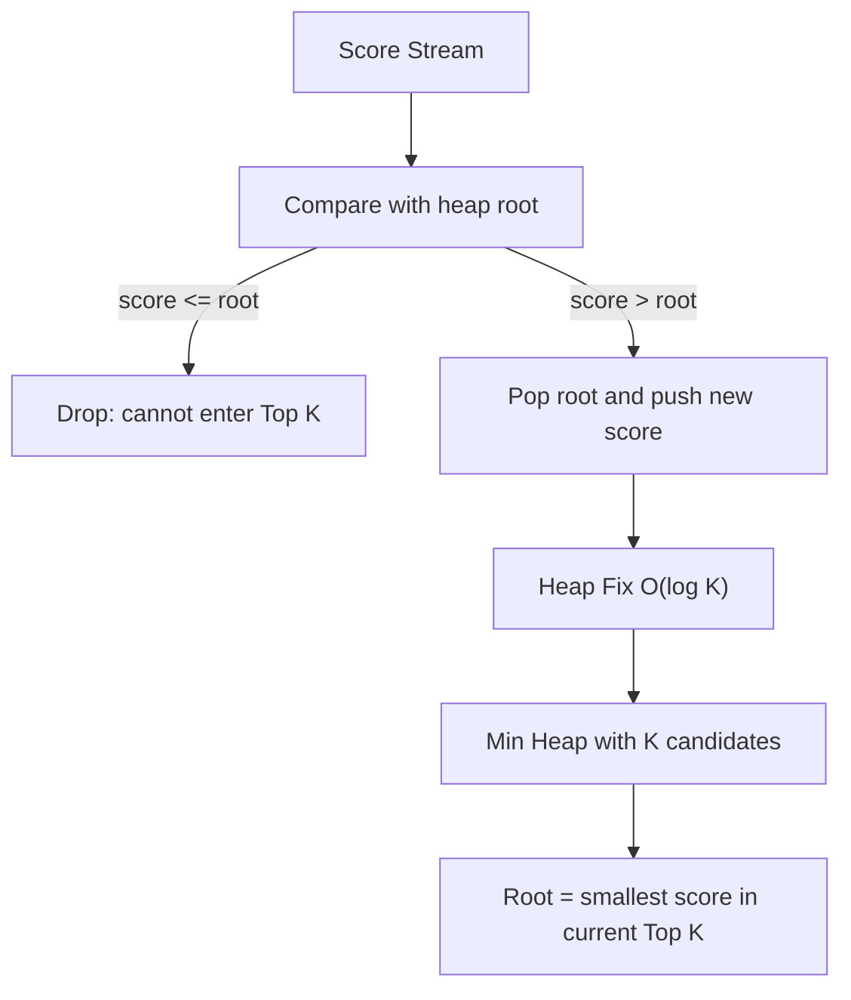

这样复杂度从 `O(n log n)` 降到 `O(n log k)`。

### 6.2 示例：Top K

```go
type UserScore struct {
	UserID int64
	Score  int64
}

type MinHeap []UserScore

func (h MinHeap) Len() int           { return len(h) }
func (h MinHeap) Less(i, j int) bool { return h[i].Score < h[j].Score }
func (h MinHeap) Swap(i, j int)      { h[i], h[j] = h[j], h[i] }

func (h *MinHeap) Push(x any) {
	*h = append(*h, x.(UserScore))
}

func (h *MinHeap) Pop() any {
	old := *h
	n := len(old)
	x := old[n-1]
	*h = old[:n-1]
	return x
}

func TopK(items []UserScore, k int) []UserScore {
	if k <= 0 {
		return nil
	}

	h := &MinHeap{}
	heap.Init(h)

	for _, item := range items {
		if h.Len() < k {
			heap.Push(h, item)
			continue
		}

		if item.Score > (*h)[0].Score {
			heap.Pop(h)
			heap.Push(h, item)
		}
	}

	result := make([]UserScore, h.Len())
	for i := len(result) - 1; i >= 0; i-- {
		result[i] = heap.Pop(h).(UserScore)
	}
	return result
}
```

### 6.3 高并发下的 Heap

Heap 本身不是并发安全的。高并发排行榜一般不让所有写请求抢同一把锁，而是：

- 按用户或榜单分片。
- 每个分片维护局部 Top K。
- 后台周期性合并出全局 Top K 快照。
- 读请求读快照。

这样写入路径不会被全局排序阻塞，读路径也不必等待写锁。

### 6.4 常见坑

#### 坑 1：以为 Heap 是全量有序

为什么会出现：堆顶一定是最小或最大值，但堆内部其他元素并不是完全排序的。直接遍历堆切片，得到的不是有序列表。

错误示例：

```go
for _, item := range *h {
	fmt.Println(item) // 不是按分数排序输出
}
```

修复方式：如果需要有序结果，要不断 `heap.Pop`，或者复制一份后排序。注意 `heap.Pop` 会破坏原堆。

#### 坑 2：Top K 用错堆方向

为什么会出现：求最大 Top K 时，应该维护大小为 K 的小根堆。很多人会直觉使用大根堆，结果无法快速淘汰当前候选集里最小的元素。

正确思路：

- 全局要找最高分。
- 堆里维护当前前 K 名。
- 堆顶应该是当前前 K 名里最低分。
- 新元素只需要和这个最低分比较。

#### 坑 3：K 接近 N 时仍然使用 Heap

为什么会出现：知道 Heap 能优化 Top K 后，容易所有 Top K 都用堆。但当 K 接近 N 时，`O(n log k)` 和 `O(n log n)` 差距不大，堆实现还更复杂。

生产建议：K 很小用堆；K 接近 N 或需要完整排序时，直接排序更简单。最终用 benchmark 判断。

#### 坑 4：并发读写同一个 Heap

为什么会出现：`container/heap` 不提供并发安全。一个 goroutine Push，另一个 goroutine Pop，会破坏底层切片和堆不变量。

修复方式：用锁保护整个堆操作，或者让单个 goroutine 独占堆，通过 channel 接收更新请求。高写入场景下优先考虑分片堆和快照合并。

---

## 7. 优先队列：让重要任务先执行

普通队列讲先来后到，优先队列讲谁更重要。

典型场景：

- 调度高优先级任务。
- 延迟队列取最早到期任务。
- 告警系统优先处理严重告警。
- 重试系统优先处理即将到期的任务。

### 7.1 生产级优先队列的难点

难点不在插入和弹出，而在任务会变化：

- 任务可能取消。
- 优先级可能调整。
- 执行时间可能推迟。
- 队列里可能残留无效任务。

因此常见实现会维护 `index` 字段，用于快速 `heap.Fix`。

```go
type Task struct {
	ID       string
	Priority int
	index    int
}
```

如果没有索引，更新一个任务需要扫描整个堆，复杂度会退化成 `O(n)`。

### 7.2 常见坑

#### 坑 1：修改堆中元素后忘记 `heap.Fix`

为什么会出现：堆只在 `heap.Push`、`heap.Pop`、`heap.Fix` 等操作时维护堆序。你直接修改元素字段，堆并不知道顺序已经被破坏。

错误示例：

```go
task.Priority = 100 // 堆结构不会自动调整
```

修复方式：元素中保存 `index`，修改优先级后调用 `heap.Fix`。

```go
func (pq *PriorityQueue) Update(task *Task, priority int) {
	task.Priority = priority
	heap.Fix(pq, task.index)
}
```

生产建议：不要把堆中元素直接暴露给外部随意修改。提供 `Update` 方法统一维护不变量。

#### 坑 2：`Less` 写反，最大堆和最小堆混淆

为什么会出现：Go 标准库 `container/heap` 默认根据 `Less` 构造最小堆。如果希望优先级大的先出队，`Less` 要反过来写。

```go
func (pq PriorityQueue) Less(i, j int) bool {
	return pq[i].Priority > pq[j].Priority // 最大堆
}
```

修复方式：给堆写单元测试，明确第一个 `Pop` 出来的是最高优先级还是最低优先级。

#### 坑 3：任务取消后不删除，堆里积累大量无效任务

为什么会出现：延迟队列或任务调度中，任务可能在执行前被取消。如果只在任务弹出时发现它已取消，堆里会长期堆积无效节点。

解决方式：

- 如果能通过 `index` 找到任务，取消时调用 `heap.Remove`。
- 如果取消非常频繁，可以使用 lazy delete，但要监控无效节点比例，超过阈值后重建堆。

```go
func (pq *PriorityQueue) Cancel(task *Task) {
	if task.index >= 0 {
		heap.Remove(pq, task.index)
	}
}
```

#### 坑 4：内存延迟队列没有持久化

为什么会出现：内存堆只存在于当前进程。进程重启、发布、宕机后，尚未执行的任务会丢失。

生产建议：订单超时关闭、支付补偿、消息重试这类关键任务，不要只放内存。可选方案包括：

- 数据库表保存任务状态，内存堆只做加速索引。
- Redis Sorted Set 保存执行时间。
- Kafka / RocketMQ / RabbitMQ 延迟消息。
- 服务启动时从持久化存储恢复未完成任务。

---

## 8. TreeMap 与 Skiplist：为范围查询而生

Go 的普通 `map` 是哈希表，适合精确查找，不适合范围查询。

如果要查询：

- 最近 10 分钟事件。
- 分数在 1000 到 2000 的用户。
- 某段时间内的订单。

普通 Map 只能全量遍历。数据量大时，这会非常慢。

### 8.1 有序结构的价值

有序结构把一部分成本放到写入时：写入时维护顺序，查询时就可以快速定位范围起点。

| 结构 | 优点 | 缺点 |
| --- | --- | --- |
| 红黑树 / AVL | 查询稳定 | 实现复杂 |
| B 树 | 缓存局部性好 | 实现复杂 |
| Skiplist | 实现相对简单，范围遍历方便 | 指针较多 |
| 排序切片 | 简单，遍历快 | 插入删除贵 |

### 8.2 Skiplist 的直觉

Skiplist 像一条普通链表上方修了几层快速通道：

```text
Level 3:  1 -------------------- 21
Level 2:  1 -------- 9 --------- 21
Level 1:  1 --- 5 -- 9 --- 15 -- 21
Level 0:  1 2 3 5 7 9 12 15 18 21
```

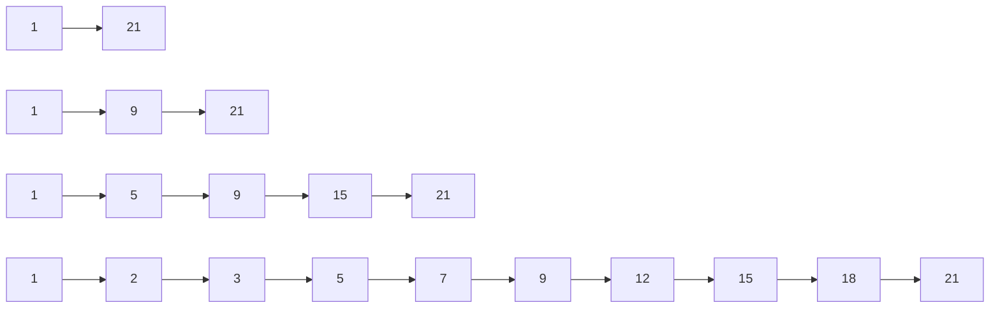

查找时从最高层开始跳，发现下一步会超过目标，就下降一层继续。它用随机层数近似平衡树的效果。

### 8.3 为什么排行榜适合 Skiplist

排行榜需要同时支持：

- 更新用户分数。
- 查询 Top N。
- 查询某个用户排名。
- 查询分数范围。

普通 Map 只能快速查用户分数。Heap 擅长 Top N，但不擅长任意用户排名。Skiplist 能维护分数顺序，因此适合排行榜。

生产级排行榜通常组合使用：

| 结构 | 作用 |
| --- | --- |
| `map[member]score` | 快速找到用户旧分数 |
| Skiplist | 按分数有序排列 |
| 快照数组 | 快速响应 Top N 高频读取 |

---

# 第三部分：并发数据结构设计

## 9. 线程安全的本质

线程安全不是“加锁”这么简单，而是让并发访问下的数据不变量始终成立。

Go 中的数据竞争是指：

- 两个 goroutine 同时访问同一块内存。
- 至少一个是写。
- 之间没有同步关系。

数据竞争的结果可能是读到旧值、读到不完整状态，甚至 Map 直接 panic。

### 9.1 三种设计思路

| 思路 | 适用场景 | 优点 | 缺点 |
| --- | --- | --- | --- |
| 共享内存 + 锁 | 通用结构 | 简单直接 | 有锁竞争 |
| 消息传递 | 状态顺序更新 | 不容易数据竞争 | 单点吞吐有限 |
| 不可变快照 | 读多写少 | 读路径快 | 写入复制成本高 |

### 9.2 分片 Map

全局一把锁的问题是所有请求都排队。分片 Map 把一个大 Map 拆成多个小 Map，每个 shard 有自己的锁。

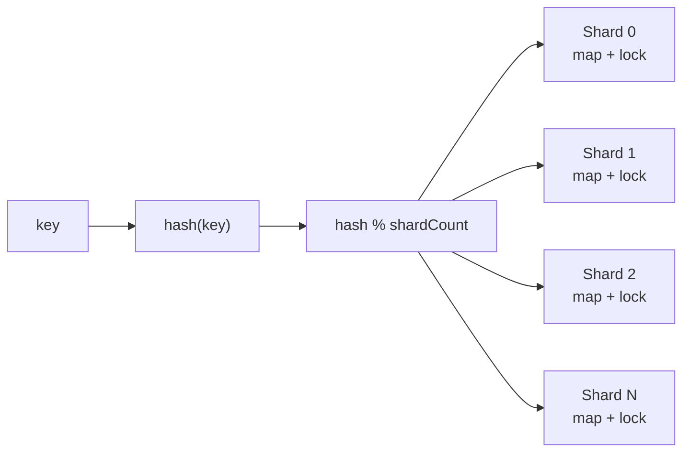

```go
const shardCount = 64

type shard struct {
	mu sync.RWMutex
	m  map[string]int64
}

type ShardedCounter struct {
	shards [shardCount]*shard
}
```

写入时根据 key 的 hash 找到对应 shard：

```go
func (c *ShardedCounter) Add(key string, delta int64) {
	s := c.getShard(key)
	s.mu.Lock()
	defer s.mu.Unlock()

	s.m[key] += delta
}
```

分片不是越多越好。分片越多，全量遍历和内存成本也越高。常见起点是 32、64、128，然后通过 benchmark 调整。

### 9.3 Copy-on-write 快照

配置、规则、路由表这类数据通常读很多，写很少。适合写时复制：

```go
type Snapshot struct {
	Rules map[string]Rule
}

type Store struct {
	value atomic.Value // stores *Snapshot
}
```

读请求直接读取当前快照，不需要加锁。更新时复制一份新数据，构造完成后一次性替换。

关键原则：快照发布后不能再修改。否则读者虽然无锁，仍然可能读到被并发修改的数据。

### 9.4 Actor 模型

Actor 模型让一个 goroutine 独占状态，其他 goroutine 通过消息请求它修改状态。

它适合强顺序场景，比如账户余额、库存扣减、房间状态。

优点是顺序清晰，缺点是单个 Actor 吞吐有限。高并发下通常要按用户 ID、房间 ID、订单 ID 做分区。

---

# 第四部分：算法优化

## 10. Top K：不要为无关数据排序

Top K 的核心思想是：如果只需要前 K 个，就不要排序所有数据。

### 10.1 先问三个问题

1. 数据是一次性计算，还是持续更新？
2. K 相比 N 是很小，还是接近 N？
3. 结果必须实时，还是允许几秒延迟？

| 场景 | 推荐方案 |
| --- | --- |
| 一次性离线计算 | 排序、堆、QuickSelect |
| K 远小于 N | 小根堆 |
| 实时排行榜 | Skiplist 或有序结构 |
| 写入极高，读取很多 | 分片 Top K + 快照 |
| 海量热词 | 近似统计结构 |

这三个问题的参考答案：

1. 如果是一次性计算，比如离线统计昨天销量，排序或小根堆都可以；如果是持续更新，比如游戏排行榜，就要使用能动态更新的数据结构或分片快照。
2. 如果 K 很小，比如从 1 亿条里取前 100，小根堆非常合适；如果 K 接近 N，比如取前 80% 的用户，全量排序可能更简单，性能也未必差。
3. 如果结果必须实时，就要在写路径维护有序结构，成本较高；如果允许秒级延迟，就可以用后台合并和读快照，吞吐会好很多。

生产实践：

- Top K 结果要定义稳定排序规则，例如 `(score desc, update_time asc, member_id asc)`，否则同分用户排名会抖动。
- 读请求远多于写请求时，应优先考虑不可变快照，避免每次读都抢写锁或重新排序。
- 分片 Top K 合并时，每个 shard 至少保留 Top K 候选。如果全局要 Top 100，每个 shard 只保留 Top 10 是不安全的。
- 榜单要明确一致性语义：是实时排名、快照排名，还是“实时分数 + 快照排名”。接口文档要写清楚。
- 对超大规模热词，精确统计可能太贵，可以使用 Count-Min Sketch、Space-Saving 等近似算法，但要向业务说明误差。

### 10.2 强实时为什么贵

每次分数变化都立刻更新全局排名，意味着写路径要维护全局有序结构。写入越高，锁竞争越严重。

很多业务不需要毫秒级强实时。例如活动排行榜允许每秒刷新一次，用户几乎感知不到差别，但系统复杂度会大幅下降：

- 写请求更新分片数据。
- 后台每秒合并一次。
- 读请求读取快照。

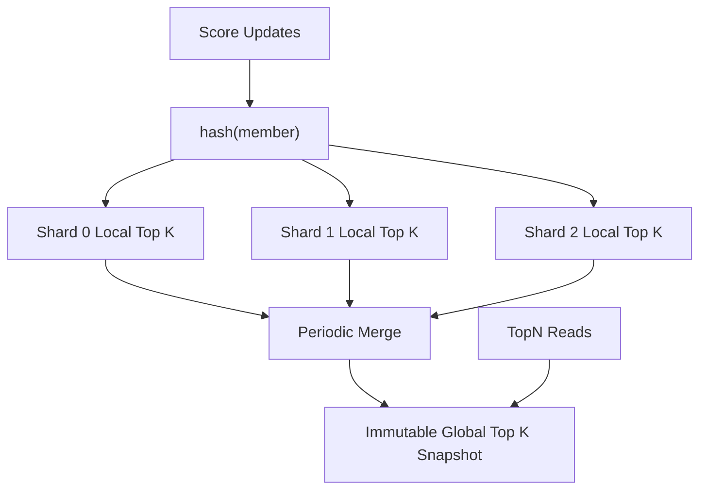

这是一种重要的工程取舍：用可接受的延迟换稳定性和吞吐。

---

## 11. 高频访问优化

高频路径优化的第一原则是：不要在每个请求里做重复且昂贵的事情。

常见成本包括：

- 锁竞争。
- 内存分配。
- 全量扫描。
- 全量排序。
- 数据库访问。
- 序列化和反序列化。
- 同步日志。

### 11.1 缓存的几个坑

| 问题 | 含义 | 解决方向 |
| --- | --- | --- |
| 缓存击穿 | 热点 key 过期，大量请求同时回源 | singleflight |
| 缓存穿透 | 查询不存在的数据 | 空值缓存 |
| 缓存雪崩 | 大量 key 同时过期 | TTL 加随机抖动 |
| 热点 key | 单个 key 被大量访问 | 多副本、分片、预热 |

缓存的目标不是让数据永远不变，而是在可接受的一致性范围内减少后端压力。

缓存问题的参考答案与生产解读：

- 缓存击穿的最佳做法是 singleflight。多个请求同时发现热点 key 过期时，只允许一个请求回源，其余请求等待结果或使用旧值。
- 缓存穿透要缓存“不存在”的结果，但 TTL 要短，避免后来数据创建后仍长期返回不存在。
- 缓存雪崩要给 TTL 加随机抖动，例如基础 TTL 10 分钟，额外随机 0 到 60 秒，避免大量 key 同时失效。
- 热点 key 可以做本地缓存、多副本缓存、读写分离或提前预热。极端热点下，单个 Redis key 本身也会成为瓶颈。

生产实践：

- 缓存值要有版本或更新时间，方便排查“为什么用户看到旧数据”。
- 对核心数据使用 cache-aside 时，更新数据库后要删除缓存，而不是直接更新缓存。删除失败要有重试或消息补偿。
- 对读多写少的数据，可以使用本地内存缓存 + 远程缓存两级结构，但要注意本地缓存失效和容量上限。
- 热路径里不要同步打印大日志，不要每次都 JSON 序列化大对象，可以缓存序列化结果。
- 缓存不是一致性方案。涉及资金、库存、权限等关键数据时，缓存只能加速读取，最终判断仍应基于权威存储或强一致服务。

---

## 12. 增量聚合：把查询成本前移

增量聚合的思想很简单：不要每次查询都重新扫描原始数据，而是在写入时维护统计结果。

### 12.1 为什么它有效

假设每秒写入 10 万条事件，查询最近 1 小时点击数。如果每次查询都扫描原始事件，查询成本会随着数据量增长。

如果按分钟聚合，查询 1 小时只需要读取 60 个桶。

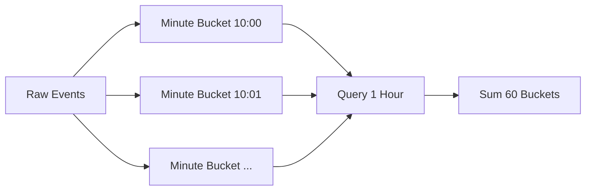

这就是增量聚合的本质：用写入时的一点成本，换取查询时的大幅降本。

### 12.2 桶粒度怎么选

| 粒度 | 适用 |
| --- | --- |
| 秒桶 | 精细实时监控 |
| 分钟桶 | 最近几小时趋势 |
| 小时桶 | 最近几天统计 |
| 天桶 | 长期报表 |

生产中常用多级聚合。查询大范围时用小时桶、天桶；查询边界部分时用分钟桶补齐精度。

参考答案：哪些指标适合增量聚合？

适合增量聚合的指标通常有可加性或可合并性，例如 PV、UV 近似值、点击数、订单数、金额总和、最大值、最小值、Top K 候选集合。不适合直接增量聚合的是需要复杂去重、强事务一致性、频繁修正历史、或者查询维度临时变化非常多的指标。

解读：增量聚合的关键是“状态能否被稳定维护”。计数和求和很好维护，复杂漏斗分析、任意条件筛选则可能需要保留明细或使用专门的 OLAP 系统。

生产实践：

- 明确窗口语义，推荐使用 `[start, end)`，避免边界重复计算。
- 事件中同时保存 `event_time` 和 `ingest_time`。前者表示业务发生时间，后者表示系统接收时间。
- 对迟到事件设置允许修正窗口，例如最近 10 分钟可修正，超过窗口进入离线补偿。
- 聚合桶要有 TTL 或归档策略，不能无限增长。
- 保留原始事件日志。聚合逻辑出错、口径变化或补数据时，可以重放修复。
- 查询大范围时使用粗粒度桶，查询边界时使用细粒度桶，这能显著减少扫描量。

### 12.3 迟到事件

真实事件可能乱序到达。移动端离线、网络重试、消息队列积压都会造成迟到事件。

处理方式：

- 允许修正最近一段时间的桶。
- 太晚的事件进入补偿任务。
- 同时记录业务发生时间和服务接收时间。
- 保留原始日志，必要时重算。

---

# 第五部分：工程化设计

## 13. 接口设计

好的接口表达能力边界，而不是暴露实现细节。

```go
type Entry struct {
	Member string
	Score  int64
	Rank   int64
}

type Store interface {
	AddScore(ctx context.Context, board string, member string, delta int64) (int64, error)
	TopN(ctx context.Context, board string, n int) ([]Entry, error)
	Rank(ctx context.Context, board string, member string) (Entry, error)
}
```

接口设计建议：

- 接口尽量小。
- 第一个参数使用 `context.Context`。
- 错误语义要稳定。
- 不暴露内部锁、Map、Skiplist。
- 对分页、过滤、排序使用请求对象，避免参数爆炸。

---

## 14. 错误处理

Go 的错误处理强调显式返回。生产系统里要区分错误类型。

```go
var ErrNotFound = errors.New("not found")
var ErrRateLimited = errors.New("rate limited")

func loadUser(id int64) error {
	return fmt.Errorf("load user %d: %w", id, ErrNotFound)
}
```

建议：

- 底层错误要 wrap 上下文。
- 边界层转换成稳定错误码。
- 不用字符串比较错误。
- 区分可重试和不可重试错误。
- 不要每一层都重复打日志。

---

## 15. 日志、指标与测试

高并发系统不能靠猜。至少要观察：

| 指标 | 说明 |
| --- | --- |
| QPS | 当前吞吐 |
| p99 延迟 | 尾延迟 |
| 错误率 | 系统健康度 |
| 队列长度 | 是否积压 |
| goroutine 数 | 是否泄漏 |
| 内存和 GC | 是否有分配压力 |
| 限流数 | 是否过载 |

常用命令：

```bash
go test ./...
go test -race ./...
go test -bench=. -benchmem ./...
```

并发结构一定要跑 race test。性能优化一定要跑 benchmark。

---

# 第六部分：高并发系统设计

## 16. Worker Pool：给系统设置边界

worker pool 的价值不是“并发处理任务”这么简单，而是限制系统最多同时处理多少任务。

没有 worker pool 的写法：

```go
for _, task := range tasks {
	go handle(task)
}
```

如果任务很多，这会瞬间创建大量 goroutine。worker pool 则让并发数量可控。

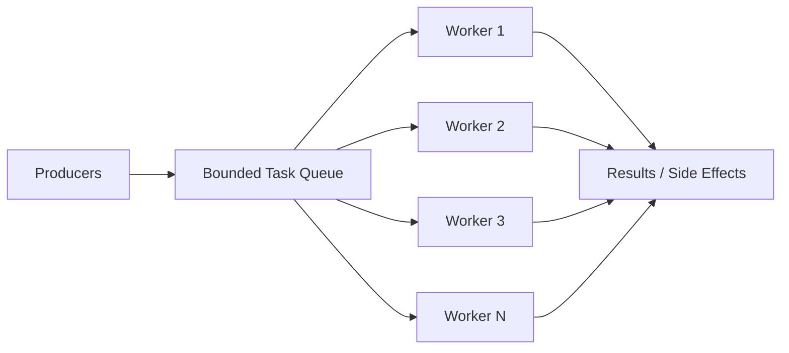

### 16.1 worker 数量如何估算

粗略公式：

```text
并发数 ≈ 目标吞吐量 * 平均处理耗时
```

如果希望每秒处理 2000 个事件，每个事件平均耗时 10ms，那么需要大约：

```text
2000 * 0.01 = 20
```

这只是起点。还要结合 CPU、内存、p99 延迟、下游容量压测调整。

参考答案与解读：

- CPU 密集型任务：worker 数通常接近 CPU 核数，过多只会增加上下文切换。
- IO 密集型任务：worker 数可以高于 CPU 核数，但不能超过下游能承受的并发。
- 数据库任务：worker 数不能只看应用，要看连接池大小、慢查询、数据库 CPU 和锁等待。
- 混合任务：最好拆成多个阶段，例如解析、计算、写库分别使用不同 pool，避免慢 IO 阻塞 CPU 任务。

生产实践：

- worker 数和队列长度都做成配置，但要有上限，避免误配置。
- 启动后暴露当前 worker 数、busy worker 数、队列长度、任务耗时、失败数。
- 任务执行要加 recover，panic 不能让 worker 静默退出。
- 不同优先级任务不要共用一个队列，否则低优先级任务可能阻塞关键任务。

### 16.2 队列长度如何估算

队列不是越长越好。它应该由可接受排队时间反推：

```text
队列长度 ≈ 处理吞吐量 * 可接受排队秒数
```

如果每秒处理 5000 个任务，最多接受排队 2 秒，队列长度可以从 10000 附近开始测试。

### 16.3 生产级 worker pool 要考虑

- 任务错误如何处理。
- worker panic 如何 recover。
- 队列满了怎么办。
- 服务关闭时是否 drain。
- 是否暴露队列长度和处理耗时。

这些问题的推荐答案：

| 问题 | 推荐做法 |
| --- | --- |
| 任务错误如何处理 | 返回错误后统一记录指标和日志，必要时进入重试队列 |
| panic 如何 recover | worker 外层 `defer recover`，记录堆栈并继续服务 |
| 队列满了怎么办 | 在线请求快速失败，后台任务可短暂等待或转持久队列 |
| 服务关闭是否 drain | 先停止接收新任务，再等待已接收任务完成，设置最大等待时间 |
| 任务是否可重试 | 只重试幂等任务，并设置最大次数和退避 |

一个生产级 worker pool 至少应该具备：有界队列、提交超时、错误回调、panic recover、优雅关闭、指标暴露。否则它只是一个教学示例。

---

## 17. Fan-out / Fan-in：并行也会放大流量

Fan-out 能降低延迟。例如一个接口要查 5 个下游，串行可能 250ms，并行后接近最慢的那个下游。

但 fan-out 会放大流量。一个请求 fan-out 到 10 个下游，1 万 QPS 会变成 10 万次下游调用。

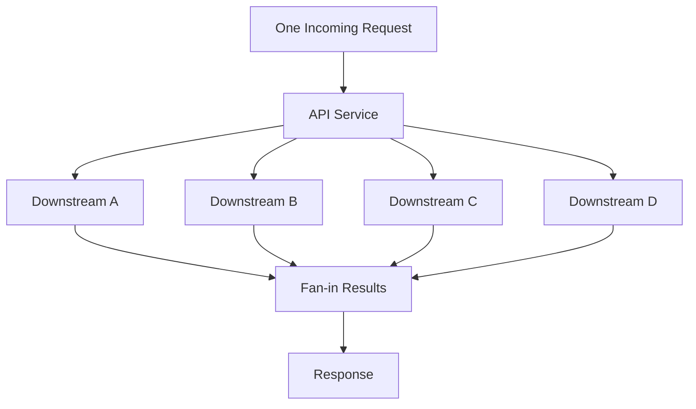

因此 fan-out 必须有：

- 总超时。
- 单下游超时。
- 最大并发数。
- 失败策略。
- 取消机制。

参考答案：fan-out 的失败策略怎么选？

| 业务类型 | 策略 | 解读 |
| --- | --- | --- |
| 支付、扣库存 | 全部成功或明确失败 | 不能返回部分成功让调用方误解 |
| 聚合页面 | 部分成功 | 核心信息展示，非核心模块可降级 |
| 多机房读 | 最快成功 | 谁先返回用谁，拿到结果后取消其他请求 |
| 多副本写 | Quorum | 达到多数成功即可返回 |
| 埋点、日志 | Best effort | 失败记录指标，不阻塞主流程 |

生产实践：

- 对每个下游设置独立并发限制，不能只限制入口请求数。
- fan-out 请求要继承入口 context，但单下游可以有更短 timeout。
- 拿到足够结果后立刻 cancel 剩余请求，减少无效消耗。
- 失败结果要能区分：超时、限流、业务失败、下游不可用。
- 对非核心下游要允许降级，不要让一个推荐服务拖垮整个首页。

常见失败策略：

| 策略 | 场景 |
| --- | --- |
| 全部成功 | 金融、强一致流程 |
| 部分成功 | 聚合页、推荐页 |
| 最快成功 | 多机房读 |
| Quorum | 多副本系统 |
| Best effort | 日志、埋点 |

---

## 18. Backpressure：承认系统有容量上限

背压就是系统处理不过来时，向上游明确表达“我现在不能再接了”。

如果没有背压，压力会藏在队列里：

```text
请求进入
  |
队列积压
  |
延迟升高
  |
调用方超时重试
  |
系统更忙
```

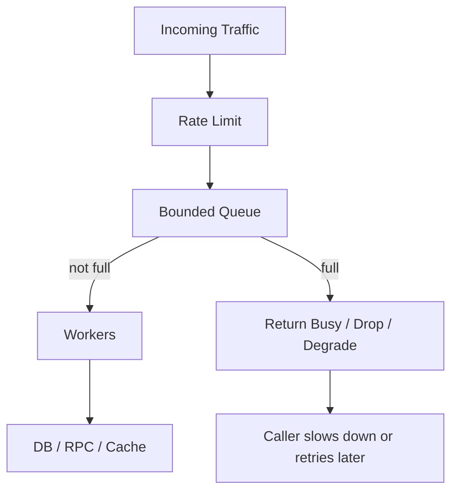

背压策略：

| 策略 | 适用 |
| --- | --- |
| 阻塞等待 | 不能轻易丢任务 |
| 快速失败 | 在线请求 |
| 丢弃最新 | 日志、指标 |
| 丢弃最旧 | 保留最新状态 |
| 降级处理 | 搜索、推荐、聚合页 |

背压不是失败，而是系统自我保护。

参考答案：队列满了到底该怎么办？

最佳答案取决于业务价值和可补偿性：

- 在线读请求：快速失败或返回降级结果，避免用户一直等待。
- 可丢弃事件：直接丢弃并记录丢弃数量，例如部分日志和指标。
- 关键写入：短暂等待，失败后写入可靠队列或返回明确错误，由调用方重试。
- 状态刷新：可以丢弃旧任务，保留最新任务。

生产实践：

- 背压错误要有明确错误码，例如 `ErrBusy`、`ErrQueueFull`、`RESOURCE_EXHAUSTED`。
- 记录队列长度、入队等待时间、丢弃数、快速失败数。
- 客户端重试必须有指数退避和抖动，不能立即重试。
- 背压应该尽量发生在靠近入口的位置，越早拒绝，浪费越少。
- 不要把背压全部转移给数据库。数据库通常是更稀缺也更共享的资源。

---

## 19. 限流：系统的安全阀

限流控制进入系统的请求速率。它的目标不是让所有请求成功，而是在过载时让系统保持可用。

常见算法：

| 算法 | 特点 |
| --- | --- |
| 固定窗口 | 简单，但边界有突刺 |
| 滑动窗口 | 平滑，成本稍高 |
| 漏桶 | 固定速率流出 |
| 令牌桶 | 允许短暂突发，最常用 |

限流位置：

- 网关限流。
- 服务实例限流。
- 用户维度限流。
- 接口维度限流。
- 下游依赖限流。

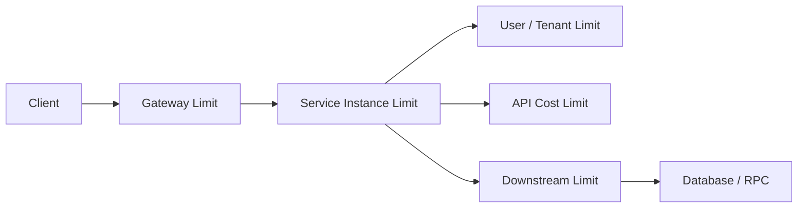

限流响应要明确。HTTP 场景通常返回 `429 Too Many Requests`，并可以携带 `Retry-After`。

参考答案：固定窗口、滑动窗口、漏桶、令牌桶怎么选？

| 算法 | 适合场景 | 注意点 |
| --- | --- | --- |
| 固定窗口 | 简单接口保护 | 窗口边界可能瞬间放过双倍流量 |
| 滑动窗口 | 用户/API 限流 | 更平滑，但存储和计算成本更高 |
| 漏桶 | 需要平滑下游流量 | 不适合允许突发的业务 |
| 令牌桶 | 大多数在线服务 | 允许突发，但总速率受控 |

生产实践：

- 网关限流保护整体入口，服务内限流保护单实例，下游限流保护数据库和 RPC。
- 限流维度至少包括接口、用户或租户、来源 IP、下游依赖。
- 限流配置要能动态调整，并设置安全默认值。
- 限流不能只看 QPS，还要看请求成本。一次复杂查询可能抵得上几十次普通查询。
- 返回限流错误时，告诉调用方是否可重试以及建议等待时间。

---

# 第七部分：实战项目

## 20. Leaderboard 高级实现

目标：实现高并发排行榜。

核心能力：

- 增加用户分数。
- 查询 Top N。
- 查询用户排名。
- 支持多榜单。
- 支持并发安全。
- 支持快照缓存。

推荐架构：

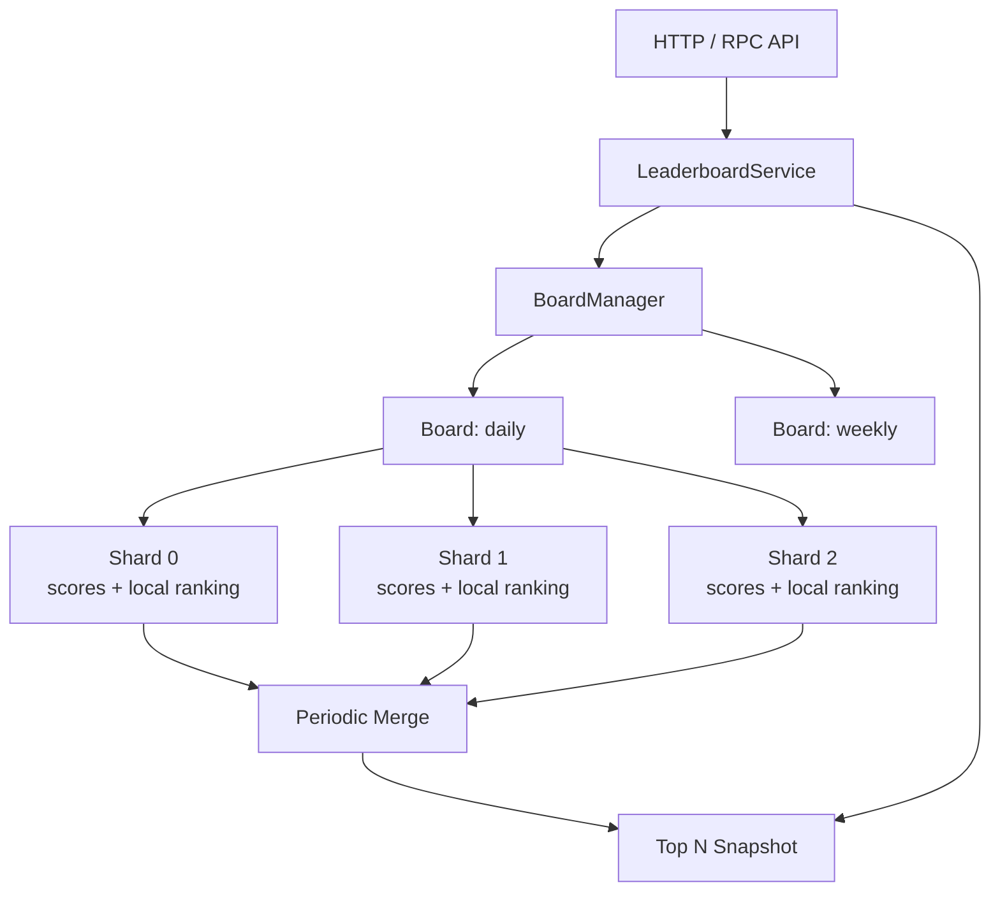

设计思路：

- 写入按 member 分片。
- 每个分片维护局部数据。
- 后台周期性合并 Top K。
- 读请求读取不可变快照。
- 对用户排名可以提供“实时分数 + 快照排名”语义。

常见坑：

#### 坑 1：每次写入都全量排序

为什么会出现：最直观的实现是每次 `AddScore` 后把所有用户重新排序。小数据量没问题，一旦用户达到几十万、几百万，写入路径会被排序拖垮。

错误思路：

```go
scores[member] += delta
sort.Slice(allEntries, less) // 每次写入都排序全量数据
```

修复方式：写路径只更新分片数据；后台周期性合并 Top K 快照。对于实时性要求高的榜单，可以使用 Skiplist 或 Redis Sorted Set，但也要评估写入成本。

#### 坑 2：`TopN` 返回内部切片

为什么会出现：为了少一次拷贝，直接返回内部缓存切片。但调用方拿到切片后可能修改元素，污染内部快照。

错误示例：

```go
func (b *Board) TopN(n int) []Entry {
	return b.snapshot[:n]
}
```

修复方式：返回副本。

```go
func (b *Board) TopN(n int) []Entry {
	result := make([]Entry, n)
	copy(result, b.snapshot[:n])
	return result
}
```

生产建议：对外返回的数据默认都当成不可信可变对象。内部缓存和快照不要暴露给调用方。

#### 坑 3：同分用户排序不稳定

为什么会出现：只按分数排序时，同分用户之间顺序可能随 Map 遍历顺序、排序实现和刷新批次变化而抖动。

修复方式：定义完整排序键，例如：

```text
score desc, updated_at asc, member_id asc
```

这样同分用户也有稳定顺序，用户刷新页面时排名不会无故跳动。

#### 坑 4：读写强一致要求过高，导致系统无法扩展

为什么会出现：如果要求每次写入后所有读请求立刻看到全局精确排名，读写路径会高度耦合，通常需要全局有序结构和强同步。

解决方式：明确 API 语义。生产中常见做法是：

- `GetScore` 返回实时分数。
- `TopN` 返回最近一次快照。
- `Rank` 返回快照排名，并告知刷新周期。

这能用很小的业务延迟换来更高吞吐和更稳定的尾延迟。

项目练习：

1. 实现多榜单 `BoardManager`。
2. 实现后台每秒刷新 Top 100。
3. 实现 `AddScore`、`TopN`、`Rank`。
4. 对 10 万、100 万用户做 benchmark。
5. 增加 HTTP API 和压测脚本。

参考实现方向：

- `BoardManager` 用 `map[string]*Board + RWMutex` 管理榜单。榜单数量变化不频繁时，这比 `sync.Map` 更容易保证类型安全和初始化语义。
- 每个 `Board` 内部按 member hash 分成多个 shard。写入只锁对应 shard，避免所有用户更新争抢一把锁。
- 每个 shard 维护 `map[member]score` 和局部 Top K 候选。后台定时从所有 shard 拉取候选并归并成全局快照。
- `TopN` 直接读 `atomic.Value` 中的不可变快照，避免读请求和写请求互相阻塞。
- `Rank` 可以分两种语义：实时计算精确排名，或者返回快照排名。生产中建议先提供快照排名，并在 API 文档中说明刷新周期。
- benchmark 要分别测写入吞吐、TopN 延迟、快照合并耗时、内存占用。不要只测单个函数平均耗时。

生产最佳实践：

- 排名规则必须稳定。推荐按 `score desc, updated_at asc, member_id asc` 排序。
- `TopN` 返回结果要复制，不能把内部快照切片直接暴露给调用方修改。
- 快照刷新失败时保留旧快照，并记录错误指标。
- 对超大榜单可以把实时写入和查询拆开：写入进消息队列，聚合服务消费更新榜单，查询服务只读快照或 Redis Sorted Set。
- 对用户可见榜单，要考虑反作弊、分数回滚、重复事件幂等和补偿重算。

---

## 21. ActivityTracker 高级实现

目标：实现高吞吐活动事件追踪系统。

核心能力：

- 写入事件。
- 查询窗口统计。
- 查询高频行为。
- 支持异步写入。
- 支持背压。
- 支持增量聚合。
- 支持过期清理。

推荐架构：

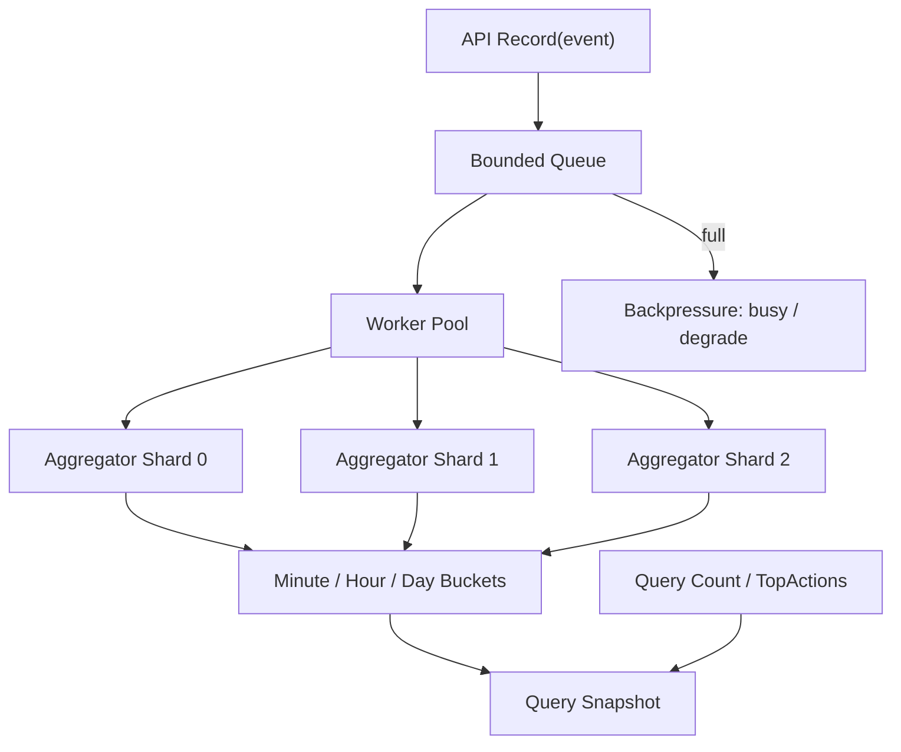

设计思路：

- 写入先进入有界队列。
- 队列满时快速失败或降级。
- worker 批量聚合事件。
- 聚合结果按分钟、小时、天分桶。
- 查询优先读取聚合桶。
- 过期桶定期清理。

常见坑：

#### 坑 1：队列无上限

为什么会出现：为了“不丢事件”，开发者容易把队列做得很大，甚至使用无限增长的内存结构。结果系统处理不过来时，内存先被打爆。

修复方式：使用有界队列，并定义满队列策略。

```go
func (t *Tracker) Record(ctx context.Context, e Event) error {
	select {
	case t.queue <- e:
		return nil
	case <-ctx.Done():
		return ctx.Err()
	default:
		return ErrBusy
	}
}
```

生产建议：关键事件不要依赖无限内存队列，而应写入可靠消息队列或本地 WAL，再异步消费。

#### 坑 2：查询大窗口时扫描太多分钟桶

为什么会出现：分钟桶适合短窗口查询。如果查询最近 90 天，扫描分钟桶需要访问 129600 个桶，延迟和 CPU 都会很差。

修复方式：使用多级聚合。查询大范围用天桶或小时桶，边界部分再用分钟桶补齐。

```text
查询最近 25 小时 =
  起始边界若干分钟桶
  + 中间完整小时桶
  + 结束边界若干分钟桶
```

#### 坑 3：事件时间和服务时间混用

为什么会出现：客户端上报的事件时间可能不准，服务端接收时间又不能完全代表业务发生时间。混用后，统计口径会混乱。

修复方式：同时保存两个时间：

- `event_time`：业务发生时间。
- `ingest_time`：服务接收时间。

实时统计通常按 `event_time` 入桶，但排障、积压监控和迟到分析要看 `ingest_time`。

#### 坑 4：没有迟到事件处理策略

为什么会出现：移动端离线、网络重试、消息队列积压都会让事件延迟到达。如果聚合系统只接受当前分钟，迟到事件要么丢失，要么污染历史。

解决方式：设置可修正窗口。例如最近 10 分钟允许修正，超过 10 分钟进入离线补偿。查询快照要标注数据延迟。

#### 坑 5：没有保留原始日志，无法重算

为什么会出现：增量聚合只保存结果，一旦代码 bug、统计口径变化或迟到策略调整，就无法修复历史数据。

生产建议：重要统计必须保留原始事件流或明细日志。聚合结果是加速查询的派生数据，不应是唯一事实来源。

项目练习：

1. 实现 64 分片聚合。
2. 实现分钟桶、小时桶、天桶。
3. 实现 `TopActions(start, end, n)`。
4. 暴露队列长度、写入失败数、处理延迟。
5. 实现优雅关闭。

参考实现方向：

- 写入入口只做轻量校验和入队，不在请求路径里做复杂聚合。
- 队列使用有界 channel，满了返回 `ErrBusy` 或降级，不能无限阻塞。
- worker 消费事件后按 `hash(action)` 或 `hash(userID)` 写入不同 aggregator shard。
- 每个 shard 维护分钟桶，后台定时把完整分钟聚合到小时桶，把完整小时聚合到天桶。
- `TopActions` 查询时先在每个 shard 内计算局部 Top K，再归并全局 Top K。
- 优雅关闭分两步：先停止接收新事件，再 drain 队列，最后 flush 聚合状态。

生产最佳实践：

- 事件要有唯一 ID 或幂等键，避免消息重试导致重复计数。
- 保存原始事件日志或消息流，方便口径变化后重算。
- 明确迟到事件策略，例如只修正最近 10 分钟，超过窗口进入离线补偿。
- 指标至少包括入队成功数、入队失败数、队列长度、消费延迟、聚合耗时、桶数量、丢弃数。
- 如果查询跨度很大，禁止扫描过多分钟桶，应自动切换到小时桶或天桶。

---

# 高并发设计检查清单

## 1. 并发安全

- 所有共享状态是否有明确保护？最佳实践是给每个结构体写清楚“哪些字段由哪把锁保护”，复杂对象可以在字段注释中标明。
- 是否跑过 `go test -race`？并发数据结构、缓存、worker pool、排行榜更新路径都应该覆盖 race test。
- 是否存在 goroutine 泄漏？压测前后观察 goroutine 数，停止流量后应回落到稳定水平。
- channel 关闭责任是否明确？通常发送方关闭；多个发送方时由协调者关闭。
- 锁内是否调用外部服务？生产代码中应避免锁内 RPC、DB、文件 IO 和同步日志。

## 2. 性能

- 热路径是否有全局锁？如果 p99 延迟随并发快速上升，优先检查锁竞争。
- 是否存在全量排序或全量扫描？TopN、统计查询、范围查询都要特别检查。
- 是否有不必要内存分配？用 `go test -bench=. -benchmem` 看 allocs/op，热路径尽量减少临时对象。
- Top K 是否避免了全量排序？K 远小于 N 时优先堆、分片 Top K 或快照。
- 查询是否使用增量聚合？高频统计查询不应每次扫描原始事件。

## 3. 稳定性

- 是否有超时？入口、下游、队列等待都要有超时预算。
- 是否有取消？请求取消后，后台 goroutine 和下游调用应尽快停止。
- 是否有限流？限流要覆盖网关、服务实例、用户/API 和下游依赖。
- 是否有背压？队列满、worker 忙、下游慢时要有明确策略。
- 队列是否有上限？所有内存队列都应有容量上限和满队列指标。
- 是否有优雅关闭？先停入口，再 drain 队列，最后关闭 worker，并设置最大等待时间。

## 4. 可观测性

- 是否有 QPS、延迟、错误率？延迟要看 p50、p90、p99，不只看平均值。
- 是否有队列长度？队列长度和入队等待时间是背压前兆。
- 是否有 goroutine 数？持续上涨通常意味着泄漏或阻塞。
- 是否有内存和 GC 指标？内存上涨、GC 频繁会直接影响尾延迟。
- 是否记录限流、丢弃、降级次数？这些不是噪声，而是系统过载的核心信号。

检查清单的使用方法：每次上线高并发功能前，至少用一次压测验证这些问题。不要等线上事故后才补指标和边界。

---

# 常见线上故障模式

| 现象 | 常见原因 | 处理方向 |
| --- | --- | --- |
| goroutine 持续上涨 | 阻塞、泄漏、未监听 context | 加超时、取消、边界 |
| p99 延迟升高 | 锁竞争、GC、下游慢、队列积压 | 看 trace、pprof、指标 |
| CPU 高但吞吐低 | 自旋、调度频繁、日志过多 | 降并发、批量、减少热路径开销 |
| 内存上涨 | 队列积压、缓存无淘汰 | 加上限、TTL、pprof |
| 数据偶发错误 | 数据竞争、快照被修改 | race test、不可变对象 |
| 数据库被打爆 | fan-out、重试风暴、缺少限流 | 限流、熔断、缓存 |

## 生产排障手册

遇到高并发问题时，不要先改代码。先判断系统属于哪一种问题。

### 1. goroutine 持续上涨

优先检查：

- 是否有 goroutine 阻塞在 channel send/receive。
- 是否有下游调用没有超时。
- 是否有请求结束后后台任务还在运行。
- worker 是否因为队列不关闭而无法退出。

排查方法：

```bash
curl http://localhost:6060/debug/pprof/goroutine?debug=2
```

看堆栈里最多的阻塞点。如果大量 goroutine 卡在同一个 channel send，通常是消费者退出或处理太慢。如果大量卡在网络读写，通常是下游超时没设置好。

### 2. p99 延迟升高

优先检查：

- 锁等待是否增加。
- 队列长度是否上涨。
- 下游延迟是否上涨。
- GC 是否变频繁。
- 是否发生重试风暴。

最佳实践是把延迟拆成阶段：入队等待时间、处理时间、下游调用时间、序列化时间。只看总耗时很难定位问题。

### 3. CPU 高但吞吐不上去

常见原因：

- goroutine 太多，调度成本升高。
- 锁竞争导致自旋和频繁唤醒。
- 热路径频繁 JSON 编解码。
- 日志量过大。
- 正则、排序、加密等 CPU 重操作在每个请求中重复执行。

处理顺序：

1. 用 CPU profile 找最热函数。
2. 先减少重复计算和同步日志。
3. 再考虑缓存、批量、算法优化。
4. 最后才考虑调 `GOMAXPROCS` 或做底层微优化。

### 4. 数据库被打爆

数据库通常是整个系统最共享、最稀缺的资源。保护数据库比保护单个服务更重要。

生产处理建议：

- 给数据库访问设置连接池上限。
- 对昂贵查询做接口级限流。
- 使用缓存和 singleflight 合并热点读。
- fan-out 查询要限制并发。
- 重试必须有退避和最大次数。
- 对写入高峰使用消息队列削峰，但队列也必须有积压监控。

如果数据库已经过载，第一步通常不是扩容，而是先止血：限流、降级、关闭非核心查询、减少重试。

---

# 结语

Go 的并发能力很强，但它给工程师的是工具，不是答案。

goroutine 让并发变得容易，但不能替你决定并发上限。channel 让通信变得优雅，但不能替你设计背压。锁让共享状态变得安全，但不能替你消除锁竞争。Heap、Skiplist、增量聚合能提升性能，但前提是你知道瓶颈在哪里。

高并发系统的核心不是把程序写得更复杂，而是把边界设计清楚：

- 并发有边界。
- 队列有边界。
- 等待有边界。
- 一致性有边界。
- 失败也有边界。

当你能解释为什么这里用锁，那里用 channel；为什么这里读快照，那里强一致；为什么 Top K 不全量排序；为什么队列满了要快速失败，你就已经不只是会写 Go，而是在设计一个能承受真实流量的系统。
