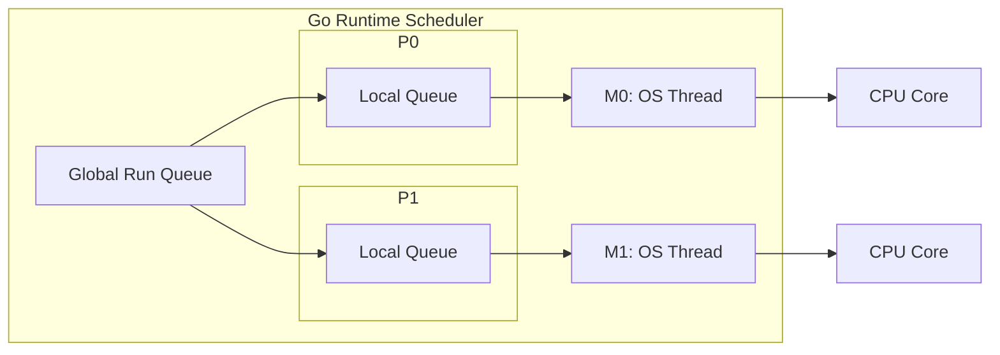

[返回首页](../README.md) / [返回上级](part-01-go-concurrency.md)

# 1. goroutine：不是免费的线程

goroutine 是 Go 最吸引人的特性之一。很多人第一次写 Go 时，会惊讶于这样一行代码：

```go
go doSomething()
```

它看起来太轻松了，以至于容易让人误以为 goroutine 是免费的。事实并非如此。goroutine 的确比操作系统线程轻得多，但只要是运行中的任务，就一定消耗资源。

## 1.1 goroutine 的系统级原理

操作系统线程是真正能被 CPU 调度执行的实体。传统语言里，如果大量创建线程，系统很快会吃不消，因为每个线程都有较大的栈、内核调度成本和上下文切换成本。

Go 的做法是自己在用户态做一层调度。可以用 G/M/P 模型来理解：

| 名称 | 含义 | 类比 |
| --- | --- | --- |
| G | goroutine | 一张待执行的任务卡 |
| M | OS 线程 | 真正干活的工人 |
| P | 调度上下文 | 工人的工具台和本地任务队列 |

Go runtime 会把大量 G 分配到少量 M 上执行。M 想执行 Go 代码，通常需要绑定一个 P。每个 P 有自己的本地运行队列，如果本地队列空了，还会从全局队列或其他 P 那里拿任务。



这套机制解释了两个现象：

1. goroutine 可以很多，因为它们不等于系统线程。
2. goroutine 不能无限多，因为它们仍然需要栈、元数据、调度和 GC 扫描成本。

## 1.2 高并发不是无限并发

假设一个接口每次请求启动 20 个 goroutine。如果有 1 万 QPS，每秒就会创建 20 万个 goroutine。即使每个 goroutine 很轻，调度、内存分配、GC 都会成为负担。

因此，高并发系统要做的第一件事不是“尽可能并发”，而是“限制并发，让资源可预测”。

| 场景 | 建议 |
| --- | --- |
| 少量异步任务 | 可以直接启动 goroutine |
| 大量独立任务 | 使用 worker pool |
| 请求内并行访问多个下游 | 使用 fan-out，并配合 `context` |
| CPU 密集任务 | 并发度接近 `runtime.GOMAXPROCS(0)` |
| IO 密集任务 | 根据下游承载能力设置并发上限 |

## 1.3 示例：并发抓取用户信息

```go
package main

import (
	"fmt"
	"sync"
	"time"
)

func fetchUser(id int) string {
	time.Sleep(100 * time.Millisecond)
	return fmt.Sprintf("user-%d", id)
}

func main() {
	ids := []int{1, 2, 3, 4, 5}
	results := make([]string, len(ids))

	var wg sync.WaitGroup
	for i, id := range ids {
		wg.Add(1)

		go func(i, id int) {
			defer wg.Done()
			results[i] = fetchUser(id)
		}(i, id)
	}

	wg.Wait()
	fmt.Println(results)
}
```

这段代码有三个值得注意的地方：

- `WaitGroup` 用来等待所有 goroutine 结束。
- 循环变量通过参数传入 goroutine，避免闭包捕获问题。
- 每个 goroutine 写入不同下标，因此不会发生同一位置的并发写。

## 1.4 常见坑

### 坑 1：goroutine 没有退出条件，形成泄漏

为什么会出现：goroutine 一旦启动，就不会因为父函数返回而自动退出。如果它阻塞在 channel、网络请求、定时器或死循环里，就会一直活着。

错误示例：

```go
func watch(ch <-chan int) {
	go func() {
		for v := range ch {
			fmt.Println(v)
		}
	}()
}
```

如果 `ch` 永远不关闭，这个 goroutine 就永远不会退出。

修复方式：给长期运行的 goroutine 增加 `context`，并在循环中监听取消信号。

```go
func watch(ctx context.Context, ch <-chan int) {
	go func() {
		for {
			select {
			case v, ok := <-ch:
				if !ok {
					return
				}
				fmt.Println(v)
			case <-ctx.Done():
				return
			}
		}
	}()
}
```

生产建议：后台 goroutine 必须有清晰的生命周期。服务关闭、请求取消、上游退出时，它都应该能停止。

### 坑 2：goroutine 中 panic 未恢复，导致进程崩溃

为什么会出现：panic 不会只杀死当前 goroutine。如果没有 recover，它会让整个进程退出。后台任务、worker pool、消息消费 goroutine 尤其要注意。

修复方式：在 goroutine 最外层 recover，并记录堆栈。

```go
go func() {
	defer func() {
		if r := recover(); r != nil {
			log.Printf("worker panic: %v", r)
		}
	}()

	runWorker()
}()
```

生产建议：recover 不是为了吞掉错误，而是为了避免单个任务拖垮整个进程。recover 后要记录日志、指标，必要时告警。

### 坑 3：请求超时后，后台 goroutine 仍在工作

为什么会出现：请求 handler 返回不代表它启动的 goroutine 会自动停止。如果 goroutine 没有拿到请求的 `context`，它不知道上游已经放弃。

错误示例：

```go
func handler(w http.ResponseWriter, r *http.Request) {
	go doSlowWork()
	w.WriteHeader(http.StatusAccepted)
}
```

修复方式：传入 `r.Context()`，并让下游调用都支持取消。

```go
func handler(w http.ResponseWriter, r *http.Request) {
	go doSlowWork(r.Context())
	w.WriteHeader(http.StatusAccepted)
}
```

如果任务必须在请求结束后继续执行，就不要直接使用请求 context，而应该进入受控的后台队列，由后台系统管理重试、超时和关闭。

### 坑 4：无限创建 goroutine，导致调度和内存压力

为什么会出现：`go func()` 太容易写，开发者容易把“并发”误解成“每个任务一个 goroutine”。任务量大时，goroutine 数量会瞬间膨胀。

错误示例：

```go
for _, job := range jobs {
	go process(job)
}
```

修复方式：使用 worker pool 或 semaphore 限制并发。

```go
sem := make(chan struct{}, 20)
for _, job := range jobs {
	sem <- struct{}{}
	go func(job Job) {
		defer func() { <-sem }()
		process(job)
	}(job)
}
```

生产建议：并发度应该根据 CPU、下游容量、连接池大小和压测结果确定，而不是根据任务数量确定。

## 1.5 练习

1. 写一个并发 URL 抓取器，最多同时抓取 10 个 URL。
2. 写一个会泄漏 goroutine 的例子，再用 `context` 修复。
3. 思考：如果一个任务是 CPU 密集型，启动 1000 个 goroutine 是否有意义？

参考答案与解读：

1. URL 抓取器应该使用“任务队列 + 固定 worker 数”或“semaphore 限制并发”。不要对每个 URL 直接启动一个 goroutine，否则 URL 数量一大就会失控。生产中还要给 HTTP client 设置连接池、请求超时、重试上限和最大响应体大小。
2. 常见泄漏例子是 goroutine 阻塞在发送 channel 上，但接收方已经退出。修复方式是给发送和接收都加 `select { case ...; case <-ctx.Done(): }`，让上游取消能传递到后台任务。
3. 通常没有意义。CPU 密集型任务受 CPU 核数限制，1000 个 goroutine 只会增加调度开销。最佳实践是并发度接近 `runtime.GOMAXPROCS(0)`，或者略高一点后压测确认。

生产实践：

- 所有请求级 goroutine 都应该能被 `context` 取消。
- 后台常驻 goroutine 要有明确的启动、停止、panic recover 和日志。
- 批量任务要设并发上限，不要直接按任务数量启动 goroutine。
- 线上要监控 goroutine 数量。稳定系统中 goroutine 数应该随流量波动，但不应长期单调上涨。

---

