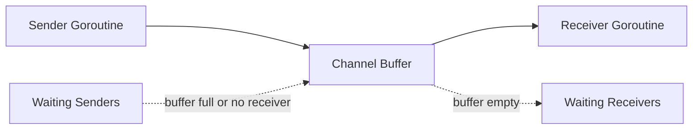

[返回首页](../README.md) / [返回上级](part-01-go-concurrency.md)

# 2. channel：带同步语义的队列

channel 常被认为是 Go 并发的灵魂。它不仅能传数据，还能表达同步关系。

## 2.1 channel 的本质

channel 可以理解成一个带同步语义的队列。它内部大致包含：

- 一个缓冲区。
- 一个等待发送的 goroutine 队列。
- 一个等待接收的 goroutine 队列。
- 一把内部锁。

无缓冲 channel 更像“当面交接”。发送方和接收方必须同时到场。  
有缓冲 channel 更像“临时仓库”。生产者可以先把东西放进去，消费者稍后再取。



| 类型 | 行为 | 适用场景 |
| --- | --- | --- |
| 无缓冲 channel | 发送和接收同步发生 | 交接任务、同步信号 |
| 有缓冲 channel | 允许短暂排队 | 任务队列、削峰 |
| 只读 channel | 限制函数只能接收 | API 边界 |
| 只写 channel | 限制函数只能发送 | API 边界 |

## 2.2 channel 的内存可见性

Go 内存模型保证：channel 发送发生在对应接收之前。通俗地说，发送前写入的数据，接收后可以看到。

```go
done := make(chan struct{})
var x int

go func() {
	x = 42
	close(done)
}()

<-done
fmt.Println(x) // 一定能看到 42
```

这里 `close(done)` 不只是关闭 channel，它也是一个同步信号。

## 2.3 示例：订单处理流水线

```go
package main

import "fmt"

type Order struct {
	ID     int
	Amount int64
}

func producer(out chan<- Order) {
	defer close(out)

	for i := 1; i <= 5; i++ {
		out <- Order{ID: i, Amount: int64(i * 100)}
	}
}

func consumer(in <-chan Order) {
	for order := range in {
		fmt.Printf("process order: id=%d amount=%d\n", order.ID, order.Amount)
	}
}

func main() {
	ch := make(chan Order, 2)
	go producer(ch)
	consumer(ch)
}
```

## 2.4 channel 不是万能队列

channel 很好用，但不要把它当作无限队列。队列一旦没有边界，就会隐藏系统过载：

```text
请求进入速度 > 处理速度
       |
队列持续增长
       |
内存上涨，延迟上涨
       |
调用方超时重试
       |
流量更大，系统雪崩
```

高并发场景下，channel 队列一定要问三个问题：

- 缓冲区多大？
- 满了怎么办？
- 队列中的任务多久以后就没有意义？

参考答案与解读：

1. 缓冲区大小应该由“处理吞吐量 × 可接受排队时间”反推，而不是拍脑袋。比如 worker 每秒处理 2000 个任务，业务最多接受排队 1 秒，队列可以从 2000 附近开始压测。
2. 队列满了要根据业务选择策略：在线请求通常快速失败；日志指标可以丢弃；核心数据可以短暂等待或落入可靠消息队列；推荐、搜索等体验型功能可以降级。
3. 任务是否过期要看业务语义。用户已经取消的请求、过期的推荐刷新、超过展示窗口的排行榜更新，继续处理价值很低。生产中常给任务附带 deadline，worker 取出后先判断是否已经过期。

一个实用判断是：如果队列里的任务等待时间已经超过调用方超时时间，它即使被处理完也很可能没有用户价值，只是在消耗系统资源。

## 2.5 常见坑

### 坑 1：向已关闭 channel 发送会 panic

为什么会出现：关闭 channel 表示“不会再有新数据”。如果关闭后仍然发送，说明发送方和关闭方的职责没有划清。

错误示例：

```go
ch := make(chan int)
close(ch)
ch <- 1 // panic: send on closed channel
```

解决方式：遵守“发送方负责关闭”的原则。如果有多个发送方，不要让任意发送方直接关闭 channel，而是由协调者在所有发送方结束后关闭。

```go
var wg sync.WaitGroup
ch := make(chan int)

for i := 0; i < 3; i++ {
	wg.Add(1)
	go func(id int) {
		defer wg.Done()
		ch <- id
	}(i)
}

go func() {
	wg.Wait()
	close(ch)
}()
```

### 坑 2：从已关闭 channel 接收零值，误以为是真数据

为什么会出现：从已关闭且已被读空的 channel 接收不会阻塞，会立刻返回元素类型的零值。如果不检查 `ok`，业务可能把零值当成正常数据。

错误示例：

```go
v := <-ch
process(v) // ch 已关闭时，v 可能是零值
```

修复方式：

```go
v, ok := <-ch
if !ok {
	return
}
process(v)
```

如果使用 `for v := range ch`，循环会在 channel 关闭且数据读完后自动退出，这是消费者读取数据流的推荐写法。

### 坑 3：`nil` channel 永久阻塞

为什么会出现：未初始化的 channel 是 nil。对 nil channel 发送和接收都会永久阻塞。这个特性有时可用于动态关闭 select 分支，但误用会导致死锁。

错误示例：

```go
var ch chan int
ch <- 1 // 永久阻塞
```

生产建议：结构体中的 channel 字段必须在构造函数里初始化，不要让调用方直接创建零值结构体后使用。

```go
type Queue struct {
	ch chan int
}

func NewQueue(size int) *Queue {
	return &Queue{ch: make(chan int, size)}
}
```

### 坑 4：`default` 分支造成 CPU 空转

为什么会出现：`select` 带 `default` 时，如果其他 case 都没准备好，会立即执行 `default`。如果外层是 for 循环，就会变成忙等。

错误示例：

```go
for {
	select {
	case v := <-ch:
		process(v)
	default:
	}
}
```

修复方式：没有特殊理由时，不要加 `default`。如果确实需要轮询，要加退避或定时器。

```go
for {
	select {
	case v := <-ch:
		process(v)
	case <-time.After(10 * time.Millisecond):
		// idle
	}
}
```

生产建议：`default` 常用于“非阻塞尝试”，例如队列满时快速失败；不适合无休止轮询。

## 2.6 练习

1. 用 channel 实现一个生产者消费者模型。
2. 给任务队列加上最大长度，队列满时返回错误。
3. 思考：什么时候用 channel 比用锁更清晰？

参考答案与解读：

1. 生产者消费者模型中，生产者负责发送并关闭 channel，消费者用 `range ch` 读取直到 channel 关闭。多个生产者时不要让每个生产者都关闭 channel，应由协调者在所有生产者结束后关闭。
2. 有界队列可以使用带缓冲 channel 加 `select default` 实现非阻塞提交。队列满时返回类似 `ErrQueueFull` 的明确错误，并记录指标。
3. 当问题本质是“任务从 A 流向 B”或“等待某个事件发生”时，channel 更清晰；当问题本质是“多个 goroutine 读写同一份状态”时，锁更清晰。

生产实践：

- channel 的关闭责任要写进代码结构里。通常是发送方关闭，接收方不关闭。
- channel 不适合做无限缓冲。需要可靠排队时，应考虑 Kafka、Redis Stream、NATS、数据库 outbox 等持久化队列。
- 对高频小对象传递，channel 可能带来额外分配和调度成本，必要时用 benchmark 比较锁、atomic 和 channel。

---

