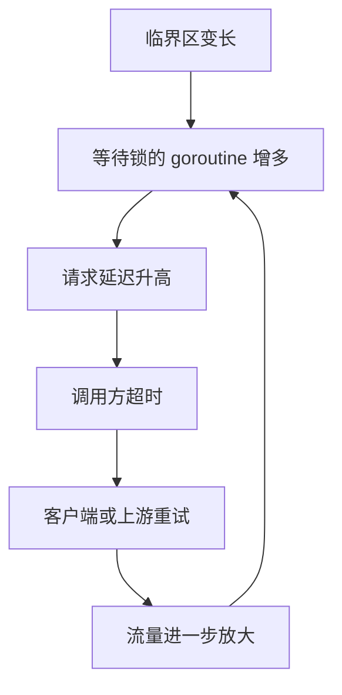

[返回首页](../README.md) / [返回上级](part-01-go-concurrency.md)

# 3. Mutex 与 RWMutex：保护不变量

锁的作用不是保护代码，而是保护数据不变量。

所谓不变量，是业务上必须一直成立的关系。例如：

- 账户余额不能为负。
- `count` 必须等于 Map 中元素数量。
- 排行榜中用户的分数和排名索引必须一致。

如果多个字段共同构成一个不变量，就必须在同一个同步边界内修改它们。

## 3.1 Mutex 的同步语义

`Mutex.Unlock` 之前的写入，对另一个 goroutine 随后成功 `Lock` 后可见。这就是锁除了互斥以外的另一个作用：建立内存可见性。

```go
type Counter struct {
	mu sync.Mutex
	n  int64
}

func (c *Counter) Inc() {
	c.mu.Lock()
	defer c.mu.Unlock()

	c.n++
}

func (c *Counter) Value() int64 {
	c.mu.Lock()
	defer c.mu.Unlock()

	return c.n
}
```

## 3.2 RWMutex 不一定更快

`RWMutex` 允许多个读者同时进入，写者独占。它适合读多写少的场景。但如果写入很频繁，读写锁维护读者和写者状态的成本可能比普通 `Mutex` 更高。

| 场景 | 建议 |
| --- | --- |
| 读很多，写很少 | 可以考虑 `RWMutex` |
| 写很多 | 先用 `Mutex`，再 benchmark |
| 读只是简单整数 | 可以考虑 `atomic` |
| 多字段保持一致 | 用锁更清晰 |

## 3.3 锁竞争如何变成线上事故

锁竞争一开始只是慢一点，后来会变成系统问题：



1. 临界区变长。
2. 等锁的 goroutine 增多。
3. 请求延迟升高。
4. 调用方超时重试。
5. 重试带来更多请求。
6. 系统进一步变慢。

因此，高并发下要尽量：

- 缩短临界区。
- 避免锁内做 IO。
- 使用分片锁降低竞争。
- 用快照减少读锁。
- 用批量合并减少写锁次数。

生产实践：

- 锁保护的是数据不变量。先写清楚哪些字段必须一起变化，再决定锁粒度。
- 临界区里只做内存操作，避免 RPC、数据库、文件 IO、同步日志和复杂回调。
- 如果必须在锁内判断状态、锁外执行慢操作、再回来更新状态，要考虑状态是否已经变化，必要时使用版本号或 CAS 思路。
- 分片锁适合大量 key 分散访问，不适合单个超级热点 key。单个热点 key 要考虑本地累加后批量 flush，或者把热点 key 拆成多个逻辑分片。
- 不要为了减少锁而牺牲正确性。数据结构还没稳定前，先用一把简单的锁保证正确，再根据指标拆分。

## 3.4 示例：读多写少缓存

```go
type User struct {
	ID   int64
	Name string
}

type UserCache struct {
	mu   sync.RWMutex
	data map[int64]User
}

func NewUserCache() *UserCache {
	return &UserCache{data: make(map[int64]User)}
}

func (c *UserCache) Get(id int64) (User, bool) {
	c.mu.RLock()
	defer c.mu.RUnlock()

	u, ok := c.data[id]
	return u, ok
}

func (c *UserCache) Set(u User) {
	c.mu.Lock()
	defer c.mu.Unlock()

	c.data[u.ID] = u
}
```

## 3.5 常见坑

### 坑 1：复制包含锁的结构体

为什么会出现：`sync.Mutex`、`sync.RWMutex` 一旦使用后就不应该被复制。复制后会出现两个锁保护同一份或相关状态的错觉，轻则数据竞争，重则死锁。

错误示例：

```go
type Counter struct {
	mu sync.Mutex
	n  int
}

func (c Counter) Inc() { // 值接收者会复制 Counter，也复制锁
	c.mu.Lock()
	defer c.mu.Unlock()
	c.n++
}
```

修复方式：包含锁的结构体使用指针接收者，并避免值复制。

```go
func (c *Counter) Inc() {
	c.mu.Lock()
	defer c.mu.Unlock()
	c.n++
}
```

生产建议：包含锁的结构体不要作为函数返回值随意复制，不要放入会复制元素的容器操作中。可以用 `go vet -copylocks` 检查这类问题。

### 坑 2：锁内调用外部服务

为什么会出现：外部服务耗时不可控。锁内做 RPC、DB、文件 IO，会让所有等待这把锁的 goroutine 一起排队。

错误示例：

```go
func (s *Store) Refresh(id int64) error {
	s.mu.Lock()
	defer s.mu.Unlock()

	user, err := s.client.LoadUser(id) // 锁内 RPC
	if err != nil {
		return err
	}
	s.users[id] = user
	return nil
}
```

修复方式：锁外做慢操作，锁内只更新共享状态。

```go
func (s *Store) Refresh(id int64) error {
	user, err := s.client.LoadUser(id)
	if err != nil {
		return err
	}

	s.mu.Lock()
	defer s.mu.Unlock()
	s.users[id] = user
	return nil
}
```

如果锁外加载期间状态可能变化，要引入版本号或再次检查，避免旧结果覆盖新结果。

### 坑 3：同一份数据有的地方加锁，有的地方不加锁

为什么会出现：并发安全要求所有访问路径都遵守同一套同步规则。只要有一个读写路径绕过锁，race 仍然存在。

错误示例：

```go
func (c *Cache) Set(k string, v string) {
	c.mu.Lock()
	defer c.mu.Unlock()
	c.data[k] = v
}

func (c *Cache) UnsafeLen() int {
	return len(c.data) // 未加锁
}
```

修复方式：所有访问共享状态的方法都加同一把锁，或者返回不可变快照。

```go
func (c *Cache) Len() int {
	c.mu.RLock()
	defer c.mu.RUnlock()
	return len(c.data)
}
```

生产建议：不要把内部 Map 暴露给调用方。否则调用方可以绕过锁直接修改。

### 坑 4：多个锁保护同一个不变量

为什么会出现：为了降低锁竞争，有时会把字段拆到不同锁下。但如果这些字段共同构成业务不变量，拆锁会让读者看到不一致状态。

例子：排行榜中 `scores` 和 `rankIndex` 必须一致。如果更新分数和更新排名索引用不同锁，读请求可能看到新分数配旧排名。

修复方式：同一个不变量用同一个锁保护；如果必须拆锁，则通过不可变快照、版本号或单线程聚合保证一致性。

参考答案：什么时候应该用 `Mutex`，什么时候用 `RWMutex`？

最佳答案是先看读写比例和临界区长度。读远多于写，并且读临界区不是极短时，`RWMutex` 可能有收益。写入频繁、读操作很短或锁竞争不明显时，`Mutex` 反而更简单、更快。

解读：`RWMutex` 并不是“更高级的 Mutex”。它要维护读者数量、写者等待等状态，本身有额外成本。生产中不要凭直觉替换，应该用 `go test -bench` 和真实读写比例验证。

---

