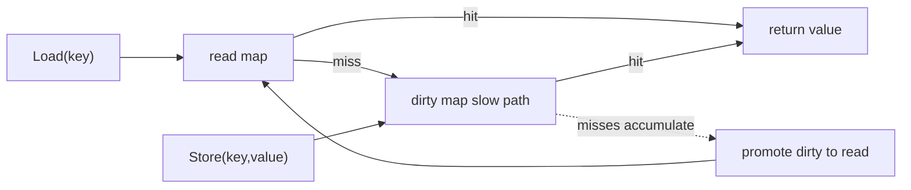

[返回首页](../README.md) / [返回上级](part-01-go-concurrency.md)

# 4. sync.Map：特殊场景下的并发 Map

`sync.Map` 不是普通 Map 的高级替代品，而是为特定场景优化的结构。

它适合：

- key 写入后很少改变。
- 读远多于写。
- 多 goroutine 访问不同 key。
- 缓存、注册表、连接表等场景。

它不适合：

- 写多读少。
- 需要复杂事务。
- 需要强一致遍历。
- value 本身也会被并发修改。

## 4.1 为什么 sync.Map 适合读多写少

可以把 `sync.Map` 简化理解为两层：

- read 区：读路径很快。
- dirty 区：记录新写入和变化较多的数据。



读取时先查 read 区，找不到再走慢路径查 dirty 区。写入多时，慢路径和内部协调成本会上升，所以它并不是所有场景都快。

## 4.2 示例：在线连接表

```go
type Conn struct {
	UserID int64
	Addr   string
}

type Registry struct {
	conns sync.Map // map[int64]*Conn
}

func (r *Registry) Add(conn *Conn) {
	r.conns.Store(conn.UserID, conn)
}

func (r *Registry) Get(userID int64) (*Conn, bool) {
	v, ok := r.conns.Load(userID)
	if !ok {
		return nil, false
	}
	return v.(*Conn), true
}

func (r *Registry) Remove(userID int64) {
	r.conns.Delete(userID)
}
```

## 4.3 常见坑

### 坑 1：以为 `sync.Map` 会保护 value

```go
conn, _ := registry.Get(1)
conn.Addr = "new addr" // 如果多个 goroutine 同时改 conn，仍然有数据竞争
```

为什么会出现：`sync.Map` 只保证 `Load`、`Store`、`Delete` 这些 Map 操作本身并发安全。它不会自动保护 value 指向的对象。

如果 value 内部也会变化，就要给 value 加锁，或者使用不可变对象替换。

```go
type Conn struct {
	mu   sync.Mutex
	Addr string
}

func (c *Conn) SetAddr(addr string) {
	c.mu.Lock()
	defer c.mu.Unlock()
	c.Addr = addr
}
```

更推荐的方式是不可变替换：构造一个新的 value，再 `Store` 回去，避免调用方拿到可变内部对象。

```go
func (r *Registry) UpdateAddr(userID int64, addr string) {
	v, ok := r.conns.Load(userID)
	if !ok {
		return
	}
	old := v.(*Conn)

	// 构造一份新的不可变 Conn，整体替换
	updated := &Conn{UserID: old.UserID, Addr: addr}
	r.conns.Store(userID, updated)
}
```

不可变替换的好处是读者拿到的 `*Conn` 永远不会被别人改动。读者看到的是某个时刻的快照，也就不需要再对 value 加锁。

### 坑 2：把 `Range` 当成强一致快照

为什么会出现：`sync.Map.Range` 遍历期间，其他 goroutine 仍然可以写入或删除。遍历看到的是一个弱一致视图，不保证包含遍历期间的所有更新。

错误场景：用 `Range` 计算严格账务总额、强一致排行榜、库存数量。这类逻辑需要强一致快照，不适合直接依赖 `sync.Map.Range`。

修复方式：如果需要强一致遍历，用 `map + RWMutex`，在读锁下复制一份快照，再在锁外计算。

```go
func (s *Store) Snapshot() map[string]int64 {
	s.mu.RLock()
	defer s.mu.RUnlock()

	cp := make(map[string]int64, len(s.data))
	for k, v := range s.data {
		cp[k] = v
	}
	return cp
}
```

### 坑 3：复杂复合操作不是原子的

为什么会出现：`Load` 和 `Store` 单独是安全的，但“先 Load，判断，再修改，再 Store”这一整段不是自动原子的。

错误示例：

```go
v, _ := m.Load("count")
m.Store("count", v.(int)+1) // 多个 goroutine 会丢更新
```

修复方式：简单计数使用 `atomic`，复杂状态使用 `map + Mutex` 或 value 内部锁。不要用 `sync.Map` 拼出伪事务。

参考答案：`sync.Map` 和 `map + Mutex` 如何选择？

| 场景 | 推荐 |
| --- | --- |
| key 基本稳定，读远多于写 | `sync.Map` |
| 写入频繁，逻辑复杂 | `map + Mutex` |
| 需要类型安全和复合事务 | `map + Mutex` 或封装泛型结构 |
| 需要强一致遍历快照 | `map + Mutex` 下复制快照 |
| value 自身会变化 | value 内部加锁或使用不可变对象 |

生产实践：

- `sync.Map.Range` 不是强一致快照，不要用它做严格账务、强一致排行榜结算。
- 对 `sync.Map` 做一层类型封装，避免到处写类型断言。
- 如果需要 `Load` 后“检查并更新 value 内部状态”，通常还需要 value 级别的锁。
- 对缓存场景，要配合 TTL、容量上限和淘汰策略，`sync.Map` 本身不负责这些。

---

