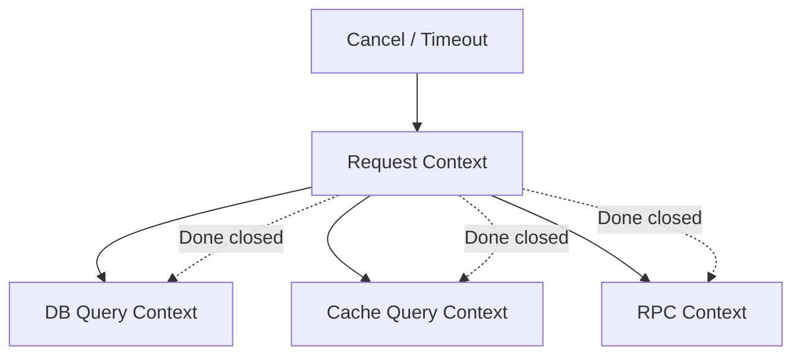

[返回首页](../README.md) / [返回上级](part-01-go-concurrency.md)

# 5. context：让并发任务知道什么时候该停

并发程序最容易遗漏的不是启动，而是停止。

用户请求已经超时，后台 goroutine 还在查数据库；服务准备关闭，worker 还在处理新任务；上游已经不需要结果，下游还在计算。这些都会浪费资源，严重时造成泄漏。

`context` 的作用就是把取消信号、超时和请求范围元数据传下去。

## 5.1 context 是一棵取消树

```text
request context
  |
  +-- db query context
  |
  +-- cache query context
  |
  +-- rpc context
```

父 context 取消后，子 context 也会收到取消信号。



## 5.2 示例：带超时的查询

```go
func query(ctx context.Context, keyword string) (string, error) {
	select {
	case <-time.After(200 * time.Millisecond):
		return "result for " + keyword, nil
	case <-ctx.Done():
		return "", ctx.Err()
	}
}

func main() {
	ctx, cancel := context.WithTimeout(context.Background(), 100*time.Millisecond)
	defer cancel()

	result, err := query(ctx, "golang")
	if err != nil {
		fmt.Println("query failed:", err)
		return
	}

	fmt.Println(result)
}
```

## 5.3 超时预算

高并发系统不能每一层都随便设置一个很大的超时。更合理的方式是分配预算：

| 层级 | 示例 |
| --- | --- |
| API 总超时 | 200ms |
| 缓存查询 | 20ms |
| 数据库查询 | 80ms |
| 下游 RPC | 100ms |

如果每一层都设置 200ms，串行调用三个下游时，用户可能等 600ms。正确做法是让下游在上游剩余时间内工作。

## 5.4 常见坑

### 坑 1：忘记调用 cancel

为什么会出现：`context.WithTimeout` 会创建定时器资源。即使超时最终会发生，提前调用 cancel 也能更快释放资源。

错误示例：

```go
func load() error {
	ctx, _ := context.WithTimeout(context.Background(), time.Second)
	return query(ctx)
}
```

修复方式：

```go
func load() error {
	ctx, cancel := context.WithTimeout(context.Background(), time.Second)
	defer cancel()
	return query(ctx)
}
```

生产建议：只要调用 `WithCancel`、`WithTimeout`、`WithDeadline`，就立刻写 `defer cancel()`，除非 cancel 的生命周期明确交给其他地方。

### 坑 2：goroutine 不监听 `ctx.Done()`

为什么会出现：上游取消只是关闭 `Done` channel，不会强行杀死 goroutine。下游必须主动检查。

错误示例：

```go
func worker(ctx context.Context, jobs <-chan Job) {
	for job := range jobs {
		process(job)
	}
}
```

修复方式：

```go
func worker(ctx context.Context, jobs <-chan Job) {
	for {
		select {
		case job, ok := <-jobs:
			if !ok {
				return
			}
			process(job)
		case <-ctx.Done():
			return
		}
	}
}
```

如果 `process` 本身很慢，它也应该接收 context，否则 worker 只能在任务之间退出。

### 坑 3：把业务参数塞进 `context.Value`

为什么会出现：`context.Value` 使用方便，容易被当成“万能参数袋”。这样会让函数真实依赖隐藏起来。

错误示例：

```go
func List(ctx context.Context) {
	page := ctx.Value("page").(int)
	_ = page
}
```

修复方式：业务参数放在显式请求对象中。

```go
type ListRequest struct {
	Page int
	Size int
}

func List(ctx context.Context, req ListRequest) {}
```

`context.Value` 只放 request id、trace id、租户 id、认证主体等请求范围元数据。

### 坑 4：下游库没有传入 context，导致取消无效

为什么会出现：入口 handler 有 context，但实际调用数据库、HTTP、RPC 时没有使用支持 context 的 API。

修复方式：使用带 context 的方法，例如 `http.NewRequestWithContext`、`db.QueryContext`、`redis.WithContext` 等。

```go
req, err := http.NewRequestWithContext(ctx, http.MethodGet, url, nil)
if err != nil {
	return err
}
resp, err := http.DefaultClient.Do(req)
```

参考答案：`context.Value` 到底该放什么？

适合放 request id、trace id、租户 id、认证主体这类“请求范围元数据”。不适合放分页参数、业务开关、数据库连接、logger 配置和可选参数。

解读：`context.Value` 是隐式依赖。业务参数放进去后，函数签名看起来简单，但调用关系变得不透明，测试也更困难。生产代码里可以定义私有 key 类型，避免不同包之间 key 冲突。

生产实践：

- 凡是可能阻塞的函数都应接收 `context.Context`。
- `WithTimeout` 和 `WithCancel` 返回的 cancel 必须调用，通常 `defer cancel()`。
- 服务关闭时用根 context 取消后台任务。
- 对外部依赖要设置独立超时，不要只依赖入口超时。
- 区分 `context.Canceled` 和 `context.DeadlineExceeded`，前者可能是客户端主动断开，后者通常代表系统或下游慢。

---

