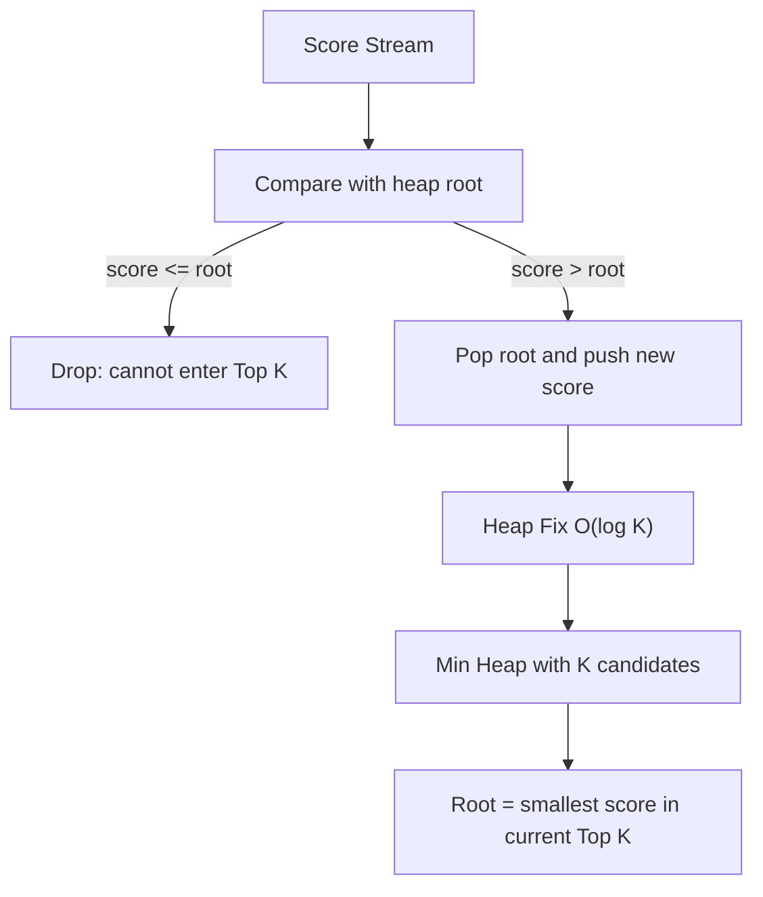

[返回首页](../README.md) / [返回上级](part-02-data-structures.md)

# 6. Heap：用局部有序换取效率

Heap 不保证全量有序，只保证堆顶是最大或最小值。正是因为它只维护较弱的有序性，插入和删除才可以做到 `O(log n)`。

## 6.1 为什么 Heap 适合 Top K

从 1 亿个用户里找前 100 名，如果全量排序，就是把 1 亿人完整排队。可我们并不关心第 101 名以后的人如何排序。

更好的办法是维护一个只有 100 个元素的小根堆：

- 堆里保存当前前 100 名候选人。
- 堆顶是这 100 人里分数最低的。
- 新用户如果比堆顶还低，直接丢弃。
- 新用户如果比堆顶高，就替换堆顶。



这样复杂度从 `O(n log n)` 降到 `O(n log k)`。

## 6.2 示例：Top K

```go
type UserScore struct {
	UserID int64
	Score  int64
}

type MinHeap []UserScore

func (h MinHeap) Len() int           { return len(h) }
func (h MinHeap) Less(i, j int) bool { return h[i].Score < h[j].Score }
func (h MinHeap) Swap(i, j int)      { h[i], h[j] = h[j], h[i] }

func (h *MinHeap) Push(x any) {
	*h = append(*h, x.(UserScore))
}

func (h *MinHeap) Pop() any {
	old := *h
	n := len(old)
	x := old[n-1]
	*h = old[:n-1]
	return x
}

func TopK(items []UserScore, k int) []UserScore {
	if k <= 0 {
		return nil
	}

	h := &MinHeap{}
	heap.Init(h)

	for _, item := range items {
		if h.Len() < k {
			heap.Push(h, item)
			continue
		}

		if item.Score > (*h)[0].Score {
			heap.Pop(h)
			heap.Push(h, item)
		}
	}

	result := make([]UserScore, h.Len())
	for i := len(result) - 1; i >= 0; i-- {
		result[i] = heap.Pop(h).(UserScore)
	}
	return result
}
```

## 6.3 高并发下的 Heap

Heap 本身不是并发安全的。高并发排行榜一般不让所有写请求抢同一把锁，而是：

- 按用户或榜单分片。
- 每个分片维护局部 Top K。
- 后台周期性合并出全局 Top K 快照。
- 读请求读快照。

这样写入路径不会被全局排序阻塞，读路径也不必等待写锁。

## 6.4 常见坑

### 坑 1：以为 Heap 是全量有序

为什么会出现：堆顶一定是最小或最大值，但堆内部其他元素并不是完全排序的。直接遍历堆切片，得到的不是有序列表。

错误示例：

```go
for _, item := range *h {
	fmt.Println(item) // 不是按分数排序输出
}
```

修复方式：如果需要有序结果，要不断 `heap.Pop`，或者复制一份后排序。注意 `heap.Pop` 会破坏原堆。

### 坑 2：Top K 用错堆方向

为什么会出现：求最大 Top K 时，应该维护大小为 K 的小根堆。很多人会直觉使用大根堆，结果无法快速淘汰当前候选集里最小的元素。

正确思路：

- 全局要找最高分。
- 堆里维护当前前 K 名。
- 堆顶应该是当前前 K 名里最低分。
- 新元素只需要和这个最低分比较。

### 坑 3：K 接近 N 时仍然使用 Heap

为什么会出现：知道 Heap 能优化 Top K 后，容易所有 Top K 都用堆。但当 K 接近 N 时，`O(n log k)` 和 `O(n log n)` 差距不大，堆实现还更复杂。

生产建议：K 很小用堆；K 接近 N 或需要完整排序时，直接排序更简单。最终用 benchmark 判断。

### 坑 4：并发读写同一个 Heap

为什么会出现：`container/heap` 不提供并发安全。一个 goroutine Push，另一个 goroutine Pop，会破坏底层切片和堆不变量。

修复方式：用锁保护整个堆操作，或者让单个 goroutine 独占堆，通过 channel 接收更新请求。高写入场景下优先考虑分片堆和快照合并。

---

