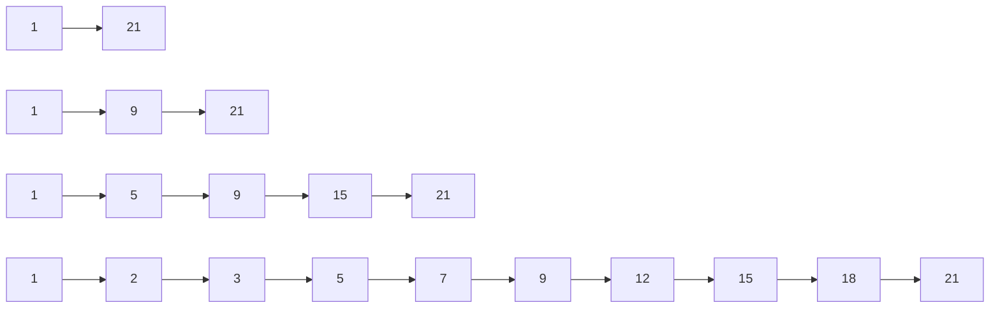

[返回首页](../README.md) / [返回上级](part-02-data-structures.md)

# 8. TreeMap 与 Skiplist：为范围查询而生

Go 的普通 `map` 是哈希表，适合精确查找，不适合范围查询。

如果要查询：

- 最近 10 分钟事件。
- 分数在 1000 到 2000 的用户。
- 某段时间内的订单。

普通 Map 只能全量遍历。数据量大时，这会非常慢。

## 8.1 有序结构的价值

有序结构把一部分成本放到写入时：写入时维护顺序，查询时就可以快速定位范围起点。

| 结构 | 优点 | 缺点 |
| --- | --- | --- |
| 红黑树 / AVL | 查询稳定 | 实现复杂 |
| B 树 | 缓存局部性好 | 实现复杂 |
| Skiplist | 实现相对简单，范围遍历方便 | 指针较多 |
| 排序切片 | 简单，遍历快 | 插入删除贵 |

## 8.2 Skiplist 的直觉

Skiplist 像一条普通链表上方修了几层快速通道：

```text
Level 3:  1 -------------------- 21
Level 2:  1 -------- 9 --------- 21
Level 1:  1 --- 5 -- 9 --- 15 -- 21
Level 0:  1 2 3 5 7 9 12 15 18 21
```



查找时从最高层开始跳，发现下一步会超过目标，就下降一层继续。它用随机层数近似平衡树的效果。

## 8.3 为什么排行榜适合 Skiplist

排行榜需要同时支持：

- 更新用户分数。
- 查询 Top N。
- 查询某个用户排名。
- 查询分数范围。

普通 Map 只能快速查用户分数。Heap 擅长 Top N，但不擅长任意用户排名。Skiplist 能维护分数顺序，因此适合排行榜。

生产级排行榜通常组合使用：

| 结构 | 作用 |
| --- | --- |
| `map[member]score` | 快速找到用户旧分数 |
| Skiplist | 按分数有序排列 |
| 快照数组 | 快速响应 Top N 高频读取 |

---

