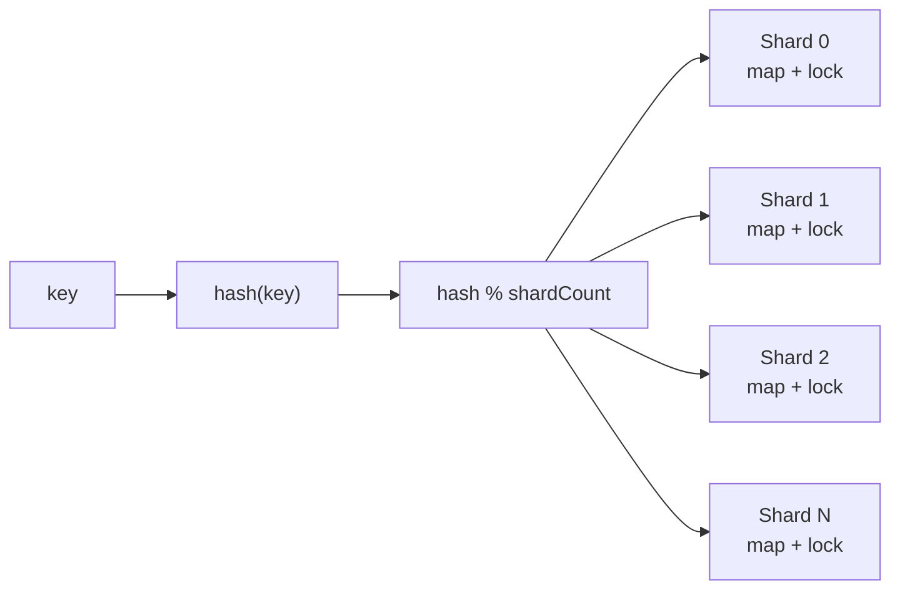

[返回首页](../README.md) / [返回上级](part-03-concurrent-data-structures.md)

# 9. 线程安全的本质

线程安全不是“加锁”这么简单，而是让并发访问下的数据不变量始终成立。

Go 中的数据竞争是指：

- 两个 goroutine 同时访问同一块内存。
- 至少一个是写。
- 之间没有同步关系。

数据竞争的结果可能是读到旧值、读到不完整状态，甚至 Map 直接 panic。

## 9.1 三种设计思路

| 思路 | 适用场景 | 优点 | 缺点 |
| --- | --- | --- | --- |
| 共享内存 + 锁 | 通用结构 | 简单直接 | 有锁竞争 |
| 消息传递 | 状态顺序更新 | 不容易数据竞争 | 单点吞吐有限 |
| 不可变快照 | 读多写少 | 读路径快 | 写入复制成本高 |

这三种方案不是互斥的。生产系统经常混合使用：写路径用锁维护真实状态，读路径用不可变快照；或者入口用 channel 排队，内部用锁保护 Map。关键是先确定状态的所有权。

### 方案一：共享内存 + 锁

这是最通用的方案。多个 goroutine 直接访问同一份状态，但所有访问都必须经过同一把锁。

```go
type Balance struct {
	mu     sync.Mutex
	amount int64
}

func (b *Balance) Deposit(delta int64) {
	b.mu.Lock()
	defer b.mu.Unlock()

	b.amount += delta
}

func (b *Balance) Withdraw(delta int64) bool {
	b.mu.Lock()
	defer b.mu.Unlock()

	if b.amount < delta {
		return false
	}
	b.amount -= delta
	return true
}

func (b *Balance) Value() int64 {
	b.mu.Lock()
	defer b.mu.Unlock()

	return b.amount
}
```

这段代码保护的不只是 `amount` 这个字段，而是“余额不能被并发写坏，且扣款不能扣成负数”这个不变量。`Withdraw` 里的检查和扣减必须在同一个临界区内完成。如果先检查、释放锁、再扣减，两个 goroutine 可能同时看到余额充足，最后把余额扣成负数。

生产中使用锁时，要给自己设一个检查清单：

- 哪些字段由这把锁保护？
- 哪些方法会读写这些字段？
- 是否有任何路径绕过了锁？
- 临界区内是否存在 RPC、DB、文件 IO、日志刷盘这类慢操作？

### 方案二：消息传递

消息传递的思路是让一个 goroutine 独占状态，其他 goroutine 不直接修改状态，只发送命令。

```go
type accountCmd struct {
	kind  string
	delta int64
	reply chan int64
	ok    chan bool
}

type AccountActor struct {
	ch chan accountCmd
}

func NewAccountActor(initial int64) *AccountActor {
	a := &AccountActor{ch: make(chan accountCmd, 1024)}
	go a.loop(initial)
	return a
}

func (a *AccountActor) loop(balance int64) {
	for cmd := range a.ch {
		switch cmd.kind {
		case "deposit":
			balance += cmd.delta
			cmd.reply <- balance
		case "withdraw":
			if balance >= cmd.delta {
				balance -= cmd.delta
				cmd.ok <- true
			} else {
				cmd.ok <- false
			}
		case "value":
			cmd.reply <- balance
		}
	}
}
```

这个模型的原理是“状态串行化”。所有修改都在 `loop` 里按顺序发生，所以不需要锁。但它并不是免费午餐：单个 actor 只有一个 goroutine 处理命令，如果请求量太大，channel 会积压。因此生产中通常按 `accountID`、`roomID`、`boardID` 做分区，让多个 actor 分摊压力。

### 方案三：不可变快照

不可变快照适合读多写少的数据，例如配置、规则、路由表、榜单 TopN。读请求直接拿当前快照，写请求构造一份新快照后一次性替换。

```go
type RouteTable struct {
	value atomic.Value // stores map[string]string
}

func NewRouteTable() *RouteTable {
	t := &RouteTable{}
	t.value.Store(map[string]string{})
	return t
}

func (t *RouteTable) Get(path string) (string, bool) {
	routes := t.value.Load().(map[string]string)
	target, ok := routes[path]
	return target, ok
}

func (t *RouteTable) Update(path string, target string) {
	old := t.value.Load().(map[string]string)
	next := make(map[string]string, len(old)+1)
	for k, v := range old {
		next[k] = v
	}
	next[path] = target
	t.value.Store(next)
}
```

关键原则是：发布出去的 `map` 不能再修改。`atomic.Value` 只保证指针替换是安全的，不会让 Map 本身变成并发安全。如果 `Update` 直接改 `old[path]`，读者仍然会和写者并发访问同一个 Map。

生产实践中，不可变快照常用在“读极多、写很少、允许读到上一版本”的场景。比如灰度规则每几秒更新一次，读请求每秒几十万次。让每个读请求加锁会把系统拖慢，而快照替换能让读路径接近普通 Map 查询。

## 9.2 分片 Map

全局一把锁的问题是所有请求都排队。分片 Map 把一个大 Map 拆成多个小 Map，每个 shard 有自己的锁。



```go
const shardCount = 64

type shard struct {
	mu sync.RWMutex
	m  map[string]int64
}

type ShardedCounter struct {
	shards [shardCount]*shard
}

func NewShardedCounter() *ShardedCounter {
	c := &ShardedCounter{}
	for i := range c.shards {
		c.shards[i] = &shard{m: make(map[string]int64)}
	}
	return c
}

func (c *ShardedCounter) getShard(key string) *shard {
	h := fnv.New32a()
	h.Write([]byte(key))
	return c.shards[h.Sum32()%shardCount]
}
```

写入时根据 key 的 hash 找到对应 shard：

```go
func (c *ShardedCounter) Add(key string, delta int64) {
	s := c.getShard(key)
	s.mu.Lock()
	defer s.mu.Unlock()

	s.m[key] += delta
}
```

分片不是越多越好。分片越多，全量遍历和内存成本也越高。常见起点是 32、64、128，然后通过 benchmark 调整。

为了让这个结构能在真实代码中使用，还需要补上读取、快照和删除。下面是一个完整的计数器版本：

```go
func (c *ShardedCounter) Value(key string) int64 {
	s := c.getShard(key)
	s.mu.RLock()
	defer s.mu.RUnlock()

	return s.m[key]
}

func (c *ShardedCounter) Delete(key string) {
	s := c.getShard(key)
	s.mu.Lock()
	defer s.mu.Unlock()

	delete(s.m, key)
}

func (c *ShardedCounter) Snapshot() map[string]int64 {
	result := make(map[string]int64)

	for _, s := range c.shards {
		s.mu.RLock()
		for k, v := range s.m {
			result[k] = v
		}
		s.mu.RUnlock()
	}

	return result
}
```

`Snapshot` 需要特别解释。它逐个 shard 加读锁并复制数据，而不是直接返回内部 Map。这样调用方拿到的是一份普通副本，后续怎么遍历、排序、序列化，都不会阻塞写入路径，也不会破坏内部状态。

但这个快照不是严格同一时刻的全局快照。它复制 shard 0 时，shard 1 可能还在变化。如果业务需要“所有 shard 在同一个时间点完全一致”，就要引入全局版本、双缓冲快照，或者暂停写入后复制。多数统计、缓存、排行榜 TopN 场景可以接受这种弱一致；账务、库存、强一致扣减则不应该用这种方式。

生产使用方式：

- 分片 Map 适合 key 分布比较均匀的计数、缓存、状态表。
- 如果某个 key 是超级热点，分片锁也没用，因为热点永远落在同一个 shard。
- 全量遍历会扫所有 shard，不适合高频调用。高频 TopN 应该用后台快照，而不是请求来了再 `Snapshot + sort`。
- shard 数量应该固定或很少调整。动态扩容会涉及数据迁移，复杂度接近自己实现一个并发哈希表。

## 9.3 Copy-on-write 快照

配置、规则、路由表这类数据通常读很多，写很少。适合写时复制：

```go
type Snapshot struct {
	Rules map[string]Rule
}

type Store struct {
	value atomic.Value // stores *Snapshot
}
```

读请求直接读取当前快照，不需要加锁。更新时复制一份新数据，构造完成后一次性替换。

关键原则：快照发布后不能再修改。否则读者虽然无锁，仍然可能读到被并发修改的数据。

下面以“风控规则表”为例。读请求根据用户类型找规则，后台定时加载新规则：

```go
type Rule struct {
	MaxAmount int64
	Enabled   bool
}

type RuleSnapshot struct {
	Version int64
	Rules   map[string]Rule
}

type RuleStore struct {
	value atomic.Value // stores *RuleSnapshot
}

func NewRuleStore() *RuleStore {
	s := &RuleStore{}
	s.value.Store(&RuleSnapshot{Rules: map[string]Rule{}})
	return s
}

func (s *RuleStore) Match(userType string) (Rule, bool) {
	snapshot := s.value.Load().(*RuleSnapshot)
	rule, ok := snapshot.Rules[userType]
	return rule, ok
}

func (s *RuleStore) Replace(version int64, rules map[string]Rule) {
	next := make(map[string]Rule, len(rules))
	for k, v := range rules {
		next[k] = v
	}

	s.value.Store(&RuleSnapshot{
		Version: version,
		Rules:   next,
	})
}
```

为什么 `Replace` 里还要复制传入的 `rules`？因为调用方传进来的 Map 可能还会被它自己修改。如果直接保存引用，就把外部可变对象发布给了所有读者。生产代码里，任何要放进快照的 Map、slice、指针对象，都要确认是否真的不可变。

Copy-on-write 的典型落地：

- 配置中心下发规则，服务内原子替换。
- API 网关路由表、限流规则、灰度规则。
- 搜索、推荐、排行榜的读快照。
- 本地缓存的整批刷新。

它不适合高频写入。如果每秒更新几万次，每次都复制整个 Map，CPU 和内存分配会很高。此时应改用锁、分片锁或增量数据结构。

## 9.4 Actor 模型

Actor 模型让一个 goroutine 独占状态，其他 goroutine 通过消息请求它修改状态。

它适合强顺序场景，比如账户余额、库存扣减、房间状态。

优点是顺序清晰，缺点是单个 Actor 吞吐有限。高并发下通常要按用户 ID、房间 ID、订单 ID 做分区。

下面是一个更接近生产的库存 Actor。它支持扣减、查询和关闭：

```go
var ErrInsufficientStock = errors.New("insufficient stock")

type stockRequest struct {
	op    string
	n     int64
	reply chan stockResponse
}

type stockResponse struct {
	value int64
	err   error
}

type StockActor struct {
	ch     chan stockRequest
	closed chan struct{}
}

func NewStockActor(initial int64) *StockActor {
	a := &StockActor{
		ch:     make(chan stockRequest, 1024),
		closed: make(chan struct{}),
	}
	go a.loop(initial)
	return a
}

func (a *StockActor) loop(stock int64) {
	defer close(a.closed)

	for req := range a.ch {
		switch req.op {
		case "deduct":
			if stock < req.n {
				req.reply <- stockResponse{value: stock, err: ErrInsufficientStock}
				continue
			}
			stock -= req.n
			req.reply <- stockResponse{value: stock}
		case "value":
			req.reply <- stockResponse{value: stock}
		}
	}
}

func (a *StockActor) Deduct(ctx context.Context, n int64) (int64, error) {
	reply := make(chan stockResponse, 1)
	req := stockRequest{op: "deduct", n: n, reply: reply}

	select {
	case a.ch <- req:
	case <-ctx.Done():
		return 0, ctx.Err()
	}

	select {
	case resp := <-reply:
		return resp.value, resp.err
	case <-ctx.Done():
		return 0, ctx.Err()
	}
}

func (a *StockActor) Close() {
	close(a.ch)
	<-a.closed
}
```

这段代码里有两个重要细节：

1. `reply` 是带缓冲的 channel。这样调用方如果因为 `ctx` 超时提前返回，actor 后续发送响应时不会永久阻塞。
2. 发送请求和等待响应都监听 `ctx.Done()`。否则 actor 队列满或处理慢时，调用方会被无限挂住。

Actor 的生产使用方式：

- 每个 actor 的队列必须有上限，满了要返回忙碌错误或降级。
- actor 处理逻辑不能做慢 IO。慢 IO 应该拆到外部 worker，结果再发回 actor 更新状态。
- 单 actor 吞吐有限，需要按业务 key 分区。例如 `stockID % 128` 路由到不同 actor。
- actor 的生命周期要可控，空闲 actor 要能回收，否则海量 key 会创建海量 goroutine。

小结：线程安全设计的核心不是选择“锁还是 channel”，而是决定状态由谁拥有、谁能修改、修改是否有顺序要求、读者看到的是否必须是强一致状态。

---

