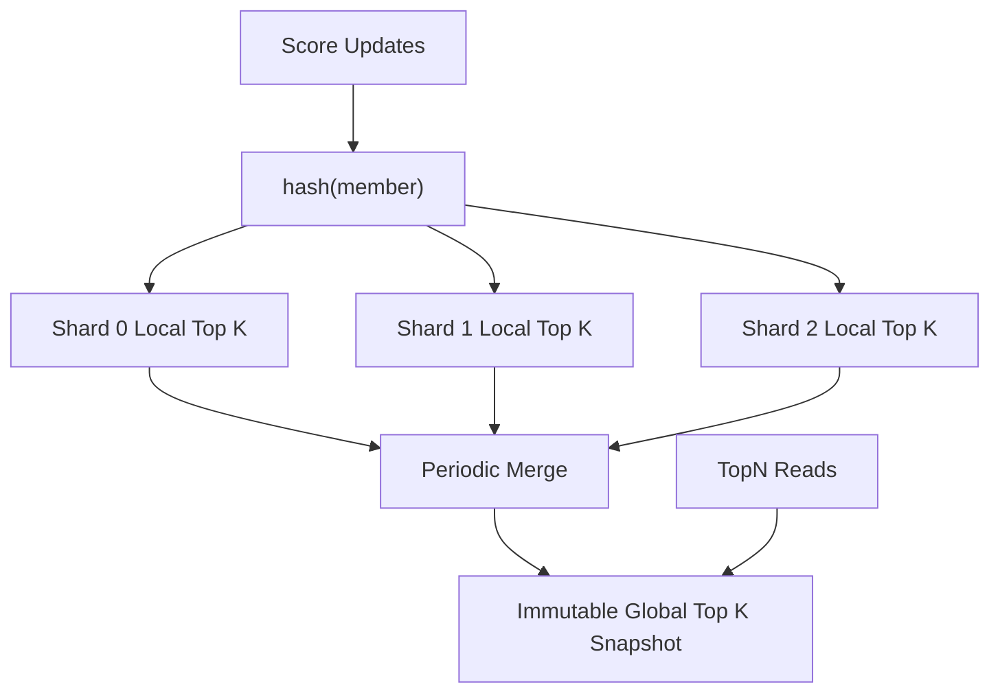

[返回首页](../README.md) / [返回上级](part-04-algorithm-optimization.md)

# 10. Top K：不要为无关数据排序

Top K 的核心思想是：如果只需要前 K 个，就不要排序所有数据。

## 10.1 先问三个问题

1. 数据是一次性计算，还是持续更新？
2. K 相比 N 是很小，还是接近 N？
3. 结果必须实时，还是允许几秒延迟？

| 场景 | 推荐方案 |
| --- | --- |
| 一次性离线计算 | 排序、堆、QuickSelect |
| K 远小于 N | 小根堆 |
| 实时排行榜 | Skiplist 或有序结构 |
| 写入极高，读取很多 | 分片 Top K + 快照 |
| 海量热词 | 近似统计结构 |

这三个问题的参考答案：

1. 如果是一次性计算，比如离线统计昨天销量，排序或小根堆都可以；如果是持续更新，比如游戏排行榜，就要使用能动态更新的数据结构或分片快照。
2. 如果 K 很小，比如从 1 亿条里取前 100，小根堆非常合适；如果 K 接近 N，比如取前 80% 的用户，全量排序可能更简单，性能也未必差。
3. 如果结果必须实时，就要在写路径维护有序结构，成本较高；如果允许秒级延迟，就可以用后台合并和读快照，吞吐会好很多。

生产实践：

- Top K 结果要定义稳定排序规则，例如 `(score desc, update_time asc, member_id asc)`，否则同分用户排名会抖动。
- 读请求远多于写请求时，应优先考虑不可变快照，避免每次读都抢写锁或重新排序。
- 分片 Top K 合并时，每个 shard 至少保留 Top K 候选。如果全局要 Top 100，每个 shard 只保留 Top 10 是不安全的。
- 榜单要明确一致性语义：是实时排名、快照排名，还是“实时分数 + 快照排名”。接口文档要写清楚。
- 对超大规模热词，精确统计可能太贵，可以使用 Count-Min Sketch、Space-Saving 等近似算法，但要向业务说明误差。

## 10.2 强实时为什么贵

每次分数变化都立刻更新全局排名，意味着写路径要维护全局有序结构。写入越高，锁竞争越严重。

很多业务不需要毫秒级强实时。例如活动排行榜允许每秒刷新一次，用户几乎感知不到差别，但系统复杂度会大幅下降：

- 写请求更新分片数据。
- 后台每秒合并一次。
- 读请求读取快照。



这是一种重要的工程取舍：用可接受的延迟换稳定性和吞吐。

## 10.3 三种 Top K 实现方式

Top K 没有唯一答案。常见实现有三类：全量排序、小根堆、QuickSelect。它们的差别在于是否需要完整有序、是否持续更新、实现复杂度是否可接受。

### 全量排序：简单但成本高

```go
func TopKBySort(items []UserScore, k int) []UserScore {
	if k <= 0 {
		return nil
	}

	cp := append([]UserScore(nil), items...)
	sort.Slice(cp, func(i, j int) bool {
		if cp[i].Score != cp[j].Score {
			return cp[i].Score > cp[j].Score
		}
		return cp[i].UserID < cp[j].UserID
	})

	if k > len(cp) {
		k = len(cp)
	}
	return cp[:k]
}
```

全量排序适合数据量不大、K 接近 N、或者结果必须完整有序的场景。它的优点是简单、稳定、容易测试；缺点是 `O(n log n)`，当 N 很大且 K 很小时浪费明显。

### 小根堆：大数据小 K 的常用方案

小根堆的核心是“只保留有希望进入 Top K 的元素”。堆大小固定为 K，堆顶是当前 Top K 里最低分。新元素如果不超过堆顶，直接忽略。

```go
func TopKByHeap(items []UserScore, k int) []UserScore {
	if k <= 0 {
		return nil
	}

	h := &MinHeap{}
	heap.Init(h)

	for _, item := range items {
		if h.Len() < k {
			heap.Push(h, item)
			continue
		}
		if item.Score > (*h)[0].Score {
			(*h)[0] = item
			heap.Fix(h, 0)
		}
	}

	out := make([]UserScore, h.Len())
	for i := len(out) - 1; i >= 0; i-- {
		out[i] = heap.Pop(h).(UserScore)
	}
	return out
}
```

这里使用 `heap.Fix` 替代 `Pop + Push`，可以少一次调整。复杂度是 `O(n log k)`，当 `k` 远小于 `n` 时收益明显。

### QuickSelect：只找分界线

QuickSelect 的思想是快速找到第 K 大的分界点，然后只排序前 K 个候选。它平均复杂度接近 `O(n)`，但实现比堆更容易写错，最坏情况会退化。

```go
func TopKByQuickSelect(items []UserScore, k int) []UserScore {
	if k <= 0 {
		return nil
	}
	if k >= len(items) {
		return TopKBySort(items, k)
	}

	cp := append([]UserScore(nil), items...)
	// nthElement 是 QuickSelect 的分区函数：将第 k 大的元素放到 cp[k-1] 位置，
	// 并使 cp[:k] 都不小于 cp[k:]。完整实现可以参考算法教材；为保证最坏情况稳定，
	// 生产中通常采用随机化或 median-of-medians 选择枢轴。
	nthElement(cp, k)

	top := append([]UserScore(nil), cp[:k]...)
	sort.Slice(top, func(i, j int) bool {
		if top[i].Score != top[j].Score {
			return top[i].Score > top[j].Score
		}
		return top[i].UserID < top[j].UserID
	})
	return top
}
```

生产建议：业务代码里优先使用排序或堆。QuickSelect 适合离线任务、算法库或对性能非常敏感且有充分测试的场景。在线服务里，清晰和稳定通常比少量平均性能收益更重要。

## 10.4 生产中的 Top K 不是一个函数

真实 Top K 往往是一个系统问题，而不是一个函数问题。以“全站实时热词 Top 100”为例，生产实现通常分为几层：

1. 写入层：接收用户搜索词，先做清洗、归一化、限流。
2. 分片聚合层：按词 hash 到多个 shard，局部计数。
3. 局部 Top K：每个 shard 定期产出 Top 100 或 Top 200 候选。
4. 全局合并层：合并各 shard 候选，生成全局快照。
5. 查询层：只读不可变快照，保证低延迟。

这套设计的原理是把高频写入和高频读取解耦。写入不直接维护一个全局大锁结构，读取不每次触发全量计算。代价是结果有刷新延迟，但系统容量大幅提升。

---

