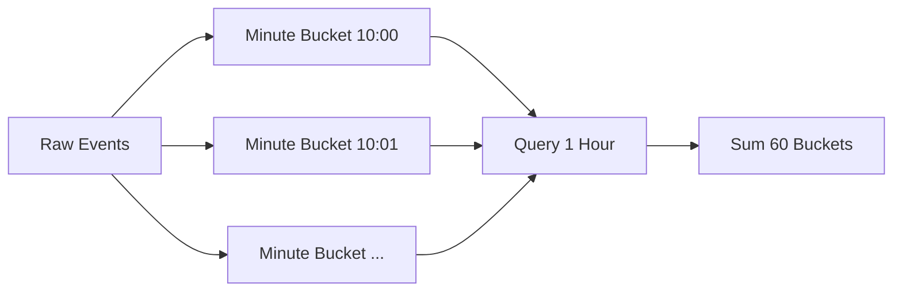

[返回首页](../README.md) / [返回上级](part-04-algorithm-optimization.md)

# 12. 增量聚合：把查询成本前移

增量聚合的思想很简单：不要每次查询都重新扫描原始数据，而是在写入时维护统计结果。

## 12.1 为什么它有效

假设每秒写入 10 万条事件，查询最近 1 小时点击数。如果每次查询都扫描原始事件，查询成本会随着数据量增长。

如果按分钟聚合，查询 1 小时只需要读取 60 个桶。



这就是增量聚合的本质：用写入时的一点成本，换取查询时的大幅降本。

## 12.2 桶粒度怎么选

| 粒度 | 适用 |
| --- | --- |
| 秒桶 | 精细实时监控 |
| 分钟桶 | 最近几小时趋势 |
| 小时桶 | 最近几天统计 |
| 天桶 | 长期报表 |

生产中常用多级聚合。查询大范围时用小时桶、天桶；查询边界部分时用分钟桶补齐精度。

参考答案：哪些指标适合增量聚合？

适合增量聚合的指标通常有可加性或可合并性，例如 PV、UV 近似值、点击数、订单数、金额总和、最大值、最小值、Top K 候选集合。不适合直接增量聚合的是需要复杂去重、强事务一致性、频繁修正历史、或者查询维度临时变化非常多的指标。

解读：增量聚合的关键是“状态能否被稳定维护”。计数和求和很好维护，复杂漏斗分析、任意条件筛选则可能需要保留明细或使用专门的 OLAP 系统。

生产实践：

- 明确窗口语义，推荐使用 `[start, end)`，避免边界重复计算。
- 事件中同时保存 `event_time` 和 `ingest_time`。前者表示业务发生时间，后者表示系统接收时间。
- 对迟到事件设置允许修正窗口，例如最近 10 分钟可修正，超过窗口进入离线补偿。
- 聚合桶要有 TTL 或归档策略，不能无限增长。
- 保留原始事件日志。聚合逻辑出错、口径变化或补数据时，可以重放修复。
- 查询大范围时使用粗粒度桶，查询边界时使用细粒度桶，这能显著减少扫描量。

## 12.3 迟到事件

真实事件可能乱序到达。移动端离线、网络重试、消息队列积压都会造成迟到事件。

处理方式：

- 允许修正最近一段时间的桶。
- 太晚的事件进入补偿任务。
- 同时记录业务发生时间和服务接收时间。
- 保留原始日志，必要时重算。

## 12.4 示例：分钟桶聚合器

下面的例子实现了一个按分钟聚合的计数器。它适合教学理解增量聚合的基本形态：

```go
type Event struct {
	Action    string
	EventTime time.Time
}

type minuteKey struct {
	Action string
	Minute int64
}

type MinuteAggregator struct {
	mu      sync.RWMutex
	buckets map[minuteKey]int64
}

func NewMinuteAggregator() *MinuteAggregator {
	return &MinuteAggregator{buckets: make(map[minuteKey]int64)}
}

func minuteOf(t time.Time) int64 {
	return t.Unix() / 60
}

func (a *MinuteAggregator) Add(e Event) {
	key := minuteKey{
		Action: e.Action,
		Minute: minuteOf(e.EventTime),
	}

	a.mu.Lock()
	defer a.mu.Unlock()
	a.buckets[key]++
}

func (a *MinuteAggregator) Count(action string, start, end time.Time) int64 {
	startMinute := minuteOf(start)
	endMinute := minuteOf(end.Add(-time.Nanosecond))

	a.mu.RLock()
	defer a.mu.RUnlock()

	var total int64
	for m := startMinute; m <= endMinute; m++ {
		total += a.buckets[minuteKey{Action: action, Minute: m}]
	}
	return total
}
```

这个实现故意简单，便于理解，但生产中还需要补几件事：

- 查询窗口使用 `[start, end)`，所以计算结束分钟时要处理边界。
- `Add` 要拒绝过早或过晚的事件，避免攻击者或错误客户端创建无限历史桶。
- `buckets` 要定期清理，否则服务运行越久内存越大。
- 如果 action 很多，单个 Map 会变成热点，应按 action 或用户分片。

## 12.5 多级桶查询的原理

分钟桶适合查最近几十分钟，天桶适合查几个月。多级桶查询的原则是：边界用细粒度，中间完整区间用粗粒度。

假设要查 `[10:07, 13:42)`：

```text
10:07 - 10:59  使用分钟桶
11:00 - 12:59  使用小时桶
13:00 - 13:42  使用分钟桶
```

这样既保证边界精度，又避免扫描 215 个分钟桶。窗口越大，多级桶收益越明显。

生产中常见结构：

```go
type MultiLevelAggregator struct {
	minutes *MinuteAggregator
	hours   *HourAggregator
	days    *DayAggregator
}
```

小时桶和天桶可以由后台任务从已经完整的分钟桶归并出来。注意不要聚合“还在变化的当前分钟”，否则迟到事件会导致小时桶与分钟桶不一致。常见做法是延迟 1 到 2 分钟再归并完整分钟。

---

