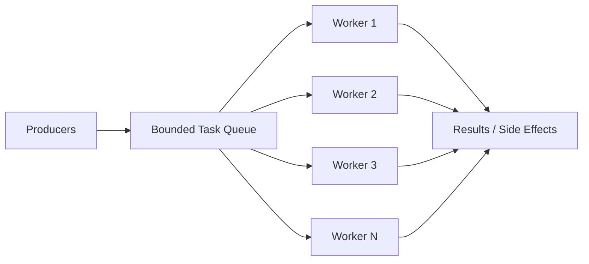

[返回首页](../README.md) / [返回上级](part-06-high-concurrency-system-design.md)

# 16. Worker Pool：给系统设置边界

worker pool 的价值不是“并发处理任务”这么简单，而是限制系统最多同时处理多少任务。

没有 worker pool 的写法：

```go
for _, task := range tasks {
	go handle(task)
}
```

如果任务很多，这会瞬间创建大量 goroutine。worker pool 则让并发数量可控。



## 16.1 worker 数量如何估算

粗略公式：

```text
并发数 ≈ 目标吞吐量 * 平均处理耗时
```

如果希望每秒处理 2000 个事件，每个事件平均耗时 10ms，那么需要大约：

```text
2000 * 0.01 = 20
```

这只是起点。还要结合 CPU、内存、p99 延迟、下游容量压测调整。

参考答案与解读：

- CPU 密集型任务：worker 数通常接近 CPU 核数，过多只会增加上下文切换。
- IO 密集型任务：worker 数可以高于 CPU 核数，但不能超过下游能承受的并发。
- 数据库任务：worker 数不能只看应用，要看连接池大小、慢查询、数据库 CPU 和锁等待。
- 混合任务：最好拆成多个阶段，例如解析、计算、写库分别使用不同 pool，避免慢 IO 阻塞 CPU 任务。

生产实践：

- worker 数和队列长度都做成配置，但要有上限，避免误配置。
- 启动后暴露当前 worker 数、busy worker 数、队列长度、任务耗时、失败数。
- 任务执行要加 recover，panic 不能让 worker 静默退出。
- 不同优先级任务不要共用一个队列，否则低优先级任务可能阻塞关键任务。

## 16.2 队列长度如何估算

队列不是越长越好。它应该由可接受排队时间反推：

```text
队列长度 ≈ 处理吞吐量 * 可接受排队秒数
```

如果每秒处理 5000 个任务，最多接受排队 2 秒，队列长度可以从 10000 附近开始测试。

## 16.3 生产级 worker pool 要考虑

- 任务错误如何处理。
- worker panic 如何 recover。
- 队列满了怎么办。
- 服务关闭时是否 drain。
- 是否暴露队列长度和处理耗时。

这些问题的推荐答案：

| 问题 | 推荐做法 |
| --- | --- |
| 任务错误如何处理 | 返回错误后统一记录指标和日志，必要时进入重试队列 |
| panic 如何 recover | worker 外层 `defer recover`，记录堆栈并继续服务 |
| 队列满了怎么办 | 在线请求快速失败，后台任务可短暂等待或转持久队列 |
| 服务关闭是否 drain | 先停止接收新任务，再等待已接收任务完成，设置最大等待时间 |
| 任务是否可重试 | 只重试幂等任务，并设置最大次数和退避 |

一个生产级 worker pool 至少应该具备：有界队列、提交超时、错误回调、panic recover、优雅关闭、指标暴露。否则它只是一个教学示例。

## 16.4 教学版 worker pool 实现

下面的实现展示核心结构：有界队列、提交超时、panic recover、关闭等待。

```go
var ErrPoolClosed = errors.New("pool closed")
var ErrPoolBusy = errors.New("pool busy")

type Task func(context.Context) error

type Pool struct {
	queue chan Task
	wg    sync.WaitGroup

	mu        sync.RWMutex
	closeOnce sync.Once
	closed    chan struct{}
	onError   func(error)
}

func NewPool(workers int, queueSize int, onError func(error)) *Pool {
	p := &Pool{
		queue:   make(chan Task, queueSize),
		closed:  make(chan struct{}),
		onError: onError,
	}

	for i := 0; i < workers; i++ {
		p.wg.Add(1)
		go p.worker()
	}
	return p
}

func (p *Pool) Submit(ctx context.Context, task Task) error {
	p.mu.RLock()
	defer p.mu.RUnlock()

	select {
	case <-p.closed:
		return ErrPoolClosed
	default:
	}

	select {
	case p.queue <- task:
		return nil
	case <-p.closed:
		return ErrPoolClosed
	case <-ctx.Done():
		return ctx.Err()
	default:
		return ErrPoolBusy
	}
}

func (p *Pool) worker() {
	defer p.wg.Done()

	for task := range p.queue {
		func() {
			defer func() {
				if r := recover(); r != nil && p.onError != nil {
					p.onError(fmt.Errorf("task panic: %v", r))
				}
			}()

			if err := task(context.Background()); err != nil && p.onError != nil {
				p.onError(err)
			}
		}()
	}
}

func (p *Pool) Shutdown(ctx context.Context) error {
	p.closeOnce.Do(func() {
		p.mu.Lock()
		defer p.mu.Unlock()

		close(p.closed)
		close(p.queue)
	})

	done := make(chan struct{})
	go func() {
		p.wg.Wait()
		close(done)
	}()

	select {
	case <-done:
		return nil
	case <-ctx.Done():
		return ctx.Err()
	}
}
```

这个版本仍然是教学版，因为它没有指标、任务级超时、优先级、动态扩缩容和 drain 进度。但它已经具备生产实现的骨架。

注意 `Submit` 中的 `default` 表示队列满时快速失败。如果业务希望短暂等待，可以移除 `default`，让它等待 `ctx` 超时或入队成功，但此时不要在等待入队期间长期持有关闭锁。在线请求通常更适合快速失败；后台任务可以接受有限等待。

---

