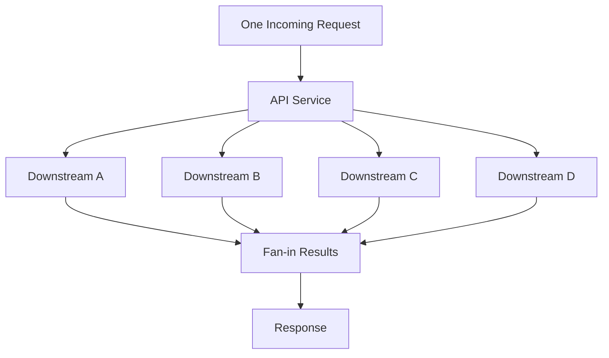

[返回首页](../README.md) / [返回上级](part-06-high-concurrency-system-design.md)

# 17. Fan-out / Fan-in：并行也会放大流量

Fan-out 能降低延迟。例如一个接口要查 5 个下游，串行可能 250ms，并行后接近最慢的那个下游。

但 fan-out 会放大流量。一个请求 fan-out 到 10 个下游，1 万 QPS 会变成 10 万次下游调用。



因此 fan-out 必须有：

- 总超时。
- 单下游超时。
- 最大并发数。
- 失败策略。
- 取消机制。

参考答案：fan-out 的失败策略怎么选？

| 业务类型 | 策略 | 解读 |
| --- | --- | --- |
| 支付、扣库存 | 全部成功或明确失败 | 不能返回部分成功让调用方误解 |
| 聚合页面 | 部分成功 | 核心信息展示，非核心模块可降级 |
| 多机房读 | 最快成功 | 谁先返回用谁，拿到结果后取消其他请求 |
| 多副本写 | Quorum | 达到多数成功即可返回 |
| 埋点、日志 | Best effort | 失败记录指标，不阻塞主流程 |

生产实践：

- 对每个下游设置独立并发限制，不能只限制入口请求数。
- fan-out 请求要继承入口 context，但单下游可以有更短 timeout。
- 拿到足够结果后立刻 cancel 剩余请求，减少无效消耗。
- 失败结果要能区分：超时、限流、业务失败、下游不可用。
- 对非核心下游要允许降级，不要让一个推荐服务拖垮整个首页。

常见失败策略：

| 策略 | 场景 |
| --- | --- |
| 全部成功 | 金融、强一致流程 |
| 部分成功 | 聚合页、推荐页 |
| 最快成功 | 多机房读 |
| Quorum | 多副本系统 |
| Best effort | 日志、埋点 |

## 17.1 示例：带并发上限的批量查询

批量查询最容易写成“每个 ID 一个 goroutine”。更稳妥的方式是使用 `errgroup.SetLimit` 限制并发：

```go
func LoadUsers(ctx context.Context, ids []int64) ([]User, error) {
	g, ctx := errgroup.WithContext(ctx)
	g.SetLimit(20)

	results := make([]User, len(ids))

	for i, id := range ids {
		i, id := i, id
		g.Go(func() error {
			user, err := loadUser(ctx, id)
			if err != nil {
				return err
			}
			results[i] = user
			return nil
		})
	}

	if err := g.Wait(); err != nil {
		return nil, err
	}
	return results, nil
}
```

这里每个 goroutine 写不同下标，所以不会互相覆盖。但如果写的是同一个 Map，就必须加锁或先写局部结果再合并。

`SetLimit(20)` 的生产含义不是“20 一定最好”，而是给下游设置最大并发。这个值应该参考下游连接池、服务限流、压测结果和入口 QPS。没有这个上限时，一个大请求就可能瞬间打满下游。

## 17.2 拿到足够结果后取消剩余请求

有些场景只需要最快成功的一份结果，例如多机房读：

```go
func Fastest(ctx context.Context, replicas []string, key string) (string, error) {
	ctx, cancel := context.WithCancel(ctx)
	defer cancel()

	type result struct {
		value string
		err   error
	}
	ch := make(chan result, len(replicas))

	for _, replica := range replicas {
		replica := replica
		go func() {
			value, err := readFromReplica(ctx, replica, key)
			ch <- result{value: value, err: err}
		}()
	}

	var lastErr error
	for range replicas {
		r := <-ch
		if r.err == nil {
			cancel()
			return r.value, nil
		}
		lastErr = r.err
	}
	return "", lastErr
}
```

`ch` 用带缓冲是为了避免 `cancel()` 后其它 goroutine 返回时卡在发送结果上。生产中还要限制 replicas 数量，或者复用 worker pool，避免一次请求启动过多 goroutine。

---

