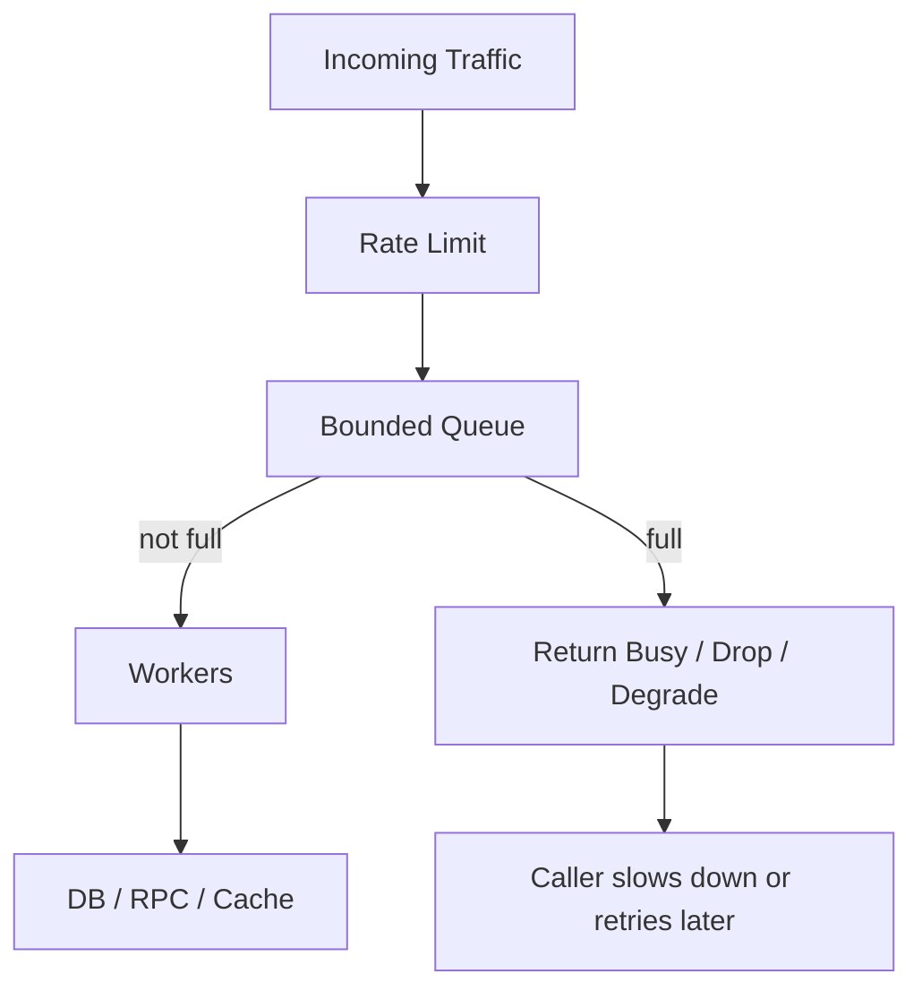

[返回首页](../README.md) / [返回上级](part-06-high-concurrency-system-design.md)

# 18. Backpressure：承认系统有容量上限

背压就是系统处理不过来时，向上游明确表达“我现在不能再接了”。

如果没有背压，压力会藏在队列里：

```text
请求进入
  |
队列积压
  |
延迟升高
  |
调用方超时重试
  |
系统更忙
```



背压策略：

| 策略 | 适用 |
| --- | --- |
| 阻塞等待 | 不能轻易丢任务 |
| 快速失败 | 在线请求 |
| 丢弃最新 | 日志、指标 |
| 丢弃最旧 | 保留最新状态 |
| 降级处理 | 搜索、推荐、聚合页 |

背压不是失败，而是系统自我保护。

参考答案：队列满了到底该怎么办？

最佳答案取决于业务价值和可补偿性：

- 在线读请求：快速失败或返回降级结果，避免用户一直等待。
- 可丢弃事件：直接丢弃并记录丢弃数量，例如部分日志和指标。
- 关键写入：短暂等待，失败后写入可靠队列或返回明确错误，由调用方重试。
- 状态刷新：可以丢弃旧任务，保留最新任务。

生产实践：

- 背压错误要有明确错误码，例如 `ErrBusy`、`ErrQueueFull`、`RESOURCE_EXHAUSTED`。
- 记录队列长度、入队等待时间、丢弃数、快速失败数。
- 客户端重试必须有指数退避和抖动，不能立即重试。
- 背压应该尽量发生在靠近入口的位置，越早拒绝，浪费越少。
- 不要把背压全部转移给数据库。数据库通常是更稀缺也更共享的资源。

## 18.1 背压要变成代码分支

背压不是文档里的口号，而是明确的代码路径。下面是一个有界写入队列：

```go
type AsyncWriter struct {
	queue chan Event
}

func NewAsyncWriter(size int) *AsyncWriter {
	return &AsyncWriter{queue: make(chan Event, size)}
}

func (w *AsyncWriter) Write(ctx context.Context, e Event) error {
	select {
	case w.queue <- e:
		return nil
	case <-ctx.Done():
		return ctx.Err()
	default:
		return ErrBusy
	}
}
```

这个实现的行为非常明确：

- 队列没满：接受任务。
- 请求已经取消：返回取消错误。
- 队列已满：立即返回 `ErrBusy`。

如果业务不能丢任务，可以把 `default` 去掉，让请求等待一小段时间：

```go
func (w *AsyncWriter) WriteWait(ctx context.Context, e Event) error {
	select {
	case w.queue <- e:
		return nil
	case <-ctx.Done():
		return ctx.Err()
	}
}
```

但等待必须受 `ctx` 控制。无限等待会把压力从队列转移到请求 goroutine，最后表现为 goroutine 数暴涨和入口超时。

## 18.2 丢弃策略也要符合业务语义

不同队列满时的处理策略不同：

```go
type LatestQueue struct {
	mu    sync.Mutex
	items []Event
	limit int
}

func (q *LatestQueue) Push(e Event) {
	q.mu.Lock()
	defer q.mu.Unlock()

	if len(q.items) == q.limit {
		copy(q.items[0:], q.items[1:])
		q.items[len(q.items)-1] = e
		return
	}
	q.items = append(q.items, e)
}
```

这个队列满时丢弃最旧事件，保留最新事件。它适合“状态刷新”类任务，例如更新用户在线状态、刷新推荐缓存。不适合订单、支付、库存，因为旧事件同样有业务价值。

生产实践中，背压策略应该写进接口文档和指标：

- 返回 `ErrBusy` 的请求是否应该重试？
- 客户端重试等待多久？
- 丢弃了多少任务？
- 被丢弃的任务是否有补偿路径？

---

