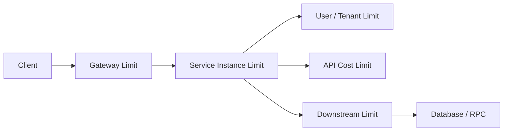

[返回首页](../README.md) / [返回上级](part-06-high-concurrency-system-design.md)

# 19. 限流：系统的安全阀

限流控制进入系统的请求速率。它的目标不是让所有请求成功，而是在过载时让系统保持可用。

常见算法：

| 算法 | 特点 |
| --- | --- |
| 固定窗口 | 简单，但边界有突刺 |
| 滑动窗口 | 平滑，成本稍高 |
| 漏桶 | 固定速率流出 |
| 令牌桶 | 允许短暂突发，最常用 |

限流位置：

- 网关限流。
- 服务实例限流。
- 用户维度限流。
- 接口维度限流。
- 下游依赖限流。



限流响应要明确。HTTP 场景通常返回 `429 Too Many Requests`，并可以携带 `Retry-After`。

参考答案：固定窗口、滑动窗口、漏桶、令牌桶怎么选？

| 算法 | 适合场景 | 注意点 |
| --- | --- | --- |
| 固定窗口 | 简单接口保护 | 窗口边界可能瞬间放过双倍流量 |
| 滑动窗口 | 用户/API 限流 | 更平滑，但存储和计算成本更高 |
| 漏桶 | 需要平滑下游流量 | 不适合允许突发的业务 |
| 令牌桶 | 大多数在线服务 | 允许突发，但总速率受控 |

生产实践：

- 网关限流保护整体入口，服务内限流保护单实例，下游限流保护数据库和 RPC。
- 限流维度至少包括接口、用户或租户、来源 IP、下游依赖。
- 限流配置要能动态调整，并设置安全默认值。
- 限流不能只看 QPS，还要看请求成本。一次复杂查询可能抵得上几十次普通查询。
- 返回限流错误时，告诉调用方是否可重试以及建议等待时间。

## 19.1 令牌桶原理

令牌桶可以理解为一个桶按固定速率产生令牌，请求进来必须先拿令牌。桶有容量上限，所以可以允许短暂突发，但长期平均速率不会超过生成速率。

```text
每秒产生 100 个令牌，桶容量 200
空闲 2 秒后桶满，可瞬间处理 200 个请求
之后如果请求持续到来，平均只能每秒通过 100 个
```

这比漏桶更适合在线服务，因为真实流量往往有短暂突刺。完全平滑会增加延迟，适度突发能提升用户体验。

## 19.2 使用 x/time/rate 实现接口限流

Go 常用 `golang.org/x/time/rate`：

```go
type RateLimiter struct {
	mu       sync.Mutex
	limiters map[string]*rate.Limiter
}

func NewRateLimiter() *RateLimiter {
	return &RateLimiter{limiters: make(map[string]*rate.Limiter)}
}

func (r *RateLimiter) Allow(key string) bool {
	r.mu.Lock()
	limiter, ok := r.limiters[key]
	if !ok {
		limiter = rate.NewLimiter(rate.Limit(100), 200)
		r.limiters[key] = limiter
	}
	r.mu.Unlock()

	return limiter.Allow()
}
```

这里的 key 可以是 `userID`、`tenantID`、`apiName` 或组合键。不同 key 使用独立 limiter，避免一个大客户把所有用户的额度用光。

生产中还要补：

- limiter map 的清理，否则无限用户会让内存增长。
- 配置动态调整，例如不同租户不同额度。
- 分布式限流。如果服务有很多实例，本地限流只能限制单实例，不能限制全局。
- 请求成本权重。复杂查询可以消耗多个 token。

## 19.3 限流和背压的区别

限流发生在请求进入系统前，目标是控制速率；背压发生在系统处理不过来时，目标是反馈容量不足。

一个接口可能同时使用两者：

```go
func (h *Handler) ServeHTTP(w http.ResponseWriter, r *http.Request) {
	if !h.limiter.Allow(userKey(r)) {
		w.Header().Set("Retry-After", "1")
		http.Error(w, "rate limited", http.StatusTooManyRequests)
		return
	}

	if err := h.pool.Submit(r.Context(), h.makeTask(r)); err != nil {
		if errors.Is(err, ErrPoolBusy) {
			http.Error(w, "busy", http.StatusServiceUnavailable)
			return
		}
		http.Error(w, err.Error(), http.StatusInternalServerError)
		return
	}

	w.WriteHeader(http.StatusAccepted)
}
```

限流返回 `429`，表示调用方超过配额；背压返回 `503` 或业务 busy 错误，表示服务当前容量不足。区分这两者有助于调用方选择不同重试策略。

---

