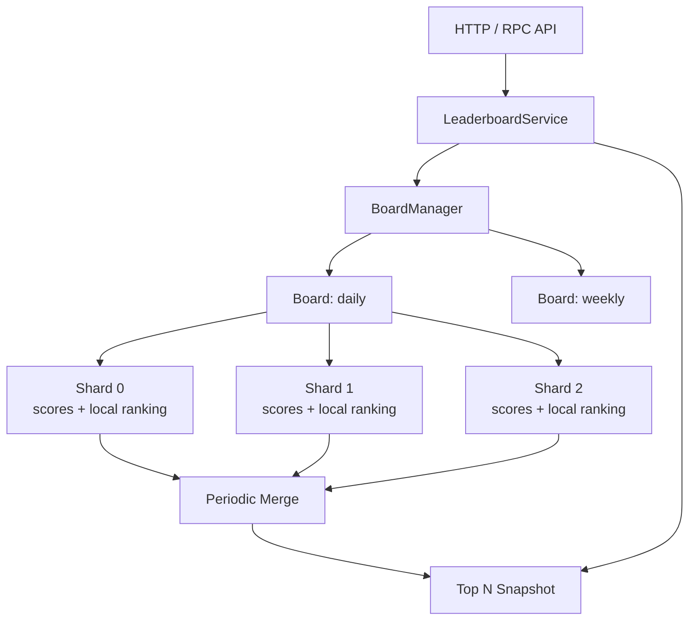

[返回首页](../README.md) / [返回上级](part-07-projects.md)

# 20. Leaderboard 高级实现

目标：实现高并发排行榜。

核心能力：

- 增加用户分数。
- 查询 Top N。
- 查询用户排名。
- 支持多榜单。
- 支持并发安全。
- 支持快照缓存。

推荐架构：



## 20.1 设计思路

- 写入按 member 分片。
- 每个分片维护局部数据。
- 后台周期性合并 Top K。
- 读请求读取不可变快照。
- 对用户排名可以提供“实时分数 + 快照排名”语义。

## 20.2 常见坑

### 坑 1：每次写入都全量排序

为什么会出现：最直观的实现是每次 `AddScore` 后把所有用户重新排序。小数据量没问题，一旦用户达到几十万、几百万，写入路径会被排序拖垮。

错误思路：

```go
scores[member] += delta
sort.Slice(allEntries, less) // 每次写入都排序全量数据
```

修复方式：写路径只更新分片数据；后台周期性合并 Top K 快照。对于实时性要求高的榜单，可以使用 Skiplist 或 Redis Sorted Set，但也要评估写入成本。

### 坑 2：`TopN` 返回内部切片

为什么会出现：为了少一次拷贝，直接返回内部缓存切片。但调用方拿到切片后可能修改元素，污染内部快照。

错误示例：

```go
func (b *Board) TopN(n int) []Entry {
	return b.snapshot[:n]
}
```

修复方式：返回副本。

```go
func (b *Board) TopN(n int) []Entry {
	result := make([]Entry, n)
	copy(result, b.snapshot[:n])
	return result
}
```

生产建议：对外返回的数据默认都当成不可信可变对象。内部缓存和快照不要暴露给调用方。

### 坑 3：同分用户排序不稳定

为什么会出现：只按分数排序时，同分用户之间顺序可能随 Map 遍历顺序、排序实现和刷新批次变化而抖动。

修复方式：定义完整排序键，例如：

```text
score desc, updated_at asc, member_id asc
```

这样同分用户也有稳定顺序，用户刷新页面时排名不会无故跳动。

### 坑 4：读写强一致要求过高，导致系统无法扩展

为什么会出现：如果要求每次写入后所有读请求立刻看到全局精确排名，读写路径会高度耦合，通常需要全局有序结构和强同步。

解决方式：明确 API 语义。生产中常见做法是：

- `GetScore` 返回实时分数。
- `TopN` 返回最近一次快照。
- `Rank` 返回快照排名，并告知刷新周期。

这能用很小的业务延迟换来更高吞吐和更稳定的尾延迟。

## 20.3 项目练习

1. 实现多榜单 `BoardManager`。
2. 实现后台每秒刷新 Top 100。
3. 实现 `AddScore`、`TopN`、`Rank`。
4. 对 10 万、100 万用户做 benchmark。
5. 增加 HTTP API 和压测脚本。

## 20.4 参考实现方向

- `BoardManager` 用 `map[string]*Board + RWMutex` 管理榜单。榜单数量变化不频繁时，这比 `sync.Map` 更容易保证类型安全和初始化语义。
- 每个 `Board` 内部按 member hash 分成多个 shard。写入只锁对应 shard，避免所有用户更新争抢一把锁。
- 每个 shard 维护 `map[member]score` 和局部 Top K 候选。后台定时从所有 shard 拉取候选并归并成全局快照。
- `TopN` 直接读 `atomic.Value` 中的不可变快照，避免读请求和写请求互相阻塞。
- `Rank` 可以分两种语义：实时计算精确排名，或者返回快照排名。生产中建议先提供快照排名，并在 API 文档中说明刷新周期。
- benchmark 要分别测写入吞吐、TopN 延迟、快照合并耗时、内存占用。不要只测单个函数平均耗时。

## 20.5 生产最佳实践

- 排名规则必须稳定。推荐按 `score desc, updated_at asc, member_id asc` 排序。
- `TopN` 返回结果要复制，不能把内部快照切片直接暴露给调用方修改。
- 快照刷新失败时保留旧快照，并记录错误指标。
- 对超大榜单可以把实时写入和查询拆开：写入进消息队列，聚合服务消费更新榜单，查询服务只读快照或 Redis Sorted Set。
- 对用户可见榜单，要考虑反作弊、分数回滚、重复事件幂等和补偿重算。

## 20.6 教学案例：分片快照排行榜

下面实现一个教学版排行榜。它不依赖第三方库，重点展示生产设计里的几个核心点：

- 写入按 member 分片，降低锁竞争。
- 每个 shard 保存真实分数。
- 后台或调用方触发 `Refresh` 生成不可变 TopN 快照。
- `TopN` 从 `atomic.Value` 读取快照，不阻塞写入。
- 排序规则稳定，避免同分排名抖动。

先定义数据结构：

```go
type Entry struct {
	Member    string
	Score     int64
	UpdatedAt time.Time
	Rank      int
}

type boardShard struct {
	mu     sync.RWMutex
	scores map[string]Entry
}

type Board struct {
	shards []boardShard
	topK   int
	snap   atomic.Value // stores []Entry
}

func NewBoard(shardCount int, topK int) *Board {
	if shardCount <= 0 {
		shardCount = 64
	}
	if topK <= 0 {
		topK = 100
	}

	b := &Board{
		shards: make([]boardShard, shardCount),
		topK:   topK,
	}
	for i := range b.shards {
		b.shards[i].scores = make(map[string]Entry)
	}
	b.snap.Store([]Entry{})
	return b
}
```

`snap` 里保存的是不可变快照。写入路径永远不修改它，只在刷新时整体替换。

member 到 shard 的映射：

```go
func (b *Board) shardFor(member string) *boardShard {
	h := fnv.New32a()
	_, _ = h.Write([]byte(member))
	return &b.shards[int(h.Sum32())%len(b.shards)]
}
```

增加分数：

```go
func (b *Board) AddScore(member string, delta int64, now time.Time) Entry {
	s := b.shardFor(member)

	s.mu.Lock()
	defer s.mu.Unlock()

	entry := s.scores[member]
	entry.Member = member
	entry.Score += delta
	entry.UpdatedAt = now
	s.scores[member] = entry
	return entry
}
```

这里 `AddScore` 只锁一个 shard。它返回的是实时分数，但不承诺实时排名。这个语义很重要：写入吞吐高时，实时更新全局排名会把所有写请求拉回一把全局锁或一个全局有序结构。

快照刷新：

```go
func (b *Board) Refresh() {
	h := &entryMinHeap{}
	heap.Init(h)

	for i := range b.shards {
		s := &b.shards[i]
		s.mu.RLock()
		for _, entry := range s.scores {
			pushTopK(h, entry, b.topK)
		}
		s.mu.RUnlock()
	}

	result := make([]Entry, h.Len())
	for i := len(result) - 1; i >= 0; i-- {
		result[i] = heap.Pop(h).(Entry)
	}
	sort.Slice(result, func(i, j int) bool {
		return better(result[i], result[j])
	})
	for i := range result {
		result[i].Rank = i + 1
	}

	b.snap.Store(result)
}

func pushTopK(h *entryMinHeap, entry Entry, k int) {
	if h.Len() < k {
		heap.Push(h, entry)
		return
	}
	if better(entry, (*h)[0]) {
		(*h)[0] = entry
		heap.Fix(h, 0)
	}
}
```

`Refresh` 的成本与用户总数有关，所以它不应该在每次 `TopN` 请求中执行。生产中通常由后台 ticker 定期刷新，例如每秒一次：

```go
func (b *Board) StartRefresh(ctx context.Context, interval time.Duration) {
	ticker := time.NewTicker(interval)
	go func() {
		defer ticker.Stop()
		for {
			select {
			case <-ticker.C:
				b.Refresh()
			case <-ctx.Done():
				return
			}
		}
	}()
}
```

堆和排序规则：

```go
type entryMinHeap []Entry

func (h entryMinHeap) Len() int { return len(h) }

func (h entryMinHeap) Less(i, j int) bool {
	return worse(h[i], h[j])
}

func (h entryMinHeap) Swap(i, j int) {
	h[i], h[j] = h[j], h[i]
}

func (h *entryMinHeap) Push(x any) {
	*h = append(*h, x.(Entry))
}

func (h *entryMinHeap) Pop() any {
	old := *h
	n := len(old)
	x := old[n-1]
	*h = old[:n-1]
	return x
}

func better(a, b Entry) bool {
	if a.Score != b.Score {
		return a.Score > b.Score
	}
	if !a.UpdatedAt.Equal(b.UpdatedAt) {
		return a.UpdatedAt.Before(b.UpdatedAt)
	}
	return a.Member < b.Member
}

func worse(a, b Entry) bool {
	return better(b, a)
}
```

这个排序规则表示：分数越高越靠前；同分时更早达到该分数的人靠前；如果时间也相同，member 字典序小的靠前。生产榜单一定要有完整排序键，否则同分用户会因为 Map 遍历顺序而排名抖动。

读取 TopN：

```go
func (b *Board) TopN(n int) []Entry {
	entries := b.snap.Load().([]Entry)
	if n > len(entries) {
		n = len(entries)
	}
	if n <= 0 {
		return nil
	}

	out := make([]Entry, n)
	copy(out, entries[:n])
	return out
}
```

返回副本是为了保护内部快照。如果调用方修改返回的切片，不会污染下一次查询。

查询用户排名可以先做快照语义：

```go
func (b *Board) Rank(member string) (Entry, bool) {
	entries := b.snap.Load().([]Entry)
	for _, entry := range entries {
		if entry.Member == member {
			return entry, true
		}
	}
	return Entry{}, false
}
```

这个 `Rank` 只在 TopK 快照中查找用户，复杂度是 `O(k)`。如果业务要求任意用户排名，就不能只保存 TopK，需要使用 Skiplist、Redis Sorted Set，或者在刷新快照时构建 `map[member]rank`。

## 20.7 多榜单管理器

实际业务通常有日榜、周榜、活动榜等多个 board。管理器负责创建和查找榜单：

```go
type BoardManager struct {
	mu     sync.RWMutex
	boards map[string]*Board
}

func NewBoardManager() *BoardManager {
	return &BoardManager{boards: make(map[string]*Board)}
}

func (m *BoardManager) GetOrCreate(name string) *Board {
	m.mu.RLock()
	board := m.boards[name]
	m.mu.RUnlock()
	if board != nil {
		return board
	}

	m.mu.Lock()
	defer m.mu.Unlock()

	if board = m.boards[name]; board != nil {
		return board
	}
	board = NewBoard(64, 100)
	m.boards[name] = board
	return board
}

func (m *BoardManager) AddScore(boardName, member string, delta int64) Entry {
	board := m.GetOrCreate(boardName)
	return board.AddScore(member, delta, time.Now())
}

func (m *BoardManager) TopN(boardName string, n int) []Entry {
	m.mu.RLock()
	board := m.boards[boardName]
	m.mu.RUnlock()
	if board == nil {
		return nil
	}
	return board.TopN(n)
}
```

这里使用“双重检查”避免每次都加写锁。第一次读锁找不到时，再进入写锁；进入写锁后还要再查一次，因为可能有另一个 goroutine 已经创建了 board。

生产扩展方向：

- 增加 board 生命周期管理，长期无人访问的活动榜要清理。
- `Refresh` 失败要保留旧快照，并记录失败指标。
- 如果榜单写入量极高，`Refresh` 扫全量用户会变重，需要每个 shard 维护局部 TopK 候选。
- 分数变更要幂等。活动积分通常来自事件流，必须用事件 ID 去重，避免消息重试重复加分。

## 20.8 HTTP API 示例

教学项目可以先暴露两个接口：

```go
func addScoreHandler(m *BoardManager) http.HandlerFunc {
	return func(w http.ResponseWriter, r *http.Request) {
		board := r.URL.Query().Get("board")
		member := r.URL.Query().Get("member")
		delta, err := strconv.ParseInt(r.URL.Query().Get("delta"), 10, 64)
		if err != nil || board == "" || member == "" {
			http.Error(w, "invalid request", http.StatusBadRequest)
			return
		}

		entry := m.AddScore(board, member, delta)
		_ = json.NewEncoder(w).Encode(entry)
	}
}

func topNHandler(m *BoardManager) http.HandlerFunc {
	return func(w http.ResponseWriter, r *http.Request) {
		board := r.URL.Query().Get("board")
		n, _ := strconv.Atoi(r.URL.Query().Get("n"))
		if n <= 0 {
			n = 10
		}

		entries := m.TopN(board, n)
		_ = json.NewEncoder(w).Encode(entries)
	}
}
```

这个 HTTP 层只用于教学。生产接口还要补鉴权、限流、请求体大小限制、错误码、指标、访问日志和超时控制。

## 20.9 Leaderboard 练习验收标准

完成这个案例后，至少做三类验证：

```go
func TestBoardTopNStableOrder(t *testing.T) {
	b := NewBoard(4, 10)
	now := time.Now()
	b.AddScore("b", 10, now)
	b.AddScore("a", 10, now)
	b.AddScore("c", 20, now)
	b.Refresh()

	got := b.TopN(3)
	if got[0].Member != "c" || got[1].Member != "a" || got[2].Member != "b" {
		t.Fatalf("unexpected order: %#v", got)
	}
}
```

```bash
go test -race ./...
go test -bench=Board -benchmem ./...
```

压测时分别看写入吞吐、`TopN` p99、`Refresh` 耗时和内存占用。如果 `Refresh` 耗时接近刷新间隔，说明快照生成已经成为瓶颈，需要局部 TopK 或外部存储。

---

