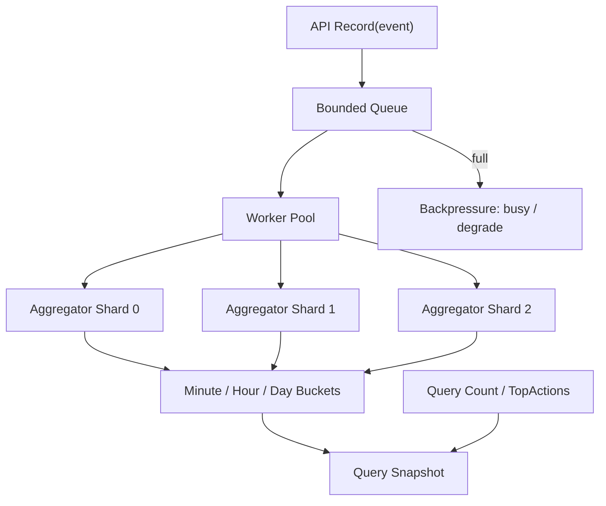

[返回首页](../README.md) / [返回上级](part-07-projects.md)

# 21. ActivityTracker 高级实现

目标：实现高吞吐活动事件追踪系统。

核心能力：

- 写入事件。
- 查询窗口统计。
- 查询高频行为。
- 支持异步写入。
- 支持背压。
- 支持增量聚合。
- 支持过期清理。

推荐架构：



## 21.1 设计思路

- 写入先进入有界队列。
- 队列满时快速失败或降级。
- worker 批量聚合事件。
- 聚合结果按分钟、小时、天分桶。
- 查询优先读取聚合桶。
- 过期桶定期清理。

## 21.2 常见坑

### 坑 1：队列无上限

为什么会出现：为了“不丢事件”，开发者容易把队列做得很大，甚至使用无限增长的内存结构。结果系统处理不过来时，内存先被打爆。

修复方式：使用有界队列，并定义满队列策略。

```go
func (t *Tracker) Record(ctx context.Context, e Event) error {
	select {
	case t.queue <- e:
		return nil
	case <-ctx.Done():
		return ctx.Err()
	default:
		return ErrBusy
	}
}
```

生产建议：关键事件不要依赖无限内存队列，而应写入可靠消息队列或本地 WAL，再异步消费。

### 坑 2：查询大窗口时扫描太多分钟桶

为什么会出现：分钟桶适合短窗口查询。如果查询最近 90 天，扫描分钟桶需要访问 129600 个桶，延迟和 CPU 都会很差。

修复方式：使用多级聚合。查询大范围用天桶或小时桶，边界部分再用分钟桶补齐。

```text
查询最近 25 小时 =
  起始边界若干分钟桶
  + 中间完整小时桶
  + 结束边界若干分钟桶
```

### 坑 3：事件时间和服务时间混用

为什么会出现：客户端上报的事件时间可能不准，服务端接收时间又不能完全代表业务发生时间。混用后，统计口径会混乱。

修复方式：同时保存两个时间：

- `event_time`：业务发生时间。
- `ingest_time`：服务接收时间。

实时统计通常按 `event_time` 入桶，但排障、积压监控和迟到分析要看 `ingest_time`。

### 坑 4：没有迟到事件处理策略

为什么会出现：移动端离线、网络重试、消息队列积压都会让事件延迟到达。如果聚合系统只接受当前分钟，迟到事件要么丢失，要么污染历史。

解决方式：设置可修正窗口。例如最近 10 分钟允许修正，超过 10 分钟进入离线补偿。查询快照要标注数据延迟。

### 坑 5：没有保留原始日志，无法重算

为什么会出现：增量聚合只保存结果，一旦代码 bug、统计口径变化或迟到策略调整，就无法修复历史数据。

生产建议：重要统计必须保留原始事件流或明细日志。聚合结果是加速查询的派生数据，不应是唯一事实来源。

## 21.3 项目练习

1. 实现 64 分片聚合。
2. 实现分钟桶、小时桶、天桶。
3. 实现 `TopActions(start, end, n)`。
4. 暴露队列长度、写入失败数、处理延迟。
5. 实现优雅关闭。

## 21.4 参考实现方向

- 写入入口只做轻量校验和入队，不在请求路径里做复杂聚合。
- 队列使用有界 channel，满了返回 `ErrBusy` 或降级，不能无限阻塞。
- worker 消费事件后按 `hash(action)` 或 `hash(userID)` 写入不同 aggregator shard。
- 每个 shard 维护分钟桶，后台定时把完整分钟聚合到小时桶，把完整小时聚合到天桶。
- `TopActions` 查询时先在每个 shard 内计算局部 Top K，再归并全局 Top K。
- 优雅关闭分两步：先停止接收新事件，再 drain 队列，最后 flush 聚合状态。

## 21.5 生产最佳实践

- 事件要有唯一 ID 或幂等键，避免消息重试导致重复计数。
- 保存原始事件日志或消息流，方便口径变化后重算。
- 明确迟到事件策略，例如只修正最近 10 分钟，超过窗口进入离线补偿。
- 指标至少包括入队成功数、入队失败数、队列长度、消费延迟、聚合耗时、桶数量、丢弃数。
- 如果查询跨度很大，禁止扫描过多分钟桶，应自动切换到小时桶或天桶。

## 21.6 教学案例：异步活动追踪器

下面实现一个教学版 `ActivityTracker`。它覆盖真实系统的核心结构：

- `Record` 只做轻量校验和入队。
- 有界队列提供背压。
- 多个 worker 异步消费事件。
- 聚合器按 action 和分钟分桶。
- 查询读取聚合桶，而不是扫描原始事件。
- 关闭时停止接收新事件并等待 worker 退出。

先定义事件和错误：

```go
var ErrTrackerClosed = errors.New("tracker closed")
var ErrTrackerBusy = errors.New("tracker busy")
var ErrInvalidEvent = errors.New("invalid event")

type ActivityEvent struct {
	ID        string
	UserID    string
	Action    string
	EventTime time.Time
	IngestTime time.Time
}
```

`ID` 用于幂等。`EventTime` 是业务发生时间，`IngestTime` 是服务接收时间。生产中两者都要保存，因为统计口径和排障口径不同。

聚合 shard：

```go
type actionMinute struct {
	Action string
	Minute int64
}

type trackerShard struct {
	mu      sync.RWMutex
	counts  map[actionMinute]int64
	seenIDs map[string]struct{}
}

func (s *trackerShard) init() {
	s.counts = make(map[actionMinute]int64)
	s.seenIDs = make(map[string]struct{})
}

func (s *trackerShard) add(e ActivityEvent) {
	s.mu.Lock()
	defer s.mu.Unlock()

	if e.ID != "" {
		if _, ok := s.seenIDs[e.ID]; ok {
			return
		}
		s.seenIDs[e.ID] = struct{}{}
	}

	key := actionMinute{
		Action: e.Action,
		Minute: e.EventTime.Unix() / 60,
	}
	s.counts[key]++
}
```

`seenIDs` 是教学版幂等实现。生产中不能无限保存所有 ID，通常会设置 TTL、使用 Redis、布隆过滤器，或者依赖上游消息系统的 exactly-once/幂等语义。

查询窗口统计：

```go
func (s *trackerShard) count(action string, start, end time.Time) int64 {
	startMinute := start.Unix() / 60
	endMinute := end.Add(-time.Nanosecond).Unix() / 60

	s.mu.RLock()
	defer s.mu.RUnlock()

	var total int64
	for m := startMinute; m <= endMinute; m++ {
		total += s.counts[actionMinute{Action: action, Minute: m}]
	}
	return total
}
```

这个查询只适合短窗口。长窗口要使用小时桶和天桶，否则扫描分钟数过多。

Tracker 主体：

```go
type ActivityTracker struct {
	queue  chan ActivityEvent
	shards []trackerShard

	mu        sync.RWMutex
	wg        sync.WaitGroup
	closeOnce sync.Once
	closed    chan struct{}
}

func NewActivityTracker(workerCount int, queueSize int, shardCount int) *ActivityTracker {
	if workerCount <= 0 {
		workerCount = 8
	}
	if queueSize <= 0 {
		queueSize = 10000
	}
	if shardCount <= 0 {
		shardCount = 64
	}

	t := &ActivityTracker{
		queue:  make(chan ActivityEvent, queueSize),
		shards: make([]trackerShard, shardCount),
		closed: make(chan struct{}),
	}
	for i := range t.shards {
		t.shards[i].init()
	}
	for i := 0; i < workerCount; i++ {
		t.wg.Add(1)
		go t.worker()
	}
	return t
}
```

写入入口：

```go
func (t *ActivityTracker) Record(ctx context.Context, e ActivityEvent) error {
	if e.Action == "" || e.EventTime.IsZero() {
		return ErrInvalidEvent
	}
	if e.IngestTime.IsZero() {
		e.IngestTime = time.Now()
	}

	t.mu.RLock()
	defer t.mu.RUnlock()

	select {
	case <-t.closed:
		return ErrTrackerClosed
	default:
	}

	select {
	case t.queue <- e:
		return nil
	case <-t.closed:
		return ErrTrackerClosed
	case <-ctx.Done():
		return ctx.Err()
	default:
		return ErrTrackerBusy
	}
}
```

这里的 `default` 是背压策略：队列满了立刻失败。对于埋点类事件，可以返回成功但记录丢弃数；对于关键行为事件，应返回明确错误，让调用方进入可靠重试或消息队列。

worker 和 shard 路由：

```go
func (t *ActivityTracker) worker() {
	defer t.wg.Done()

	for e := range t.queue {
		shard := t.shardFor(e.Action)
		shard.add(e)
	}
}

func (t *ActivityTracker) shardFor(action string) *trackerShard {
	h := fnv.New32a()
	_, _ = h.Write([]byte(action))
	return &t.shards[int(h.Sum32())%len(t.shards)]
}
```

这里按 action 分片，适合查询 action 维度统计。如果写入热点是单个 action，例如 `page_view` 占 90%，这个分片会失效。生产中可以改为按 `(action, userID)` 或事件 ID 分片，查询时再跨 shard 汇总。

查询接口：

```go
func (t *ActivityTracker) Count(action string, start, end time.Time) int64 {
	if !start.Before(end) {
		return 0
	}

	var total int64
	for i := range t.shards {
		total += t.shards[i].count(action, start, end)
	}
	return total
}
```

即使按 action 分片，这里仍然遍历所有 shard，是为了让未来分片策略变化时查询语义不变。生产中如果明确 action 只会落到一个 shard，可以直接查目标 shard，但代码耦合会更强。

优雅关闭：

```go
func (t *ActivityTracker) Shutdown(ctx context.Context) error {
	t.closeOnce.Do(func() {
		t.mu.Lock()
		defer t.mu.Unlock()

		close(t.closed)
		close(t.queue)
	})

	done := make(chan struct{})
	go func() {
		t.wg.Wait()
		close(done)
	}()

	select {
	case <-done:
		return nil
	case <-ctx.Done():
		return ctx.Err()
	}
}
```

关闭顺序是：先关闭 `closed`，让新请求被拒绝；再关闭队列，让 worker 消费完已入队事件后退出。这个版本没有持久化 flush，如果事件不能丢，关闭前还要把未处理事件写入 WAL 或可靠消息队列。

## 21.7 TopActions 查询

`TopActions(start, end, n)` 的朴素做法是扫描窗口内所有桶，累加每个 action 的计数，然后用堆取 TopN：

```go
type ActionCount struct {
	Action string
	Count  int64
}

func (t *ActivityTracker) TopActions(start, end time.Time, n int) []ActionCount {
	if n <= 0 || !start.Before(end) {
		return nil
	}

	total := make(map[string]int64)
	for i := range t.shards {
		t.shards[i].fillRange(total, start, end)
	}

	h := &actionMinHeap{}
	heap.Init(h)
	for action, count := range total {
		item := ActionCount{Action: action, Count: count}
		if h.Len() < n {
			heap.Push(h, item)
			continue
		}
		if item.Count > (*h)[0].Count {
			(*h)[0] = item
			heap.Fix(h, 0)
		}
	}

	out := make([]ActionCount, h.Len())
	for i := len(out) - 1; i >= 0; i-- {
		out[i] = heap.Pop(h).(ActionCount)
	}
	return out
}

func (s *trackerShard) fillRange(total map[string]int64, start, end time.Time) {
	startMinute := start.Unix() / 60
	endMinute := end.Add(-time.Nanosecond).Unix() / 60

	s.mu.RLock()
	defer s.mu.RUnlock()

	for key, count := range s.counts {
		if key.Minute >= startMinute && key.Minute <= endMinute {
			total[key.Action] += count
		}
	}
}
```

这个实现容易理解，但生产中要注意：如果 action 和桶都很多，扫描所有 `counts` 会变慢。优化方向有两个：

- 按时间组织桶：`map[minute]map[action]count`，查询窗口时只扫相关分钟。
- 后台维护 TopActions 快照：查询直接读快照，适合热门固定窗口，如最近 5 分钟、1 小时、24 小时。

堆实现：

```go
type actionMinHeap []ActionCount

func (h actionMinHeap) Len() int { return len(h) }

func (h actionMinHeap) Less(i, j int) bool {
	if h[i].Count != h[j].Count {
		return h[i].Count < h[j].Count
	}
	return h[i].Action > h[j].Action
}

func (h actionMinHeap) Swap(i, j int) { h[i], h[j] = h[j], h[i] }

func (h *actionMinHeap) Push(x any) {
	*h = append(*h, x.(ActionCount))
}

func (h *actionMinHeap) Pop() any {
	old := *h
	n := len(old)
	x := old[n-1]
	*h = old[:n-1]
	return x
}
```

## 21.8 过期清理和迟到事件

内存聚合器必须清理旧桶：

```go
func (t *ActivityTracker) Cleanup(before time.Time) {
	beforeMinute := before.Unix() / 60
	for i := range t.shards {
		s := &t.shards[i]
		s.mu.Lock()
		for key := range s.counts {
			if key.Minute < beforeMinute {
				delete(s.counts, key)
			}
		}
		s.mu.Unlock()
	}
}
```

清理策略要和迟到事件策略一致。如果允许修正最近 10 分钟，就不能清理 10 分钟内的桶。常见配置：

```text
实时修正窗口：10 分钟
内存保留窗口：2 小时
离线明细保留：7 天或更久
```

如果事件晚到超过实时修正窗口，生产系统通常不直接修改内存聚合，而是写入补偿队列，由离线任务重算历史报表。这样实时系统不会被非常旧的事件拖慢。

## 21.9 ActivityTracker 验收标准

这个案例完成后，至少验证四件事：

```go
func TestActivityTrackerCount(t *testing.T) {
	tracker := NewActivityTracker(2, 100, 4)
	defer tracker.Shutdown(context.Background())

	now := time.Now()
	for i := 0; i < 10; i++ {
		err := tracker.Record(context.Background(), ActivityEvent{
			ID:        fmt.Sprintf("e-%d", i),
			UserID:    "u1",
			Action:    "click",
			EventTime: now,
		})
		if err != nil {
			t.Fatal(err)
		}
	}

	requireEventually(t, func() bool {
		return tracker.Count("click", now.Add(-time.Minute), now.Add(time.Minute)) == 10
	})
}

func requireEventually(t *testing.T, fn func() bool) {
	t.Helper()

	deadline := time.Now().Add(time.Second)
	for time.Now().Before(deadline) {
		if fn() {
			return
		}
		time.Sleep(10 * time.Millisecond)
	}
	t.Fatal("condition was not met before timeout")
}
```

测试异步系统时不要立刻断言，因为事件还在队列里。可以使用 `require.Eventually`，或者在教学代码里提供 `Flush` 方法等待队列处理完成。

压测和观测重点：

- `Record` 成功数、失败数、`ErrTrackerBusy` 数量。
- 队列长度和队列等待时间。
- worker 消费延迟，即 `now - ingest_time`。
- 聚合桶数量和内存占用。
- `TopActions` 查询的 p99 延迟。

生产落地时，`ActivityTracker` 通常不会单独运行在业务进程里。更常见的架构是：业务服务把事件写入 Kafka、Pulsar、NATS 或本地 WAL，聚合服务异步消费并维护实时视图。这样业务入口不会被统计系统拖慢，统计系统故障也不会直接影响核心交易链路。

---

