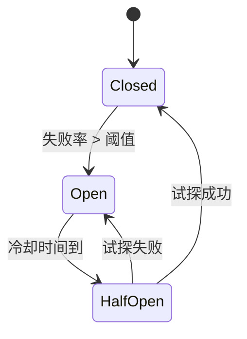

[返回首页](../README.md) / [返回上级](appendix-b-shutdown-circuit-breaker.md)

# B.2 熔断（Circuit Breaker）

熔断的作用是在下游持续失败时，主动断开调用，避免把自己拖垮。它是 fan-out、重试、缓存之外的最后一道屏障。

熔断器有三个状态：

| 状态 | 含义 | 行为 |
| --- | --- | --- |
| Closed | 正常 | 请求直通，失败计数累积 |
| Open | 断路 | 请求立即失败（fail fast），不调用下游 |
| Half-Open | 试探 | 放行少量请求，根据结果决定回到 Closed 或 Open |



常见实现库：`sony/gobreaker`、`afex/hystrix-go`、`resilience4j`（Java 参考）。

```go
import "github.com/sony/gobreaker"

var cb = gobreaker.NewCircuitBreaker(gobreaker.Settings{
	Name:        "user-service",
	MaxRequests: 3,
	Interval:    60 * time.Second,
	Timeout:     10 * time.Second,
	ReadyToTrip: func(counts gobreaker.Counts) bool {
		return counts.ConsecutiveFailures > 10
	},
})

func GetUser(ctx context.Context, id int64) (*User, error) {
	v, err := cb.Execute(func() (any, error) {
		return loadUserFromRPC(ctx, id)
	})
	if err != nil {
		return nil, err
	}
	return v.(*User), nil
}
```

要点：

- 熔断粒度要合理。按“服务+接口”或“服务+上游依赖”维度，不要一个熔断器覆盖整个进程。
- 熔断开启时要返回明确错误，并且要有指标和告警。长期 Open 说明下游真的有问题。
- 和超时、重试配合使用。熔断不能替代超时；超时保证单次请求快速失败，熔断保证持续失败时不再尝试。
- 幂等写入才可以重试。熔断打开期间的请求通常不应进入重试队列。

